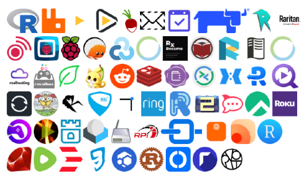
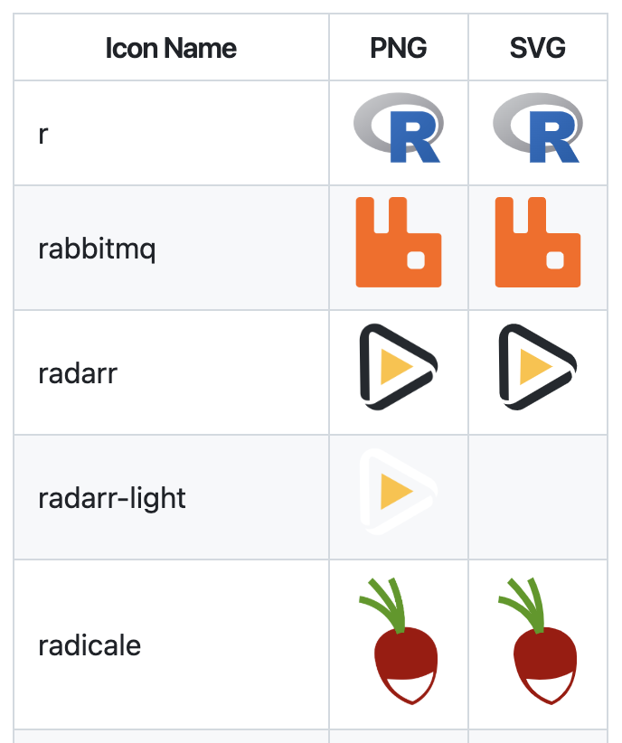

# Awesome Dashboard Icons

The **largest collection** of icons for dashboards like:

- [Homepage](https://gethomepage.dev/)
- [Homarr](https://homarr.dev/)
- [Dashy](https://dashy.to/)

Includes **3579 icons** and growing.

## ✨ Browse the Gallery

[Icon Gallery](_static/gallery-a.md) displays a mashup of icon images only - for **faster visual scanning**.

## 🔎 Search the Directory

[Icon Directory](_static/directory-a.md) lists icon names with each image filetype - for **faster searching**.

## 🚀 After updating icons

After altering icons, re-generate the static browsable files:

    ./scripts/generate_directory.py; ./scripts/generate_gallery.py; ./scripts/update_count.py

## 🐳 Running scripts with Docker

A Dockerfile is provided so you don't need to install Python or system dependencies locally.

**Build the image (one-time):**

    docker build -t awesome-dashboard-icons .

**Convert all SVGs to PNG (skips existing):**

    docker run --rm -v "$(pwd)/icons:/app/icons" awesome-dashboard-icons scripts/convert_svg_to_png.py

**Convert specific icons:**

    docker run --rm -v "$(pwd)/icons:/app/icons" awesome-dashboard-icons scripts/convert_svg_to_png.py icons/spotify.svg

**Force-regenerate existing PNGs:**

    docker run --rm -v "$(pwd)/icons:/app/icons" awesome-dashboard-icons scripts/convert_svg_to_png.py --overwrite

**Regenerate static docs:**

    docker run --rm -v "$(pwd):/app" awesome-dashboard-icons scripts/generate_directory.py
    docker run --rm -v "$(pwd):/app" awesome-dashboard-icons scripts/generate_gallery.py
    docker run --rm -v "$(pwd):/app" awesome-dashboard-icons scripts/update_count.py
