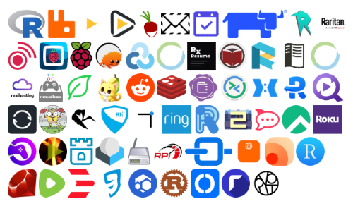
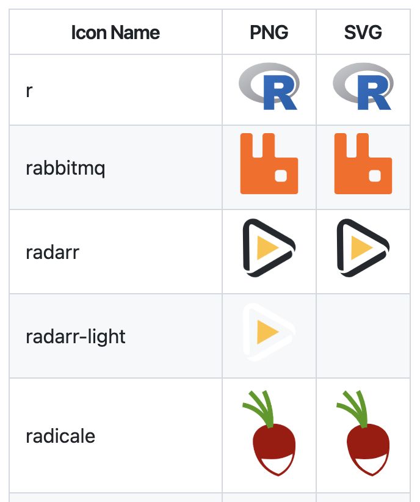

# Awesome Dashboard Icons

The **largest collection** of icons for dashboards like:

- [Homepage](https://gethomepage.dev/)
- [Homarr](https://homarr.dev/)
- [Dashy](https://dashy.to/)

Includes **3591 icons** and growing.

## ✨ Browse the Gallery

[Icon Gallery](_static/gallery-a.md) displays a mashup of icon images only - for **faster visual scanning**.

## 🔎 Search the Directory

[Icon Directory](_static/directory-a.md) lists icon names with each image filetype - for **faster searching**.

## 🏷️ Icon naming conventions

All icon filenames use **kebab-case** (lowercase, hyphen-separated). When multiple variants of an icon exist, a suffix is appended to the base name.

| Suffix | Purpose | Example |
|--------|---------|---------|
| *(none)* | Primary default icon | `plex.png` |
| `-logo` | Full wordmark or branded logo version | `plex-logo.png` |
| `-light` | Light-theme variant | `plex-light.png` |
| `-dark` | Dark-theme variant | `plex-dark.png` |
| `-white` | White monochrome variant | `trezor-white.png` |
| `-black` | Black monochrome variant | `apple-black.png` |
| `-outline` | Stroke/outline-only variant | `ansible-outline.png` |
| `-alt` | Alternative design or style | `docker-alt.png` |
| `-alt-NN` | Two or more alt icons, starting at `-02`. | `docker-alt-02.png` |

## 🚀 After adding an icon

Github will automatically generate missing PNGs from available SVGs and update  `_static` files. See [DEVELOPMENT.md](DEVELOPMENT.md) to run scripts locally.

## 📄 License

Licensed under the Apache License 2.0. See the [LICENSE](LICENSE) file for details.

