# Awesome Dashboard Icons

[[HOME](../README.md)][[#](directory.md)][[A](directory-a.md)][[B](directory-b.md)][[C](directory-c.md)][[D](directory-d.md)][[E](directory-e.md)][[F](directory-f.md)][[G](directory-g.md)][[H](directory-h.md)][[I](directory-i.md)][[J](directory-j.md)][[K](directory-k.md)][[L](directory-l.md)][[M](directory-m.md)][[N](directory-n.md)][[O](directory-o.md)][[P](directory-p.md)][[Q](directory-q.md)][[R](directory-r.md)][[S](directory-s.md)][[T](directory-t.md)][[U](directory-u.md)][[V](directory-v.md)][[W](directory-w.md)][[X](directory-x.md)][[Y](directory-y.md)][[Z](directory-z.md)]

# Directory: A

| Icon Name | PNG | SVG |
|-----------|-----|-----|
| abbey-music-player |  |   |
| abiotic-factor-logo |  |   |
| ac-browser |  |   |
| ac3-player |  |   |
| ac3-video-player |  |   |
| accountstudio-mp3-player |  |   |
| accuweather |  |   |
| acestream |  |   |
| acode |  |   |
| acorns |  |  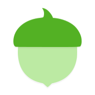 |
| act-fibernet |  |   |
| act-logo |  |  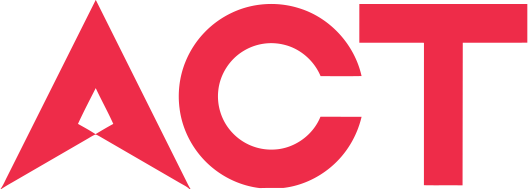 |
| action-launcher |  |  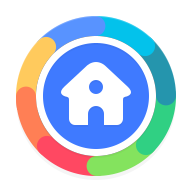 |
| actiondirector |  |  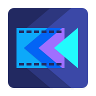 |
| activity-launcher |  |   |
| activitypub |  |   |
| activitywatch |  |  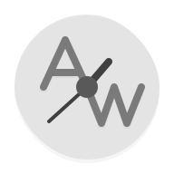 |
| actual |  |   |
| actual-budget |  |   |
| ad-director |  |  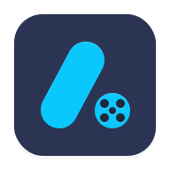 |
| ada-fruit |  |   |
| adaway |  |   |
| adblock |  |   |
| adblock-browser |  |  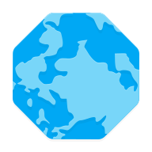 |
| adblock-plus |  |  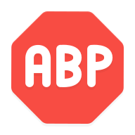 |
| adguard |  |   |
| adguard-home |  |   |
| adguard-home-light |  |   |
| adidas-running |  |  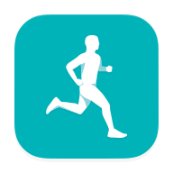 |
| adm |  |   |
| adminer |  |   |
| adminerevo |  |   |
| adobe-illustrator-draw |  |   |
| adobe-lightroom |  |   |
| adobe-photoshop |  |   |
| adobe-premiere-rush |  |   |
| adobe-reader |  |   |
| adobe-scan |  |  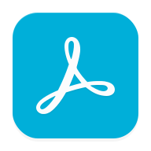 |
| adp |  |   |
| adsbexchange |  |   |
| adventurelog | 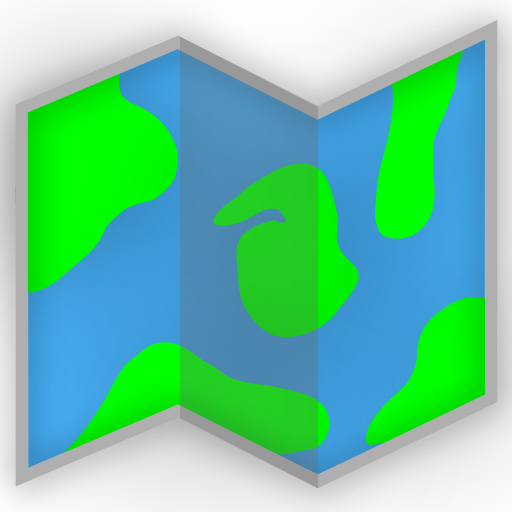 |  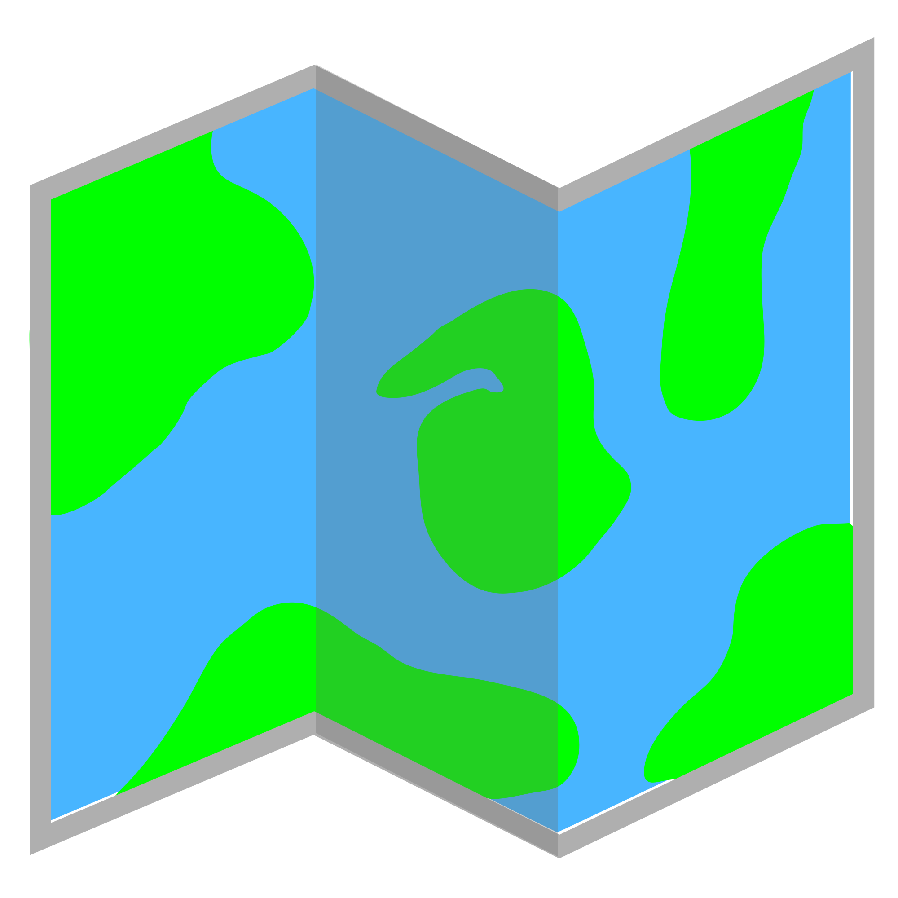 |
| adw-launcher |  |   |
| aeat |  |   |
| aegis |  |  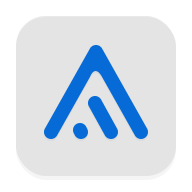 |
| aeondroid |  |  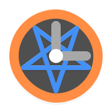 |
| aftership |  |  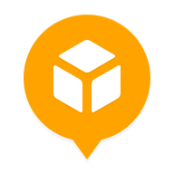 |
| afwall-plus |  |   |
| agoda |  |  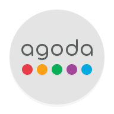 |
| aimp |  |  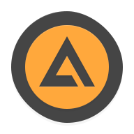 |
| airbnb |  |   |
| airdroid |  |  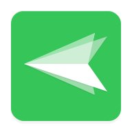 |
| airguard |  |  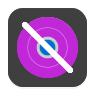 |
| airnz |  |  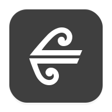 |
| airsonic | 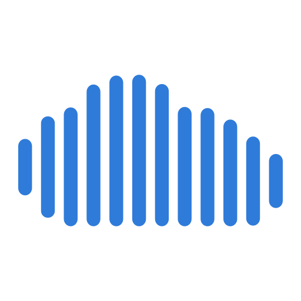 |   |
| airtel |  |  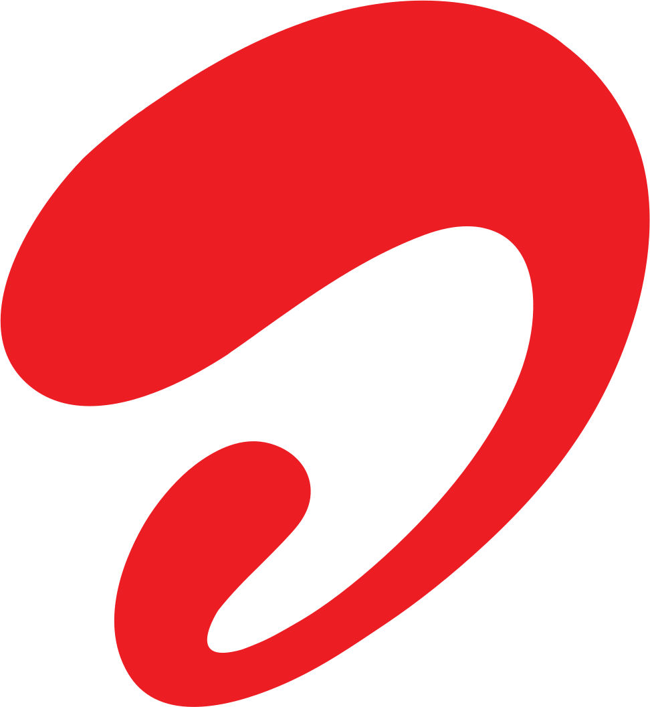 |
| airthings | 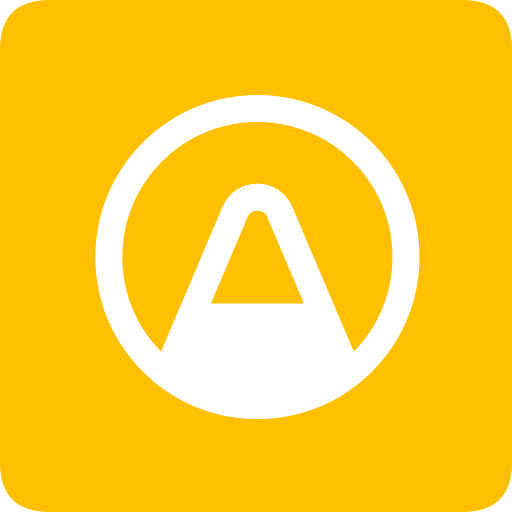 |   |
| airthings-logo |  |   |
| airvpn |  |  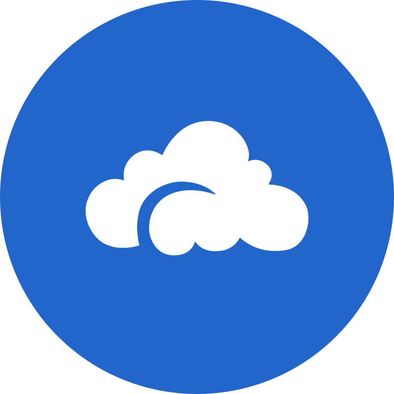 |
| ajustes-de-microg |  |   |
| al-chan |  |  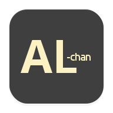 |
| al-quran |  |   |
| alarm-clock |  |  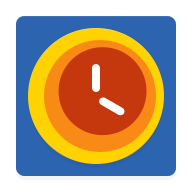 |
| alarmio |  |   |
| alarmpi |  |   |
| albert-heijn |  |  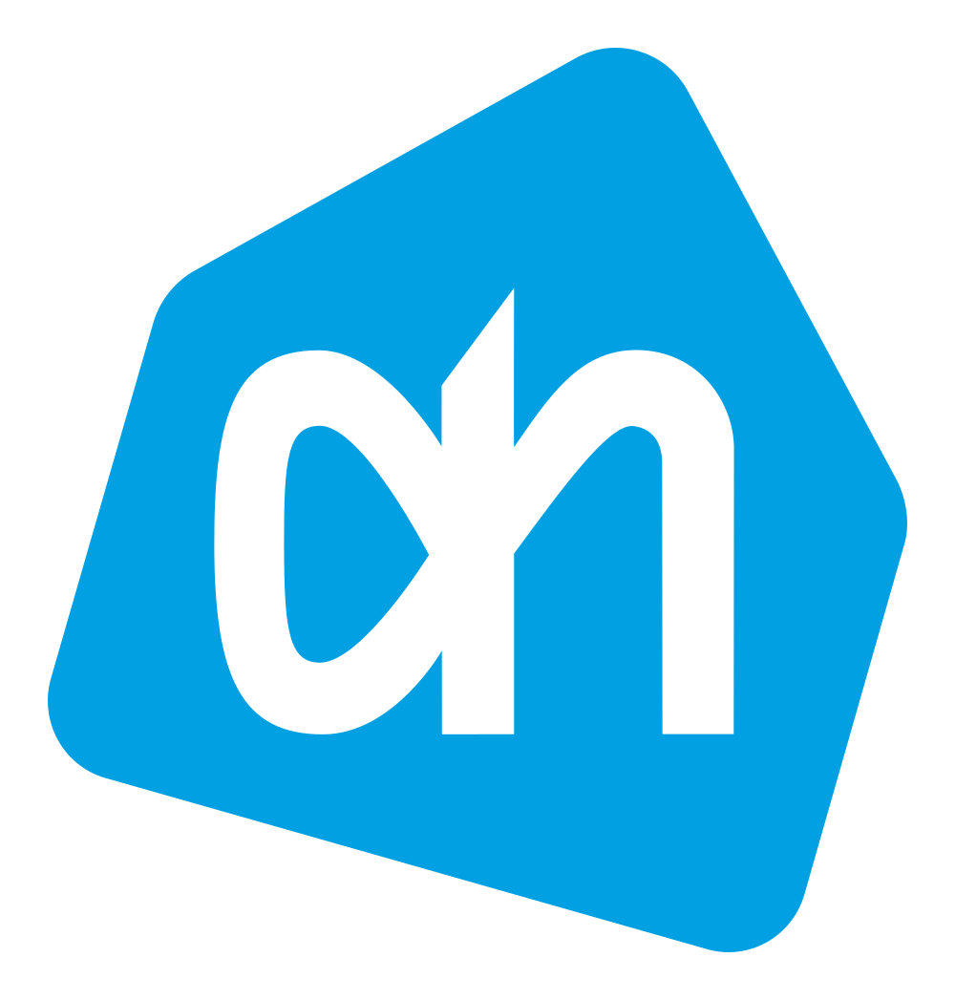 |
| alchemy-2 |  |   |
| alertmanager |  |   |
| alfabank |  |   |
| algovpn |  |   |
| aliexpress |  |   |
| alist | 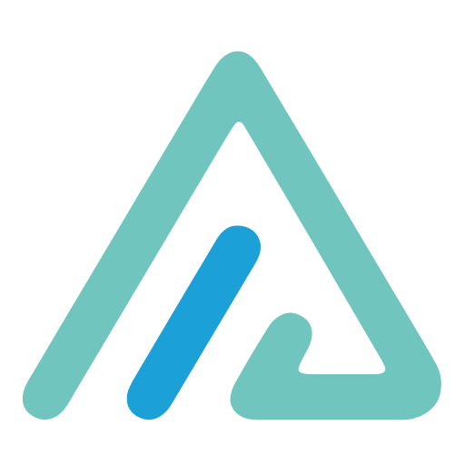 |   |
| alive |  |  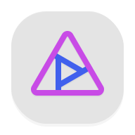 |
| all-document-reader |  |   |
| allcast |  |   |
| alloy |  |   |
| allstate |  |  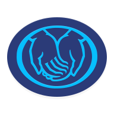 |
| alltube |  |   |
| alma |  |   |
| almalinux |  |   |
| alpine | 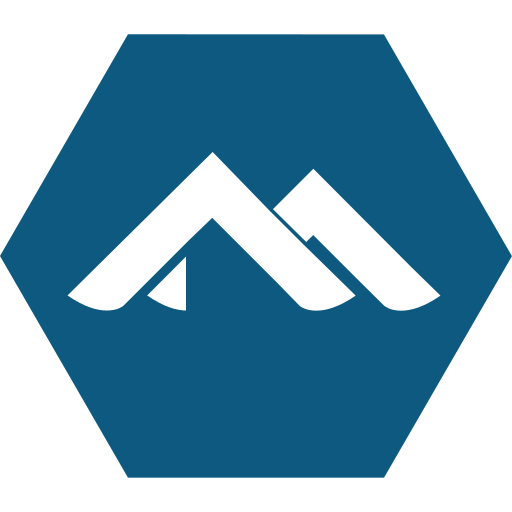 |   |
| amazon |  |   |
| amazon-drive |  |   |
| amazon-echo |  |   |
| amazon-fire |  |   |
| amazon-kindle |  |   |
| amazon-light |  |   |
| amazon-music |  |   |
| amazon-photos |  |   |
| amazon-workspaces |  |  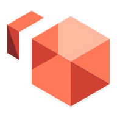 |
| amcrest |  |   |
| amcrest-cloud | 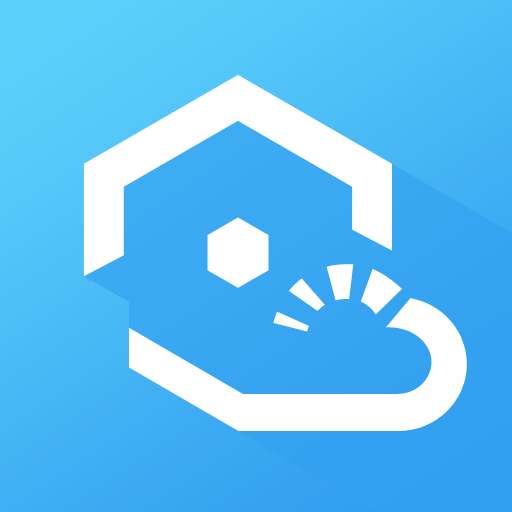 |   |
| amd |  |   |
| amd-light |  |  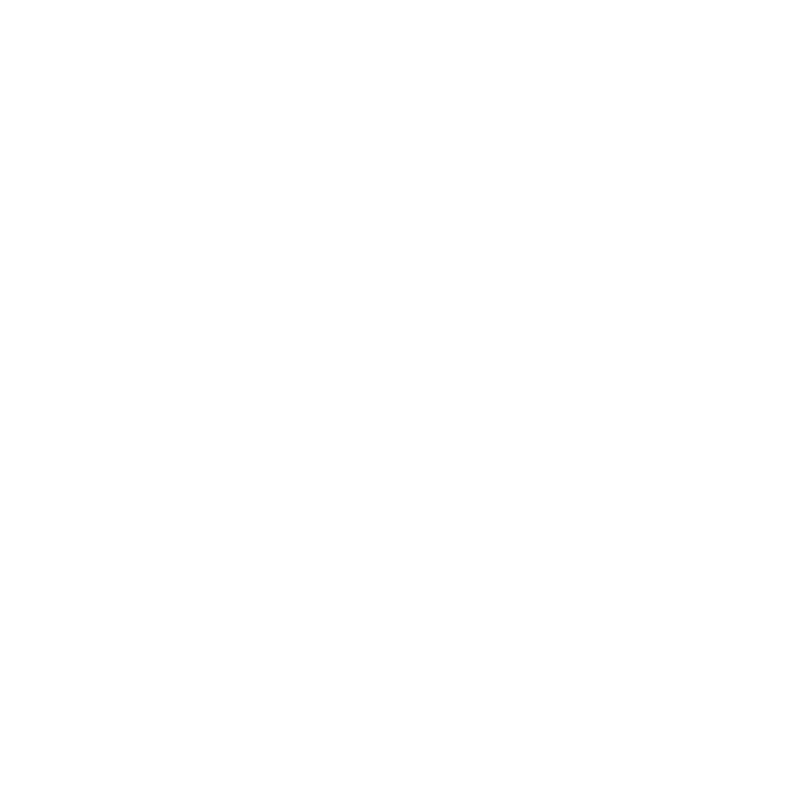 |
| amd-logo |  |   |
| ameixa |  |  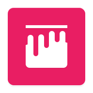 |
| ameixa-monochrome |  |  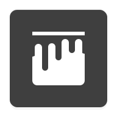 |
| ami | 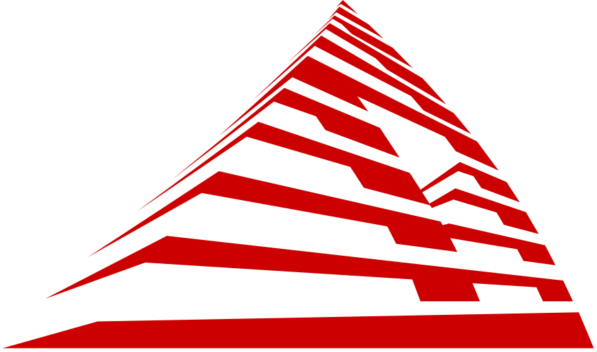 |   |
| ami-logo |  |   |
| ami-logo-light |  |   |
| among-us |  |  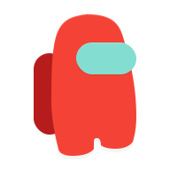 |
| amp | 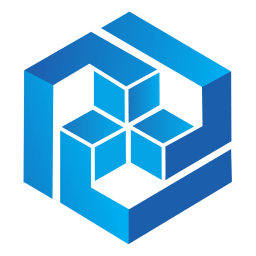 |   |
| ampache |  |   |
| ampere |  |   |
| amplayer |  |   |
| amvd |  |   |
| andotp |  |   |
| android |  |   |
| android-auto |  |   |
| android-file-transfer |  |   |
| android-light |  |   |
| android-robot |  |   |
| androidstudio |  |   |
| andropen-office |  |   |
| anime-x-stream |  |  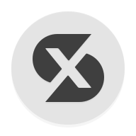 |
| ankidroid |  |   |
| ankit-musicplayer |  |   |
| anlinux |  |   |
| anonaddy |  |   |
| another-widget |  |   |
| ansible |  |   |
| ansible-outline |  |   |
| ansible-red |  |   |
| ansible-teal |  |   |
| antennapod |  |  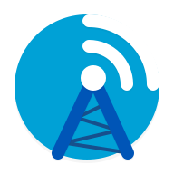 |
| antennas |  |   |
| any-do |  |   |
| anydesk |  |   |
| anysoftkeyboard-canary |  |  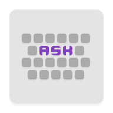 |
| anything-llm |  |   |
| anything-llm-light |  |  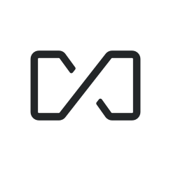 |
| apache |  |   |
| apache-airflow |  |   |
| apache-cassandra | 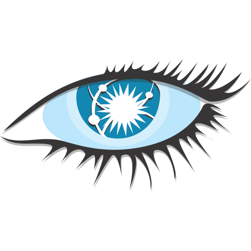 |   |
| apache-cloudstack |  |   |
| apache-druid |  |  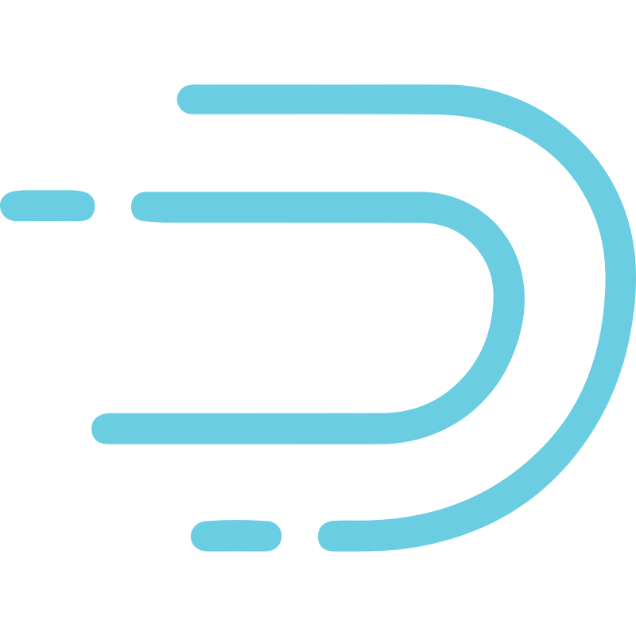 |
| apache-guacamole |  |   |
| apache-httpd |  |   |
| apache-kafka |  |   |
| apache-openoffice |  |   |
| apache-solr |  |   |
| apache-subversion |  |   |
| apache-tomcat | 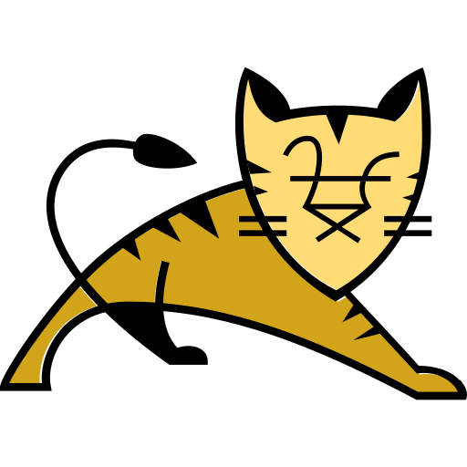 |  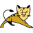 |
| apc-logo |  |   |
| apex-launcher |  |  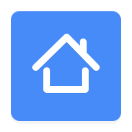 |
| apiscp |  |   |
| app-store | 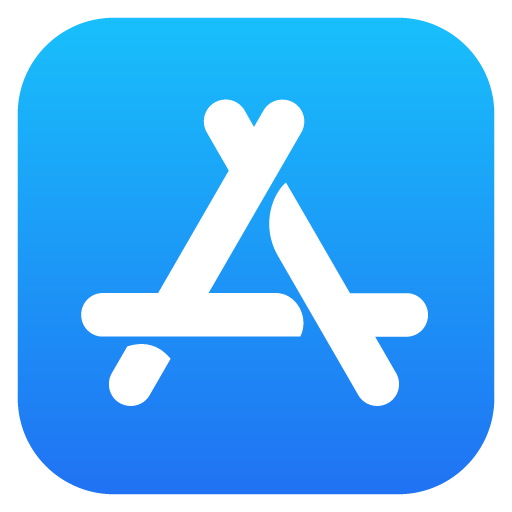 |  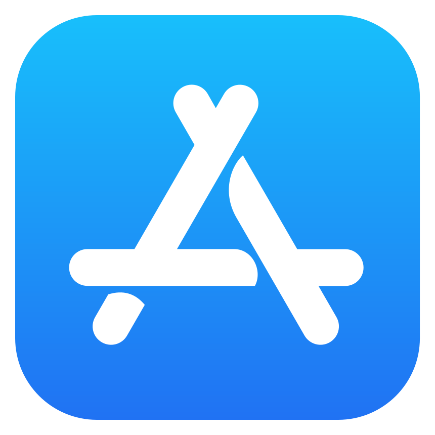 |
| app-watcher |  |   |
| appdaemon |  |   |
| appimage |  |   |
| apple |  |   |
| apple-black |  |   |
| apple-rainbow |  |   |
| apprise |  |   |
| appsddoz-video-player |  |   |
| apteka-ru |  |   |
| aptoide |  |   |
| apus |  |   |
| apus-browser-pro-video-booster |  |   |
| apus-launcher |  |   |
| apus-launcher-pro |  |   |
| ar-zone |  |   |
| arc |  |   |
| arch |  |   |
| archisteamfarm |  |   |
| archivebox |  |   |
| archiveteamwarrior |  |   |
| archos-video-player |  |   |
| arcticons-dark |  |   |
| ard-mediathek |  |   |
| arduino |  |   |
| argocd |  |   |
| ariang |  |   |
| ark |  |   |
| arlo |  |   |
| arm |  |   |
| arm-workout |  |   |
| armorfly-browser |  |   |
| arris-logo |  |   |
| arris-logo-light |  |   |
| artflow |  |   |
| artifacthub |  |   |
| artifactory |  |   |
| aruba |  |   |
| asana |  |   |
| asciinema |  |   |
| asrock-rack-ipmi-logo |  |   |
| assetgrid |  |   |
| assetto-corsa |  |   |
| asterisk |  |   |
| astral |  |   |
| astral-light |  |   |
| astro |  |   |
| astroneer |  |   |
| asus-browser |  |   |
| asus-logo |  |   |
| asus-logo-light |  |   |
| asus-rog |  |   |
| asus-router |  |   |
| asustor |  |   |
| ata-football |  |   |
| atimetracker |  |   |
| atlassian |  |   |
| atlassian-bamboo |  |   |
| atlassian-bitbucket |  |   |
| atlassian-confluence |  |   |
| atlassian-jira |  |   |
| atlassian-opsgenie |  |   |
| atlassian-trello |  |   |
| atmosphere |  |   |
| atomic |  |   |
| att |  |   |
| auchan |  |   |
| audacity |  |   |
| audible |  |   |
| audio-bassbooster |  |   |
| audio-beats |  |   |
| audioamp-video-player |  |   |
| audiobooks-com |  |   |
| audiobookshelf |  |   |
| audiofx |  |   |
| audioknigi-online |  |   |
| audiovision-music-player |  |   |
| auracast |  |   |
| aurora-droid |  |   |
| aurora-services |  |   |
| aurora-store |  |   |
| authelia |  |   |
| authenticator |  |   |
| authentik |  |   |
| authentik-light |  |   |
| authorizer |  |   |
| authy |  |   |
| auto-ru |  |   |
| autoairplanemode |  |   |
| autobrr |  |   |
| autolist |  |   |
| automatag |  |   |
| automate |  |   |
| automateit |  |   |
| autoscout24 |  |   |
| autosync |  |   |
| autotrader |  |   |
| avg |  |   |
| avigilon-logo |  |   |
| avito |  |   |
| avmfritzbox |  |   |
| aws |  |   |
| aws-ecs |  |   |
| awwesome |  |   |
| awx |  |   |
| ax-player |  |   |
| axis |  |   |
| axisnet |  |   |
| az-screen-recorder |  |   |
| azuracast |  |   |
| azure |  |   |
| azure-container-instances |  |   |
| azure-container-service |  |   |
| azure-devops |  |   |
| azure-dns |  |   |

[[HOME](../README.md)][[#](directory.md)][[A](directory-a.md)][[B](directory-b.md)][[C](directory-c.md)][[D](directory-d.md)][[E](directory-e.md)][[F](directory-f.md)][[G](directory-g.md)][[H](directory-h.md)][[I](directory-i.md)][[J](directory-j.md)][[K](directory-k.md)][[L](directory-l.md)][[M](directory-m.md)][[N](directory-n.md)][[O](directory-o.md)][[P](directory-p.md)][[Q](directory-q.md)][[R](directory-r.md)][[S](directory-s.md)][[T](directory-t.md)][[U](directory-u.md)][[V](directory-v.md)][[W](directory-w.md)][[X](directory-x.md)][[Y](directory-y.md)][[Z](directory-z.md)]

