# Awesome Dashboard Icons

[[HOME](..)][[#](directory.md)][[A](directory-a.md)][[B](directory-b.md)][[C](directory-c.md)][[D](directory-d.md)][[E](directory-e.md)][[F](directory-f.md)][[G](directory-g.md)][[H](directory-h.md)][[I](directory-i.md)][[J](directory-j.md)][[K](directory-k.md)][[L](directory-l.md)][[M](directory-m.md)][[N](directory-n.md)][[O](directory-o.md)][[P](directory-p.md)][[Q](directory-q.md)][[R](directory-r.md)][[S](directory-s.md)][[T](directory-t.md)][[U](directory-u.md)][[V](directory-v.md)][[W](directory-w.md)][[X](directory-x.md)][[Y](directory-y.md)][[Z](directory-z.md)]

# Directory: C

| Icon Name | PNG | SVG |
|-----------|-----|-----|
| c |  |   |
| c-sharp | 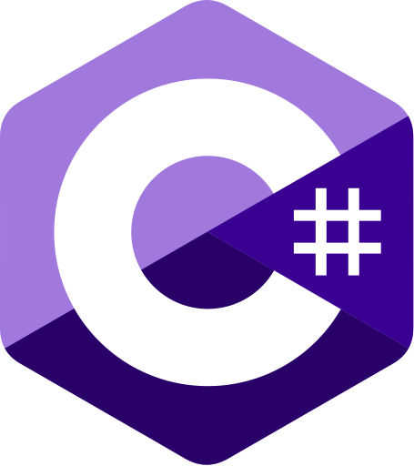 |  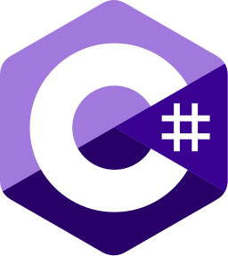 |
| cabify |  |   |
| cabot | 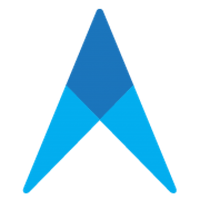 |   |
| cacti |  |   |
| caddy |  |   |
| cadvisor |  |   |
| caffeine |  |  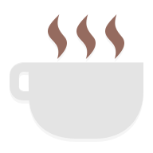 |
| caixa |  |   |
| caixa-tem |  |   |
| cake-browser |  |   |
| cake-wallet |  |  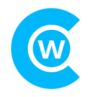 |
| calces |  |  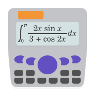 |
| calckey |  |   |
| calcy-iv |  |   |
| caldera | 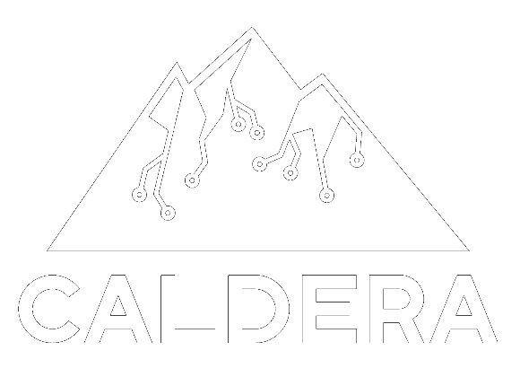 |   |
| calendar-widget-agenda |  |   |
| calibre | 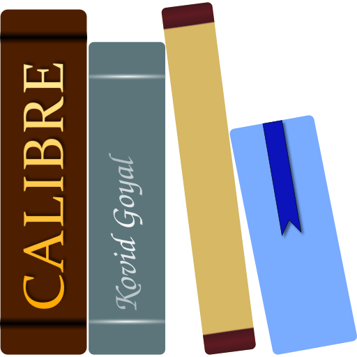 |  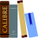 |
| calibre-web |  |   |
| call-blocker |  |   |
| call-log-analytics |  |   |
| callapp-contacts |  |   |
| calm |  |   |
| cam-scanner |  |  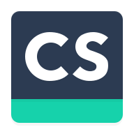 |
| cambly |  |  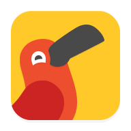 |
| camera-connect-and-control |  |   |
| camera-go |  |   |
| camera-ui |  |   |
| camera-zoom-fx |  |  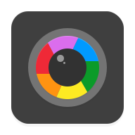 |
| canon-cw |  |  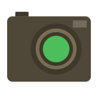 |
| canonical |  |   |
| canonical-snapcraft |  |   |
| canonical-ubuntu |  |   |
| canva |  |   |
| capcut |  |  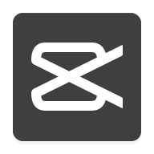 |
| cardigann |  |   |
| cardigann-light |  |   |
| careem |  |   |
| carfax |  |   |
| carmax |  |   |
| carmudi |  |  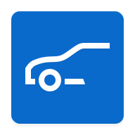 |
| carrefour |  |  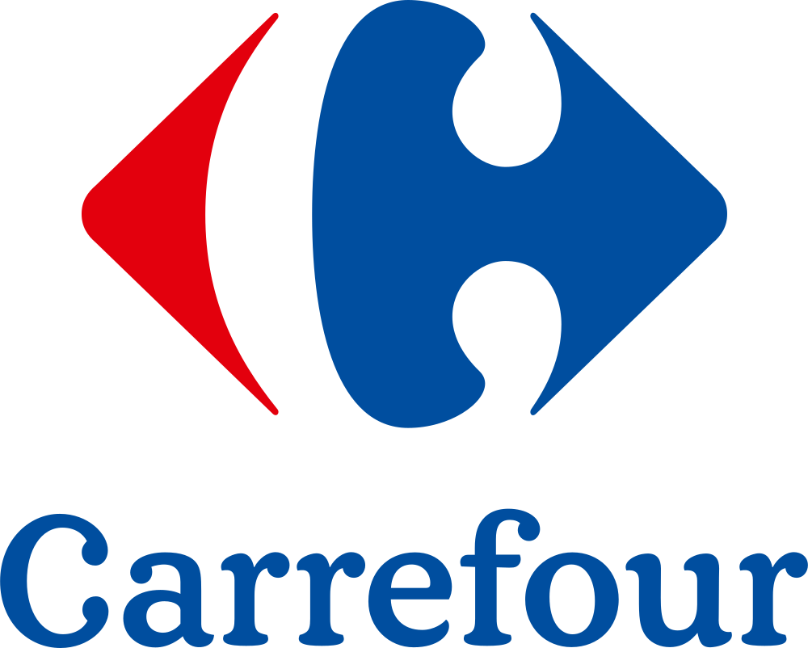 |
| cars-com |  |   |
| carteira-de-trabalho-digital |  |   |
| carvana |  |   |
| carwale |  |   |
| casaos |  |  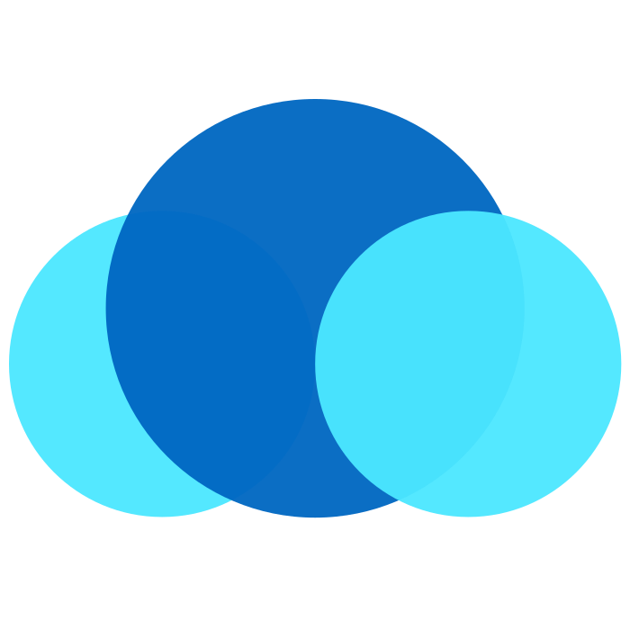 |
| cash-app |  |   |
| casse-o-player |  |   |
| castbox |  |   |
| castopod |  |   |
| castro |  |  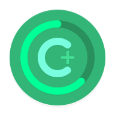 |
| catima |  |   |
| caustic |  |  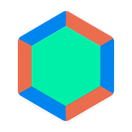 |
| ccleaner |  |   |
| cdek |  |  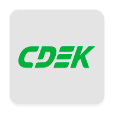 |
| celestia |  |  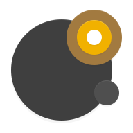 |
| centos | 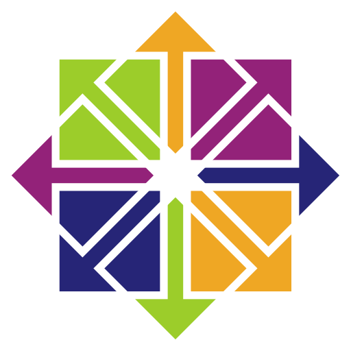 |  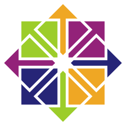 |
| ceph |  |  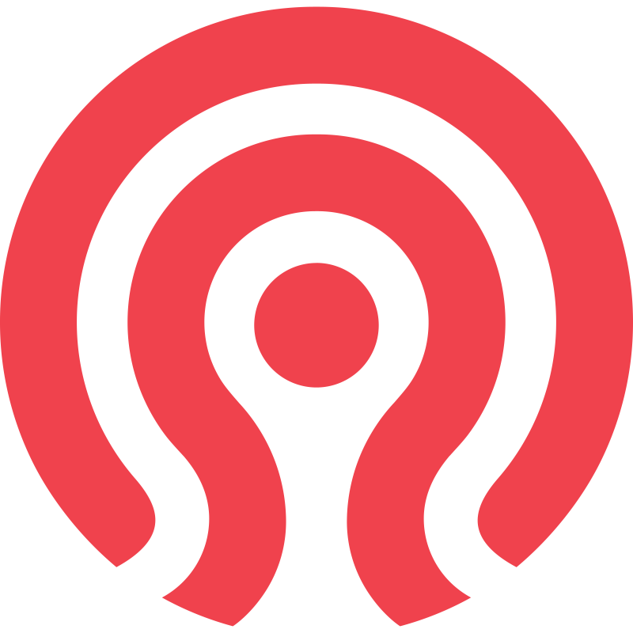 |
| cert-manager |  |   |
| cert-warden | 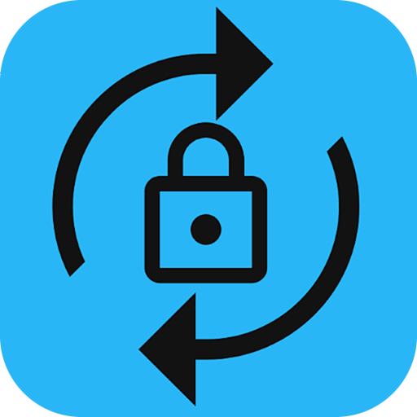 |  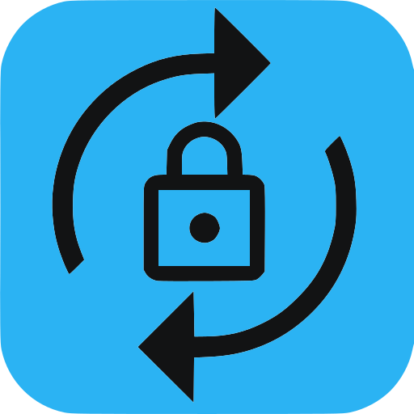 |
| chainguard | 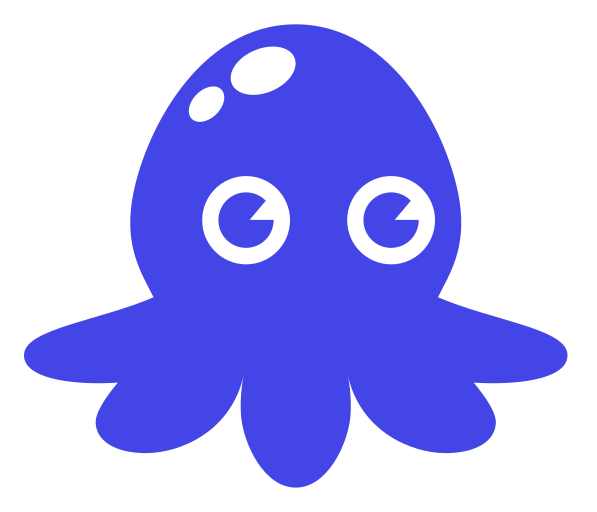 |   |
| changedetection |  |   |
| changedetection-io |  |   |
| channels |  |   |
| chatgpt |  |  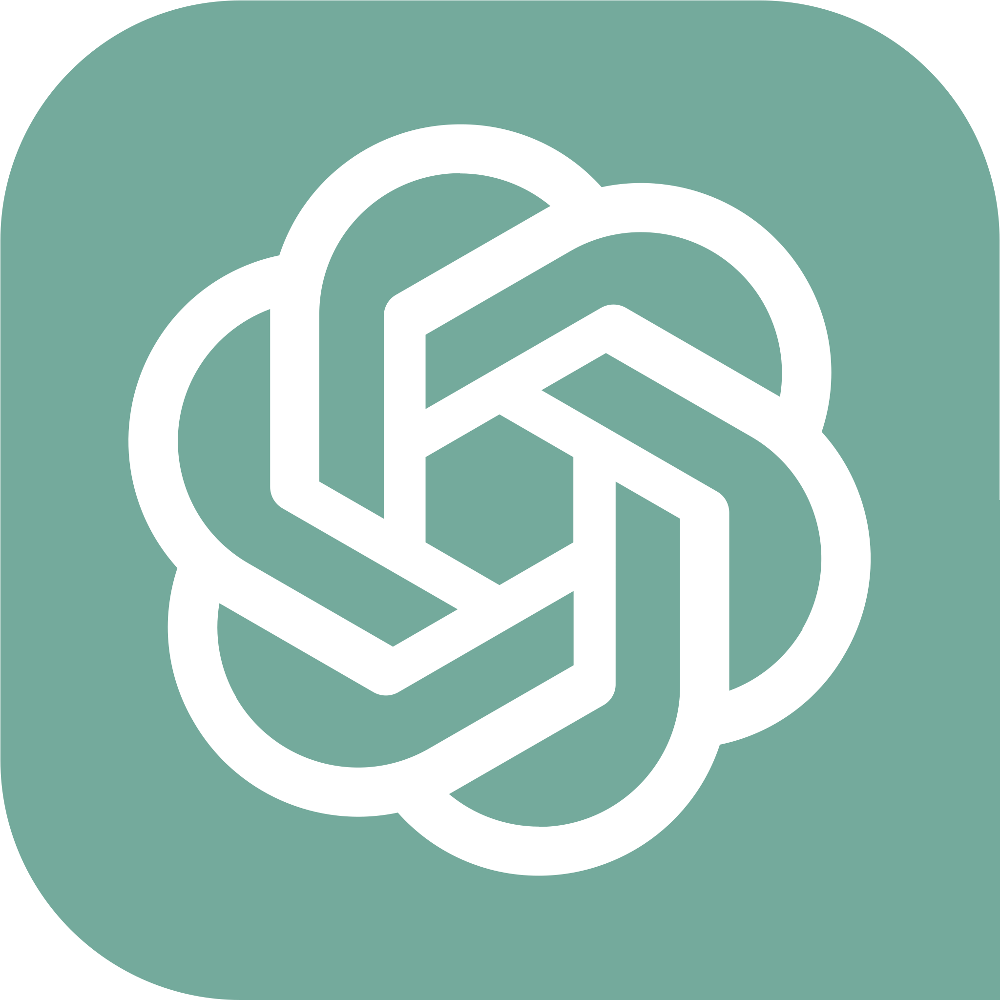 |
| chatpad-ai |  |   |
| check-engine |  |  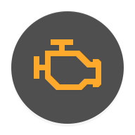 |
| checkmk | 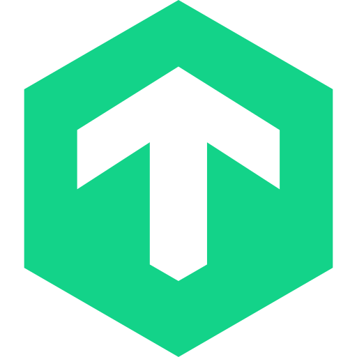 |   |
| cherry |  |   |
| chevereto |  |   |
| chiefonboarding |  |   |
| chipdip |  |  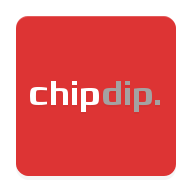 |
| chollometro |  |   |
| chowdown |  |   |
| chrome |  |   |
| chrome-beta |  |   |
| chrome-canary |  |   |
| chrome-dev |  |   |
| chrome-devtools | 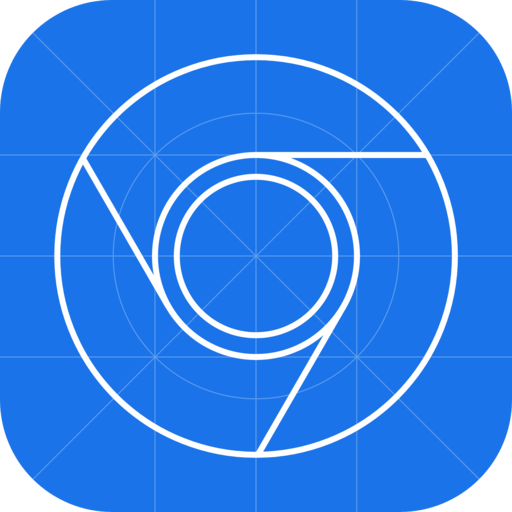 |   |
| chrome-remote-desktop |  |   |
| chromecast |  |   |
| chromecast-light |  |   |
| chromer-browser |  |   |
| chromium |  |   |
| chronograf |  |   |
| chronus |  |   |
| cilium | 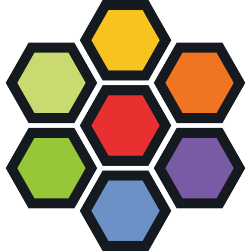 |   |
| cinny | 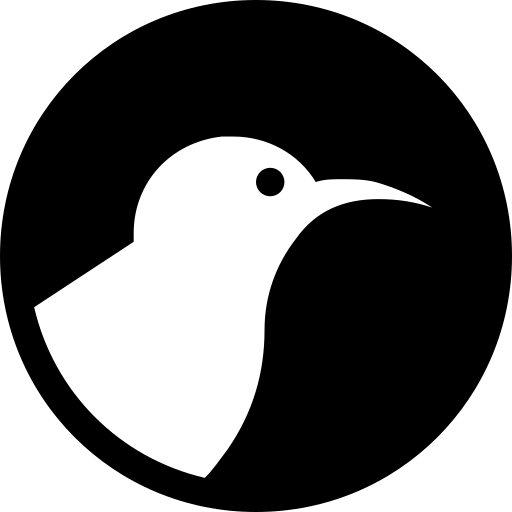 |   |
| cinny-light |  |   |
| circleci |  |   |
| cisco-anyconnect |  |  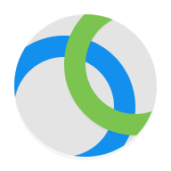 |
| cisco-logo | 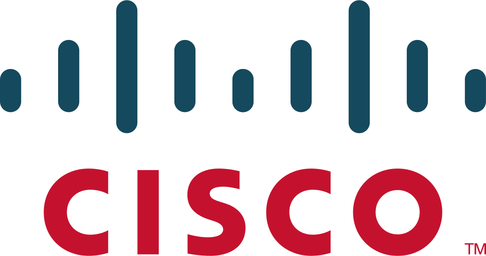 |   |
| citibanamex |  |  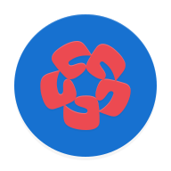 |
| citilink |  |   |
| citrix-receiver |  |   |
| citymapper |  |   |
| citymobil |  |   |
| clash |  |   |
| classdojo |  |   |
| clean-music |  |   |
| cleartrip |  |   |
| clementine |  |   |
| clickup |  |  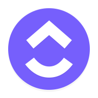 |
| clima |  |  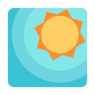 |
| clockify |  |  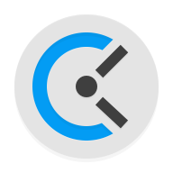 |
| clocksync |  |  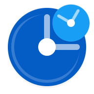 |
| closed-captioning |  |   |
| closed-captioning-light |  |   |
| cloud-native-computing-foundation |  |   |
| cloud-player-doubletwist |  |   |
| cloud66 |  |   |
| cloud9 | 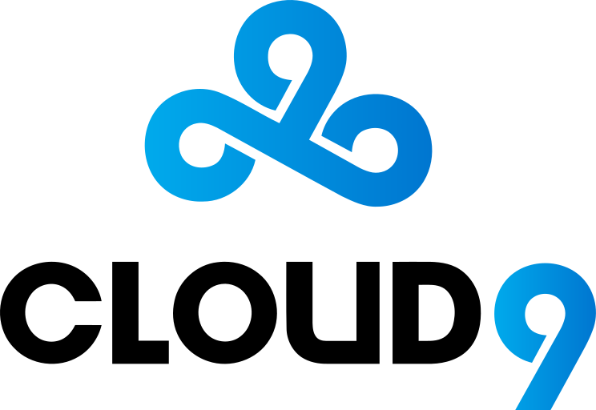 |   |
| cloudbeaver |  |   |
| cloudcmd |  |   |
| cloudflare |  |   |
| cloudflare-pages |  |   |
| cloudflare-zero-trust | 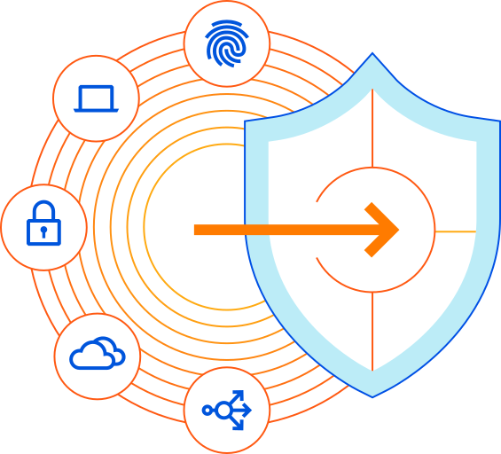 |  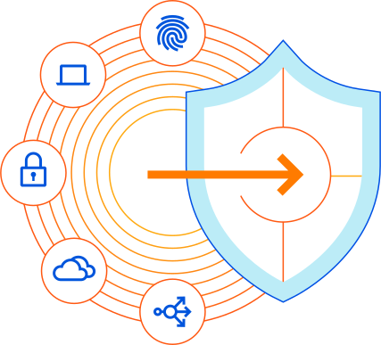 |
| cloudpanel | 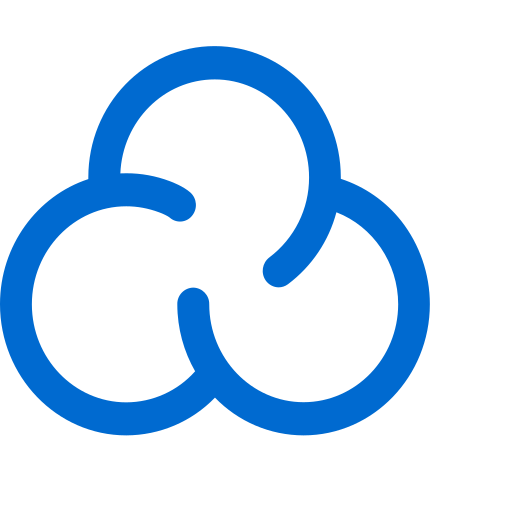 |   |
| cloudskipper-music-player |  |   |
| cloudstream |  |  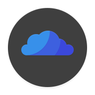 |
| cloudstream-beta |  |   |
| clue |  |   |
| cm-browser |  |  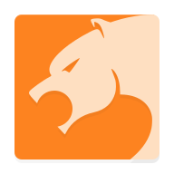 |
| cnn |  |   |
| cockpit |  |   |
| cockpit-cms |  |   |
| cockpit-cms-light |  |   |
| code |  |   |
| code-server | 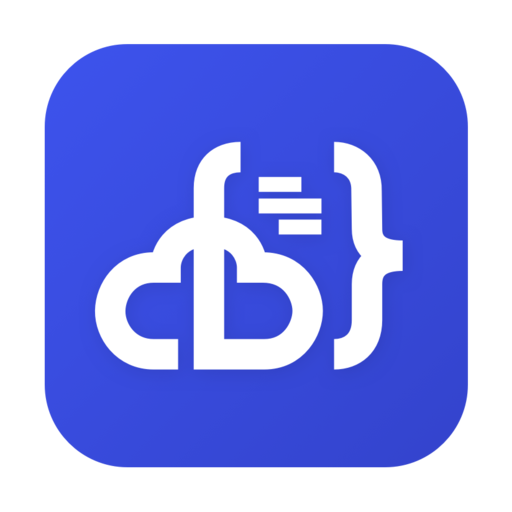 |   |
| codeberg | 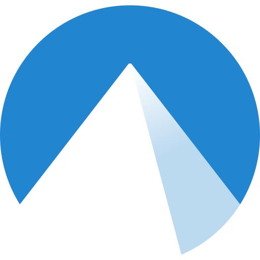 |   |
| coder |  |   |
| coder-light |  |   |
| codestats |  |   |
| codestats-light |  |   |
| codex |  |   |
| codimd |  |   |
| codimd-light |  |   |
| collabora-office |  |   |
| collabora-online-logo |  |   |
| color-chooser |  |   |
| comic-geeks |  |   |
| comics-viewer |  |   |
| comixology |  |   |
| commafeed |  |   |
| compass |  |   |
| composer |  |   |
| conan-exiles |  |   |
| concourse |  |   |
| connectips |  |   |
| consul |  |   |
| contabo |  |   |
| coocent-eq |  |   |
| cookmate |  |   |
| cookpad |  |   |
| coolify |  |   |
| core-keepers |  |   |
| coredns |  |   |
| coreos |  |   |
| corona-warn |  |   |
| cosign |  |   |
| costco-logo |  |   |
| coub |  |   |
| couchpotato |  |   |
| counter-strike-2 |  |   |
| counter-strike-global-offensive |  |   |
| coursera |  |   |
| covpass |  |   |
| cozy |  |   |
| cpanel |  |   |
| cpp |  |   |
| cpu-x |  |   |
| cpu-z |  |   |
| crafty-controller |  |   |
| crater-invoice |  |   |
| crayon |  |   |
| crazydomains |  |   |
| credit-karma |  |   |
| cribl-logo |  |   |
| cribl-logo-light |  |   |
| cricbuzz |  |   |
| cricheroes |  |   |
| cricket-exchange |  |   |
| cricket-line-guru |  |   |
| cricline |  |   |
| cronometer |  |   |
| cross-seed |  |   |
| cross-seed-square |  |   |
| crowdsec |  |   |
| crunchyroll |  |   |
| cryptfs-password |  |   |
| cryptomator |  |   |
| cryptopass |  |   |
| cryptpad |  |   |
| csploit |  |   |
| css |  |   |
| ctemplar |  |   |
| cube-black |  |   |
| cube-blueberry |  |   |
| cube-teal |  |   |
| cups |  |   |
| cups-light |  |   |
| cura |  |   |
| curl |  |   |
| cute-cut |  |   |
| cx-file-explorer |  |   |
| cyberchef |  |   |

[[HOME](..)][[#](directory.md)][[A](directory-a.md)][[B](directory-b.md)][[C](directory-c.md)][[D](directory-d.md)][[E](directory-e.md)][[F](directory-f.md)][[G](directory-g.md)][[H](directory-h.md)][[I](directory-i.md)][[J](directory-j.md)][[K](directory-k.md)][[L](directory-l.md)][[M](directory-m.md)][[N](directory-n.md)][[O](directory-o.md)][[P](directory-p.md)][[Q](directory-q.md)][[R](directory-r.md)][[S](directory-s.md)][[T](directory-t.md)][[U](directory-u.md)][[V](directory-v.md)][[W](directory-w.md)][[X](directory-x.md)][[Y](directory-y.md)][[Z](directory-z.md)]

