# Awesome Dashboard Icons

[[HOME](..)][[#](directory.md)][[A](directory-a.md)][[B](directory-b.md)][[C](directory-c.md)][[D](directory-d.md)][[E](directory-e.md)][[F](directory-f.md)][[G](directory-g.md)][[H](directory-h.md)][[I](directory-i.md)][[J](directory-j.md)][[K](directory-k.md)][[L](directory-l.md)][[M](directory-m.md)][[N](directory-n.md)][[O](directory-o.md)][[P](directory-p.md)][[Q](directory-q.md)][[R](directory-r.md)][[S](directory-s.md)][[T](directory-t.md)][[U](directory-u.md)][[V](directory-v.md)][[W](directory-w.md)][[X](directory-x.md)][[Y](directory-y.md)][[Z](directory-z.md)]

# Directory: D

| Icon Name | PNG | SVG |
|-----------|-----|-----|
| d-link |  |   |
| d-link-wifi |  |   |
| d-notes |  |   |
| d00r |  |   |
| dahua |  |   |
| dailyart |  |   |
| dailyhunt |  |   |
| dart |  |  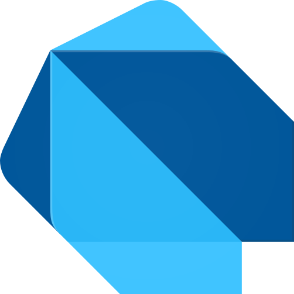 |
| dash-wallet |  |   |
| dashboard-icons |  |   |
| dashdot |  |   |
| dashlane |  |   |
| dashy |  |   |
| data-counter-widget |  |  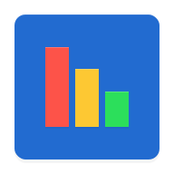 |
| data-monitor |  |   |
| databot |  |  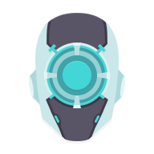 |
| datadex |  |   |
| datadog |  |  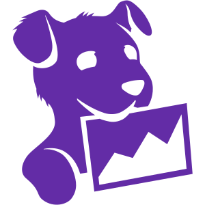 |
| dataeye |  |   |
| datovka |  |   |
| davis |  |   |
| davx-5 |  |   |
| day-z | 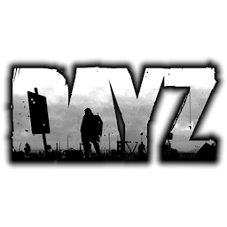 |   |
| dc-os |  |   |
| dd-wrt |  |   |
| dd-wrt-light | 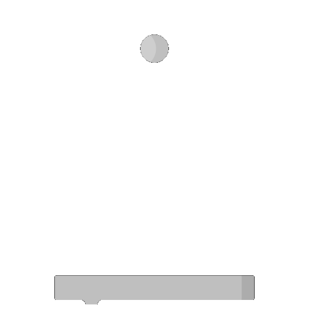 |   |
| ddns-updater |  |  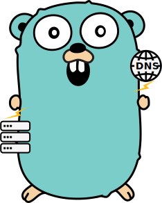 |
| deadbeef |  |   |
| debian |  |   |
| deemix |  |   |
| deezer |  |   |
| deflemask |  |   |
| deliveroo |  |   |
| dell |  |  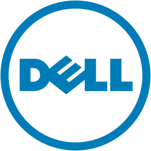 |
| dellin |  |   |
| deltachat |  |   |
| deluge |  |   |
| deno |  |   |
| deno-light |  |   |
| denon-logo |  |   |
| denon-logo-light |  |   |
| deployarr |  |   |
| derandom |  |  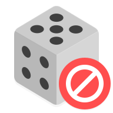 |
| detmir |  |   |
| develancacheui | 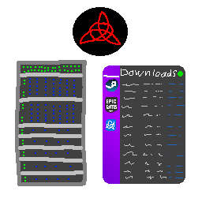 |   |
| devhub |  |   |
| deviantart |  |  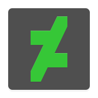 |
| devtooly |  |   |
| devtooly-light |  |   |
| diagrams-net |  |   |
| didi |  |   |
| didi-food |  |   |
| dietpi |  |   |
| difm-radio |  |  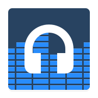 |
| digid |  |   |
| digilocker |  |   |
| digital-ocean |  |   |
| digital-ocean-logo |  |   |
| dijital-operator |  |   |
| dillinger |  |   |
| dim |  |   |
| dim-light | 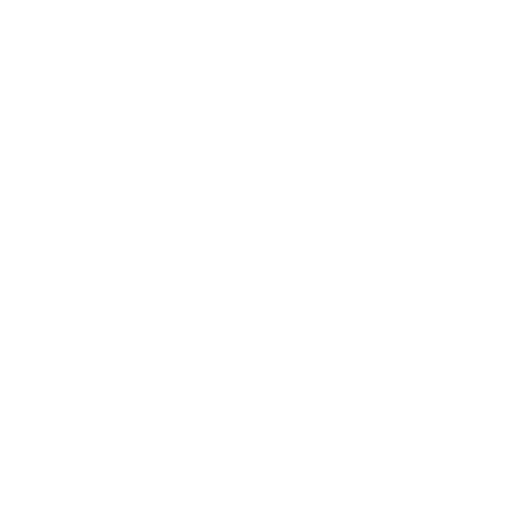 |   |
| dingtone |  |   |
| directadmin |  |   |
| directus | 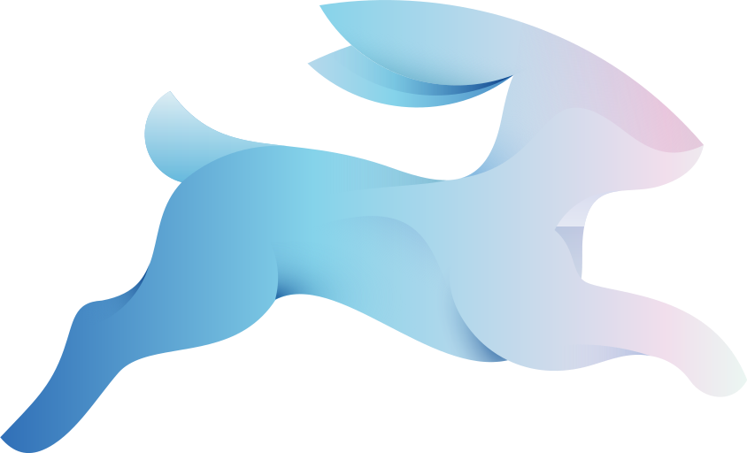 |  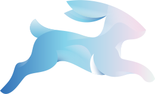 |
| discord |  |   |
| discourse |  |   |
| diskover | 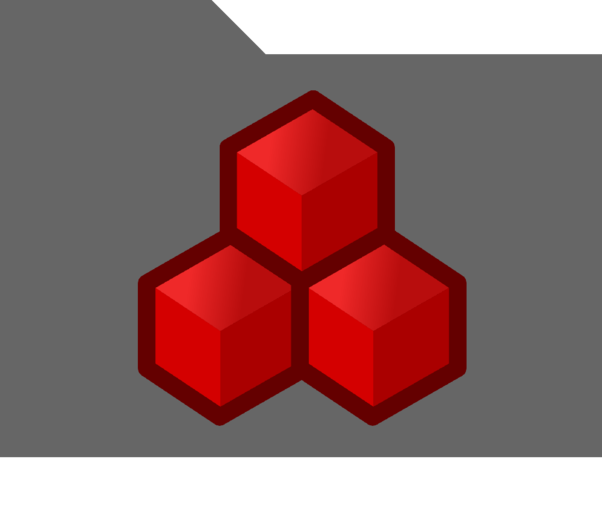 |   |
| disney-plus |  |   |
| disney-plus-logo |  |   |
| disney-plus-logo-light | 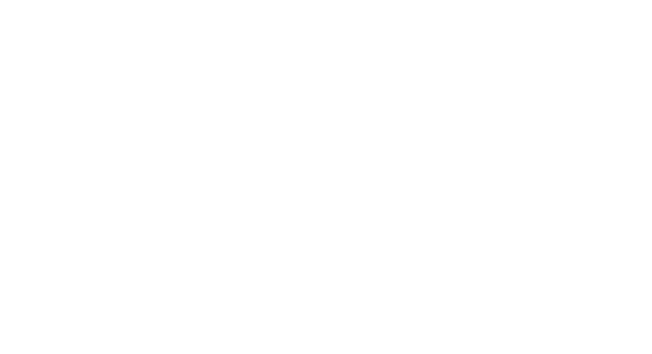 |   |
| disney-star-plus |  |   |
| diun |  |   |
| dixy |  |   |
| diyhue |  |   |
| dlna |  |   |
| dns66 |  |   |
| doc-scanner |  |   |
| dochki-sinochki |  |  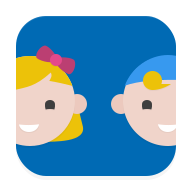 |
| docker |  |   |
| docker-alt |  |   |
| docker-compose |  |   |
| docker-gc |  |   |
| docker-mailserver |  |  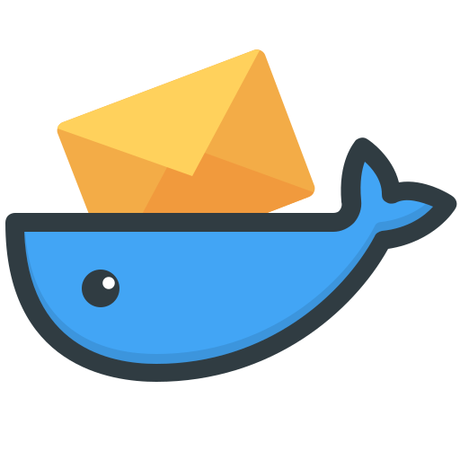 |
| docker-moby |  |   |
| dockge |  |   |
| dockge-light | 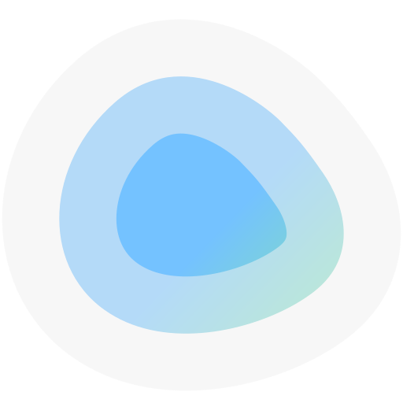 |   |
| docking-station |  |   |
| dockstarter | 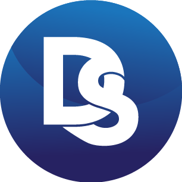 |   |
| docs-to-go |  |   |
| docs-viewer |  |   |
| docsify |  |  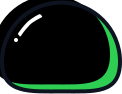 |
| docspell |  |  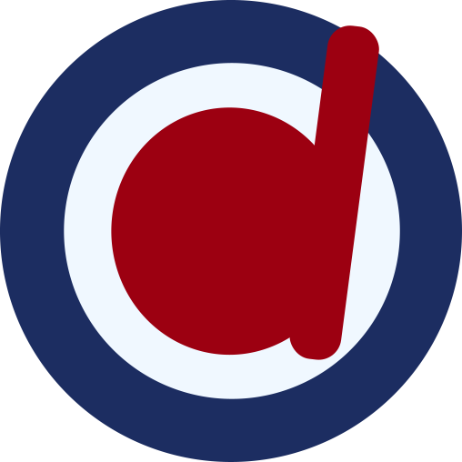 |
| doctolib |  |   |
| docusaurus | 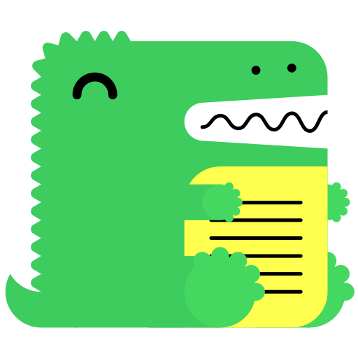 |   |
| docuseal |  |   |
| dogpile |  |   |
| dokuwiki | 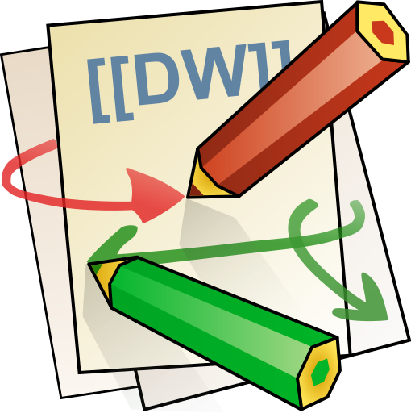 |   |
| dolibarr |  |   |
| dolphin | 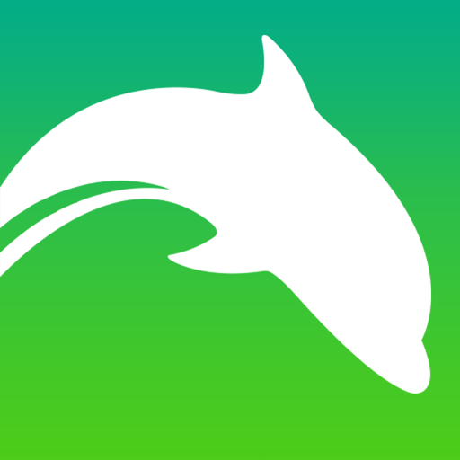 |   |
| dolphin-emu |  |   |
| dolphin-web-browser |  |   |
| dolphin-zero-browser |  |   |
| domainmod |  |   |
| domoticz |  |   |
| dont-starve-together | 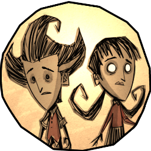 |   |
| dontkillmyapp |  |   |
| doodle |  |   |
| dopplertask |  |   |
| dosbox |  |  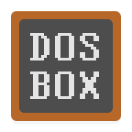 |
| dota |  |   |
| dota-2 |  |  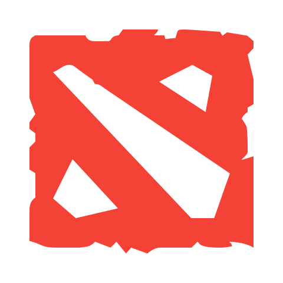 |
| dotnet |  |   |
| dotpict |  |   |
| double-take |  |   |
| double-twist-player |  |   |
| dove-icon-pack |  |  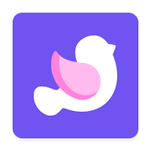 |
| dovecot-logo |  |   |
| dozzle |  |   |
| dpd |  |   |
| dragonflybsd |  |   |
| draw |  |   |
| draytek-logo |  |   |
| dreams-player |  |   |
| drink-water-reminder |  |   |
| driver-license |  |   |
| droid-ify |  |   |
| droidcam |  |   |
| drone-ci |  |   |
| dropbox |  |   |
| droppy |  |   |
| drum-pads-24 |  |   |
| drumpad |  |  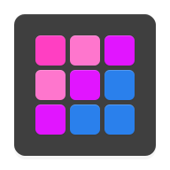 |
| drums |  |   |
| drupal |  |   |
| drupal-druplicon |  |   |
| drupe |  |   |
| drweb |  |   |
| drweb-mcc |  |   |
| du |  |   |
| dub-music-player |  |   |
| dub-studio-eq |  |   |
| duck-duck-go |  |   |
| duckdns |  |   |
| duckduckgo |  |   |
| dukto |  |   |
| duo |  |  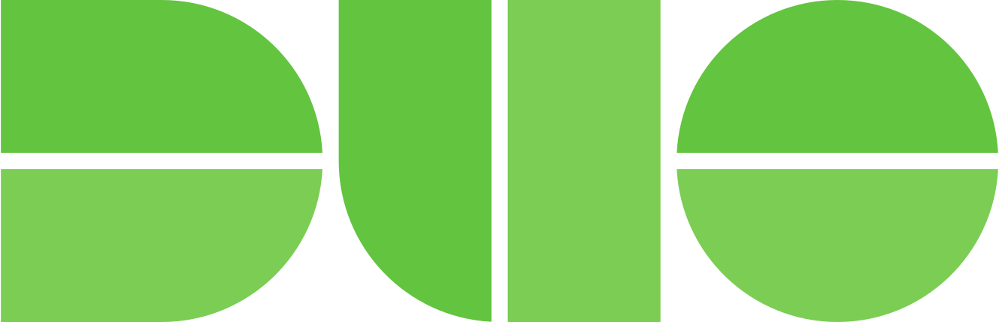 |
| duokan-reader |  |   |
| duolingo |  |  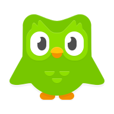 |
| duplicacy |  |   |
| duplicati |  |   |

[[HOME](..)][[#](directory.md)][[A](directory-a.md)][[B](directory-b.md)][[C](directory-c.md)][[D](directory-d.md)][[E](directory-e.md)][[F](directory-f.md)][[G](directory-g.md)][[H](directory-h.md)][[I](directory-i.md)][[J](directory-j.md)][[K](directory-k.md)][[L](directory-l.md)][[M](directory-m.md)][[N](directory-n.md)][[O](directory-o.md)][[P](directory-p.md)][[Q](directory-q.md)][[R](directory-r.md)][[S](directory-s.md)][[T](directory-t.md)][[U](directory-u.md)][[V](directory-v.md)][[W](directory-w.md)][[X](directory-x.md)][[Y](directory-y.md)][[Z](directory-z.md)]

