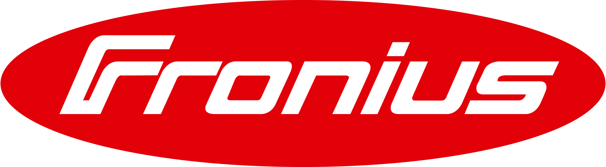

# Awesome Dashboard Icons

[[HOME](..)][[#](directory.md)][[A](directory-a.md)][[B](directory-b.md)][[C](directory-c.md)][[D](directory-d.md)][[E](directory-e.md)][[F](directory-f.md)][[G](directory-g.md)][[H](directory-h.md)][[I](directory-i.md)][[J](directory-j.md)][[K](directory-k.md)][[L](directory-l.md)][[M](directory-m.md)][[N](directory-n.md)][[O](directory-o.md)][[P](directory-p.md)][[Q](directory-q.md)][[R](directory-r.md)][[S](directory-s.md)][[T](directory-t.md)][[U](directory-u.md)][[V](directory-v.md)][[W](directory-w.md)][[X](directory-x.md)][[Y](directory-y.md)][[Z](directory-z.md)]

# Directory: F

| Icon Name | PNG | SVG |
|-----------|-----|-----|
| f-droid |  |   |
| f-sharp |  |   |
| f5-networks |  |   |
| fabulous |  |   |
| facebook |  |   |
| facebook-lite |  |   |
| facebook-messenger |  |   |
| facebook-pages |  |   |
| facer |  |   |
| faceunlock |  |   |
| factorio |  |   |
| factorio-alt |  |   |
| fairemail |  |   |
| falcon-christmas |  |   |
| far-manager |  |   |
| farming-simulator |  |   |
| fast |  |   |
| fast-com |  |   |
| fast-com-light |  |   |
| fasten |  |   |
| fastest-mini-browser |  |   |
| fasthub |  |   |
| fastmail |  |   |
| fbmessenger |  |   |
| fbmessenger-lite |  |   |
| fbreader |  |   |
| fedora |  |   |
| fedora-alt |  |   |
| feedback |  |   |
| feeder |  |   |
| feedly |  |   |
| feedly-classic |  |   |
| feishin |  |   |
| fennec |  |   |
| fenrus |  |   |
| fenrus-light |  |   |
| ferdi |  |   |
| ferdium |  |   |
| fermentrack |  |   |
| ferretdb |  |   |
| ferretdb-light |  |   |
| fidelity-investments |  |   |
| figma |  |   |
| fiinote |  |   |
| file-commander |  |   |
| file-manager-alpha |  |   |
| filebot |  |   |
| filebrowser |  |   |
| filecloud |  |   |
| filecloud-light |  |   |
| fileflows |  |   |
| filegator |  |   |
| filemaster |  |   |
| filepizza |  |   |
| filerun |  |   |
| files |  |   |
| filezilla |  |   |
| filmigo |  |   |
| filmorago |  |   |
| finamp |  |   |
| finamp-dark |  |   |
| finamp-light |  |   |
| findroid |  |   |
| findroid-dark |  |   |
| findroid-light |  |   |
| fios |  |   |
| fios-light |  |   |
| firebase |  |   |
| firefly |  |   |
| firefly-iii |  |   |
| firefox |  |   |
| firefox-beta |  |   |
| firefox-developer-edition |  |   |
| firefox-focus |  |   |
| firefox-lite |  |   |
| firefox-nightly |  |   |
| firefox-reality |  |   |
| firefox-send |  |   |
| firefox-trunk |  |   |
| fireshare |  |   |
| firewalla |  |   |
| fitbit |  |   |
| fite-tv |  |   |
| fitify |  |   |
| fiton |  |   |
| fixprice |  |   |
| fl-studio-mobile |  |   |
| flame |  |   |
| flaresolverr |  |   |
| flarum |  |   |
| flat-notes |  |   |
| flathub |  |   |
| flatnotes |  |   |
| flatpak |  |   |
| flatpak-dark |  |   |
| flatpak-light |  |   |
| fleksy |  |   |
| flexget |  |   |
| flick-launcher |  |   |
| flick-launcher-pro |  |   |
| flickr |  |   |
| flightaware |  |   |
| flightradar24 |  |   |
| flipaclip |  |   |
| flipboard |  |   |
| flipboard-briefing |  |   |
| flipkart |  |   |
| flitsmeister |  |   |
| flo |  |   |
| flogo |  |   |
| flood |  |   |
| florisboard |  |   |
| florisboard-beta |  |   |
| flud |  |   |
| fluent-reader |  |   |
| fluffychat |  |   |
| fluidd |  |   |
| flux |  |   |
| flux-cd |  |   |
| flv-player |  |   |
| flv-video-player |  |   |
| fly-io |  |   |
| fm-player |  |   |
| fng |  |   |
| fns |  |   |
| focalboard |  |   |
| focus-to-do |  |   |
| folder-player |  |   |
| foldingathome |  |   |
| folium |  |   |
| followers-and-unfollowers |  |   |
| fontawesome |  |   |
| foobar2000 |  |   |
| foodpanda |  |   |
| fooducate |  |   |
| forest |  |   |
| forgejo |  |   |
| forgerock |  |   |
| forti-token |  |   |
| forticlient |  |   |
| forticlient-legacy |  |   |
| forticlient-vpn |  |   |
| fortinet |  |   |
| fortnite |  |   |
| foscam |  |   |
| fossil |  |   |
| fotmob |  |   |
| fotoable-music-player |  |   |
| fotocasa |  |   |
| foundry-vtt |  |   |
| foursquare |  |   |
| foxfi |  |   |
| foxit-mobile |  |   |
| foxit-pdfscanner |  |   |
| framework |  |   |
| franz |  |   |
| free-download-manager |  |   |
| free-software-foundation |  |   |
| freebox-delta |  |   |
| freebox-pop |  |   |
| freebox-revolution |  |   |
| freebsd |  |   |
| freeciv |  |   |
| freedombox |  |   |
| freeipa |  |   |
| freeletics |  |   |
| freenas |  |   |
| freenas-light |  |   |
| freenom |  |   |
| freeoffice-planmaker |  |   |
| freeoffice-planmaker-hd |  |   |
| freeoffice-presentations |  |   |
| freeoffice-presentations-hd |  |   |
| freeoffice-textmaker |  |   |
| freeoffice-textmaker-hd |  |   |
| freeotp |  |   |
| freepbx |  |   |
| freescout |  |   |
| freezer |  |   |
| freshping |  |   |
| freshrss |  |   |
| friendica |  |   |
| frigate |  |   |
| frigate-light |  |   |
| fritter |  |   |
| fronius |  |   |
| frost |  |   |
| frostwire |  |   |
| ftm |  |   |
| fulcio |  |   |
| funimate |  |   |
| funkwhale |  |   |
| fusionauth |  |   |
| fusionauth-light |  |   |
| fusionpbx |  |   |

[[HOME](..)][[#](directory.md)][[A](directory-a.md)][[B](directory-b.md)][[C](directory-c.md)][[D](directory-d.md)][[E](directory-e.md)][[F](directory-f.md)][[G](directory-g.md)][[H](directory-h.md)][[I](directory-i.md)][[J](directory-j.md)][[K](directory-k.md)][[L](directory-l.md)][[M](directory-m.md)][[N](directory-n.md)][[O](directory-o.md)][[P](directory-p.md)][[Q](directory-q.md)][[R](directory-r.md)][[S](directory-s.md)][[T](directory-t.md)][[U](directory-u.md)][[V](directory-v.md)][[W](directory-w.md)][[X](directory-x.md)][[Y](directory-y.md)][[Z](directory-z.md)]

