# Awesome Dashboard Icons

[[HOME](..)][[#](directory.md)][[A](directory-a.md)][[B](directory-b.md)][[C](directory-c.md)][[D](directory-d.md)][[E](directory-e.md)][[F](directory-f.md)][[G](directory-g.md)][[H](directory-h.md)][[I](directory-i.md)][[J](directory-j.md)][[K](directory-k.md)][[L](directory-l.md)][[M](directory-m.md)][[N](directory-n.md)][[O](directory-o.md)][[P](directory-p.md)][[Q](directory-q.md)][[R](directory-r.md)][[S](directory-s.md)][[T](directory-t.md)][[U](directory-u.md)][[V](directory-v.md)][[W](directory-w.md)][[X](directory-x.md)][[Y](directory-y.md)][[Z](directory-z.md)]

# Directory: G

| Icon Name | PNG | SVG |
|-----------|-----|-----|
| galaxy-store |  |   |
| galaxy-wearable |  |   |
| game-launcher |  |   |
| gamevault |  |   |
| gameyfin |  |   |
| gameyfin-light |  |   |
| gaps |  |   |
| garrys-mod |  |   |
| gaseous |  |   |
| gatsby |  |   |
| gatus |  |   |
| gboard |  |   |
| gcmob |  |   |
| gcstar |  |   |
| gcstar-scanner |  |  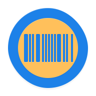 |
| gdmss-plus |  |  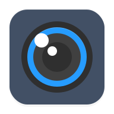 |
| gearcalculator |  |   |
| geckoview |  |   |
| geforce-now |  |   |
| geico |  |   |
| gemini |  |   |
| genius-scan |  |   |
| gentoo |  |  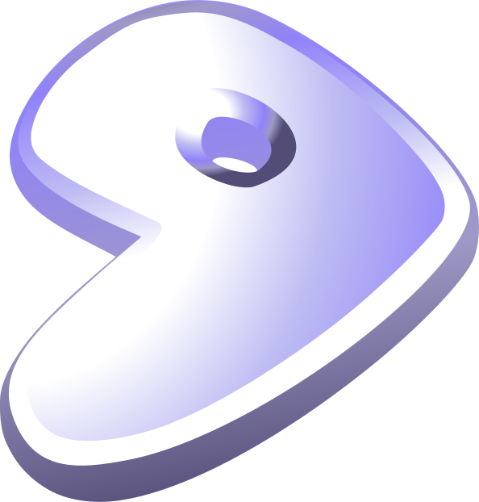 |
| geogebra-classic |  |  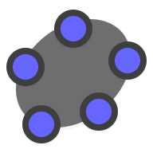 |
| geonet |  |  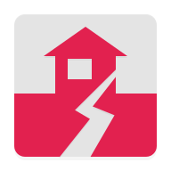 |
| geozilla |  |   |
| gerbera |  |   |
| get-iplayer |  |   |
| getapps |  |   |
| getcontact |  |   |
| getir |  |   |
| ghost |  |   |
| ghost-light |  |   |
| ghostery-privacy-browser |  |   |
| ghostfolio |  |   |
| gif-maker-editor |  |   |
| gif-me |  |   |
| gigaset |  |   |
| gimp |  |   |
| giphy |  |  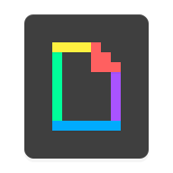 |
| git | 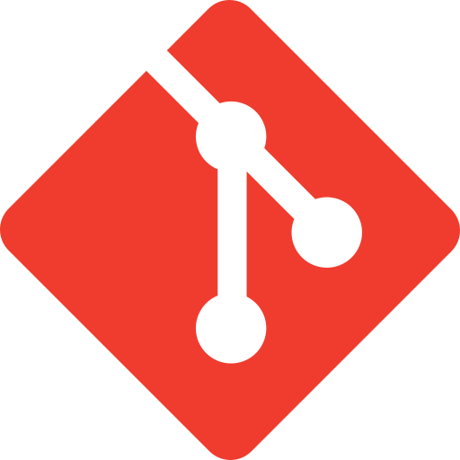 |   |
| gitbook |  |   |
| gitea |  |   |
| gitee |  |   |
| github |  |  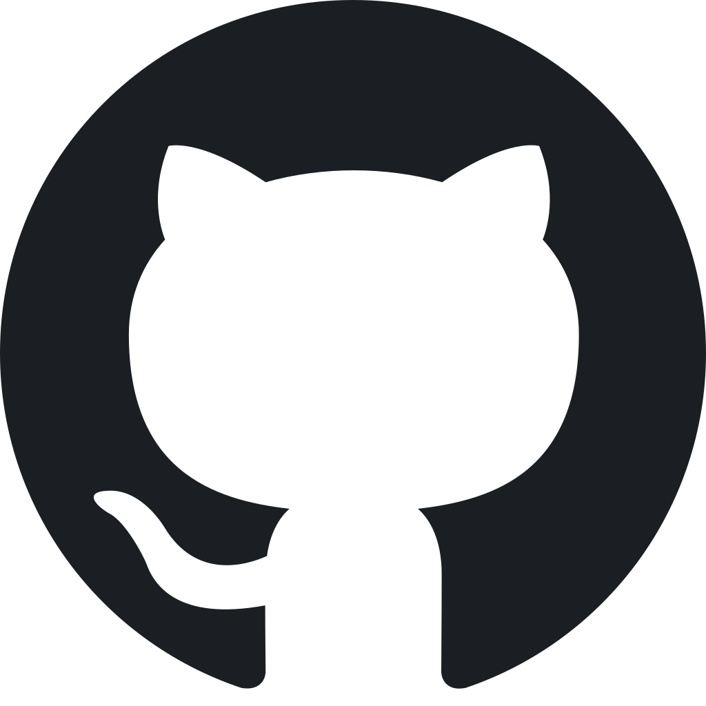 |
| github-light |  |   |
| gitkraken |  |  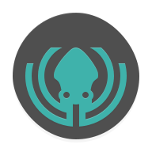 |
| gitlab |  |   |
| gitsign |  |   |
| gitter |  |   |
| gittigidiyor |  |   |
| gladys-assistant |  |   |
| glances | 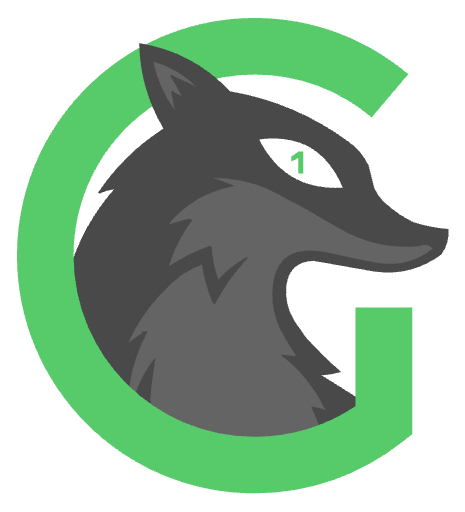 |   |
| glances-light |  |   |
| glassdoor |  |   |
| glasswire |  |   |
| glide |  |   |
| glitch-lab |  |   |
| glow |  |   |
| glpi |  |   |
| gluetun |  |   |
| gmail |  |   |
| go |  |   |
| go-launcher |  |   |
| go2rtc |  |   |
| go2rtc-alt |  |   |
| goaccess |  |   |
| gobenefits |  |   |
| godaddy | 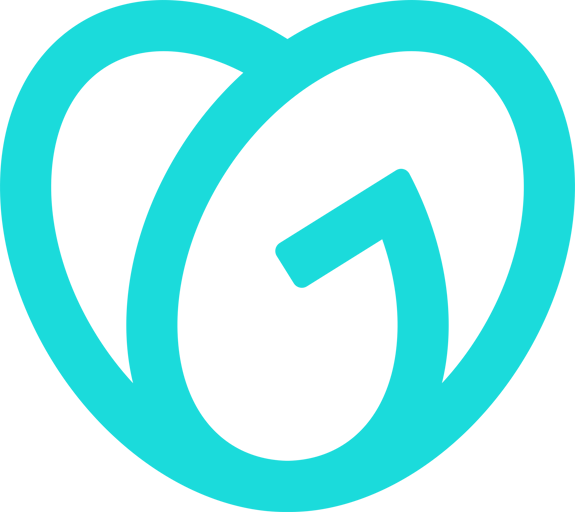 |   |
| godaddy-alt |  |   |
| gogs |  |   |
| goibibo |  |   |
| gojek |  |   |
| goldendict |  |   |
| goldex |  |   |
| gollum | 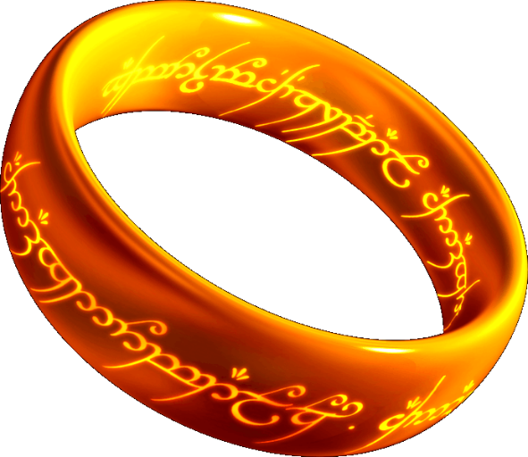 |   |
| golly |  |  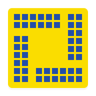 |
| gom-player |  |   |
| gonemad-music-player |  |   |
| gonic |  |   |
| goodreads |  |   |
| google |  |   |
| google-admin |  |   |
| google-admob |  |   |
| google-alerts |  |  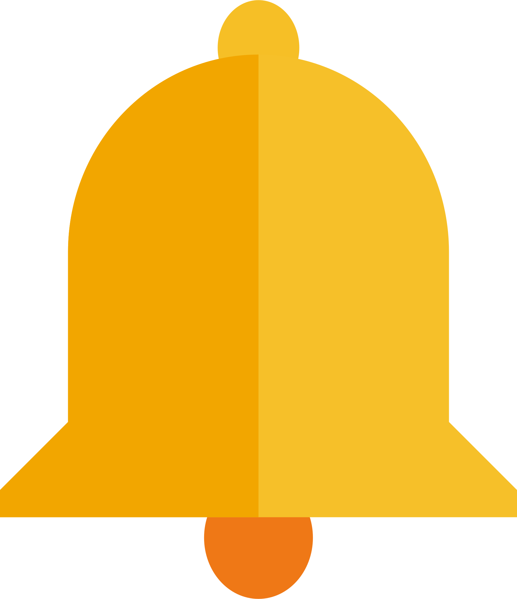 |
| google-analytics |  |   |
| google-assistant |  |   |
| google-calendar |  |   |
| google-chat |  |   |
| google-classroom |  |   |
| google-cloud-platform | 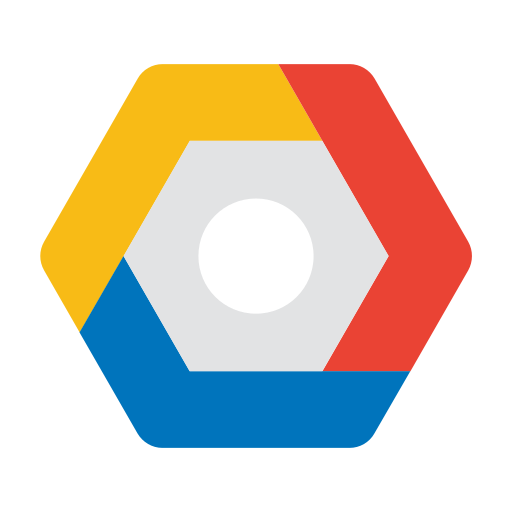 |   |
| google-cloud-print |  |   |
| google-compute-engine |  |   |
| google-contacts |  |   |
| google-docs |  |   |
| google-domains |  |   |
| google-drive |  |   |
| google-earth | 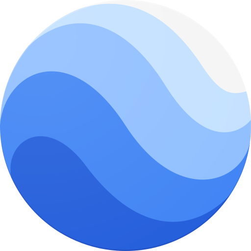 |   |
| google-fi |  |   |
| google-fit |  |   |
| google-fonts |  |  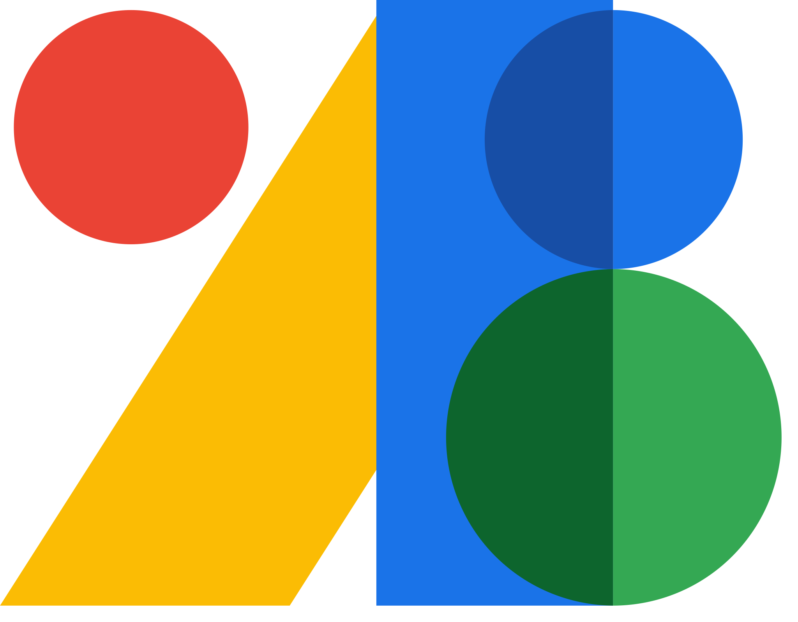 |
| google-forms |  |   |
| google-gemini |  |   |
| google-home |  |   |
| google-keep |  |   |
| google-lens | 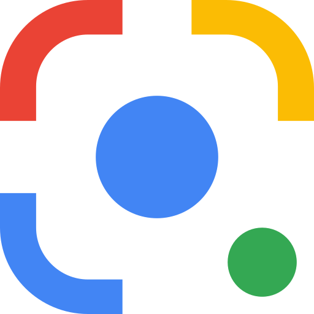 |  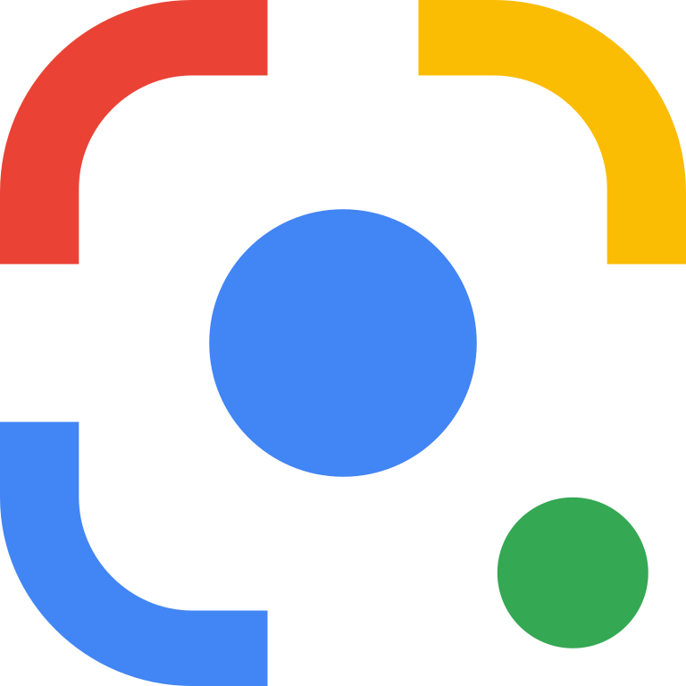 |
| google-mail |  |   |
| google-maps |  |   |
| google-meet |  |   |
| google-messages |  |   |
| google-news |  |   |
| google-one |  |   |
| google-pay |  |   |
| google-photos |  |   |
| google-play |  |   |
| google-play-books |  |   |
| google-play-games |  |   |
| google-podcasts |  |   |
| google-scholar |  |   |
| google-search-console |  |   |
| google-sheets |  |   |
| google-shopping |  |   |
| google-sites |  |   |
| google-slides |  |   |
| google-street-view |  |   |
| google-translate |  |   |
| google-tv |  |   |
| google-voice |  |   |
| google-wallet |  |   |
| google-wifi |  |   |
| gopro-quik |  |   |
| gosuslugi |  |   |
| gotify |  |   |
| gotomeeting |  |   |
| govbr |  |   |
| gplayer |  |   |
| gps-data |  |   |
| gpt4free |  |   |
| grab |  |   |
| grafana |  |   |
| grammarly |  |   |
| gramps |  |   |
| grandstream |  |   |
| graphie |  |   |
| grav |  |   |
| grav-light |  |   |
| graylog |  |  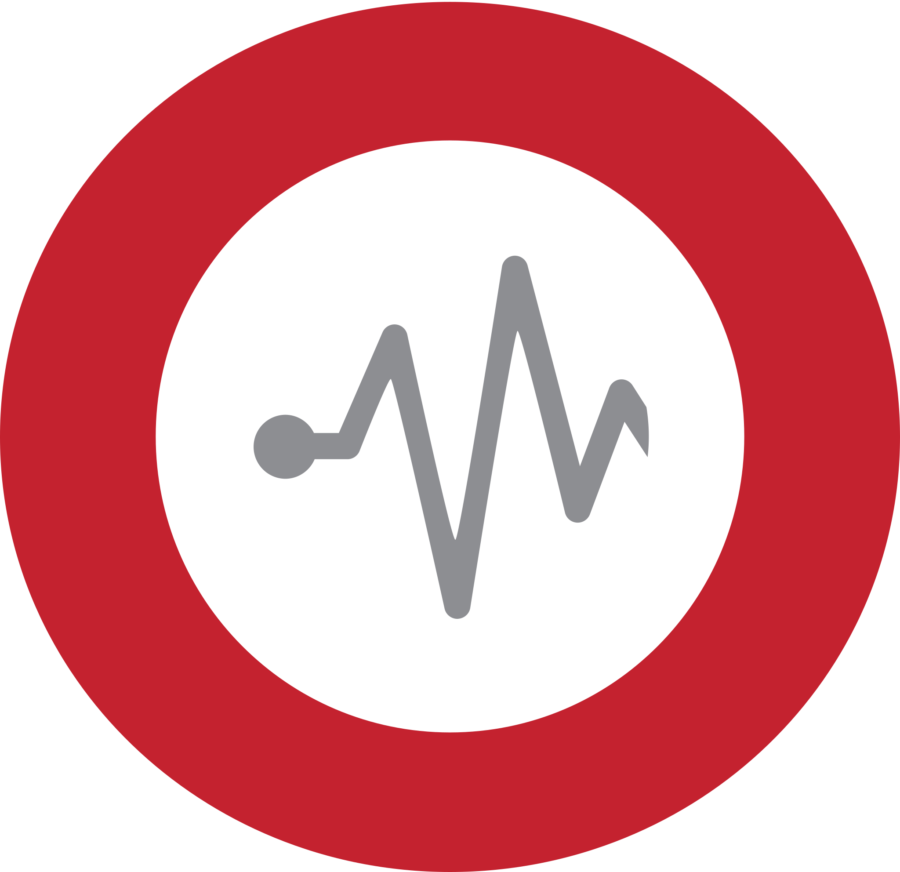 |
| green-apple-mp3-player |  |   |
| green-banana-music |  |   |
| green-bitcoin-wallet |  |   |
| greenbone |  |   |
| greentooth |  |  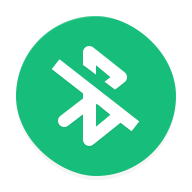 |
| grist |  |   |
| grocy |  |   |
| groovepad |  |   |
| groupme |  |   |
| grubhub |  |  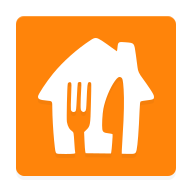 |
| grype | 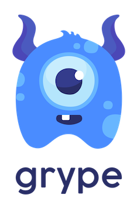 |   |
| gsam-battery-monitor |  |   |
| gta-5 |  |   |
| guacamole | 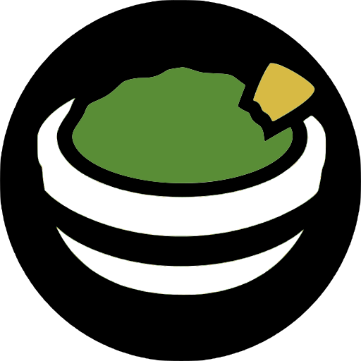 |   |
| guacamole-light |  |   |
| guardian |  |   |
| guest-suitecase |  |   |
| guilded |  |   |
| guitartuna |  |   |

[[HOME](..)][[#](directory.md)][[A](directory-a.md)][[B](directory-b.md)][[C](directory-c.md)][[D](directory-d.md)][[E](directory-e.md)][[F](directory-f.md)][[G](directory-g.md)][[H](directory-h.md)][[I](directory-i.md)][[J](directory-j.md)][[K](directory-k.md)][[L](directory-l.md)][[M](directory-m.md)][[N](directory-n.md)][[O](directory-o.md)][[P](directory-p.md)][[Q](directory-q.md)][[R](directory-r.md)][[S](directory-s.md)][[T](directory-t.md)][[U](directory-u.md)][[V](directory-v.md)][[W](directory-w.md)][[X](directory-x.md)][[Y](directory-y.md)][[Z](directory-z.md)]

