# Awesome Dashboard Icons

[[HOME](..)][[#](directory.md)][[A](directory-a.md)][[B](directory-b.md)][[C](directory-c.md)][[D](directory-d.md)][[E](directory-e.md)][[F](directory-f.md)][[G](directory-g.md)][[H](directory-h.md)][[I](directory-i.md)][[J](directory-j.md)][[K](directory-k.md)][[L](directory-l.md)][[M](directory-m.md)][[N](directory-n.md)][[O](directory-o.md)][[P](directory-p.md)][[Q](directory-q.md)][[R](directory-r.md)][[S](directory-s.md)][[T](directory-t.md)][[U](directory-u.md)][[V](directory-v.md)][[W](directory-w.md)][[X](directory-x.md)][[Y](directory-y.md)][[Z](directory-z.md)]

# Directory: H

| Icon Name | PNG | SVG |
|-----------|-----|-----|
| habit-browser |  |   |
| hackers-keyboard |  |   |
| halo-browser |  |  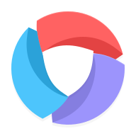 |
| hammond | 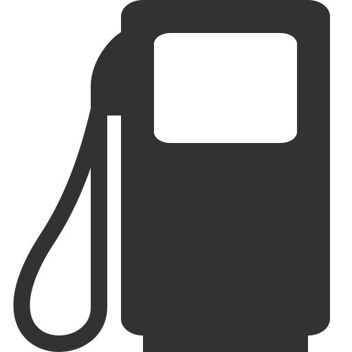 |   |
| hamro-patro |  |   |
| handbrake |  |   |
| haproxy | 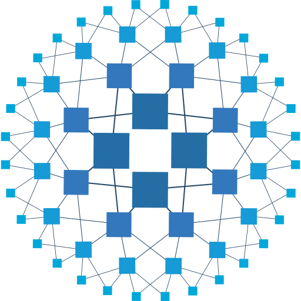 |   |
| harbor |  |   |
| hard-forum | 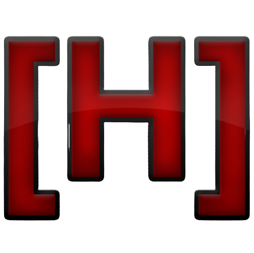 |   |
| harvester | 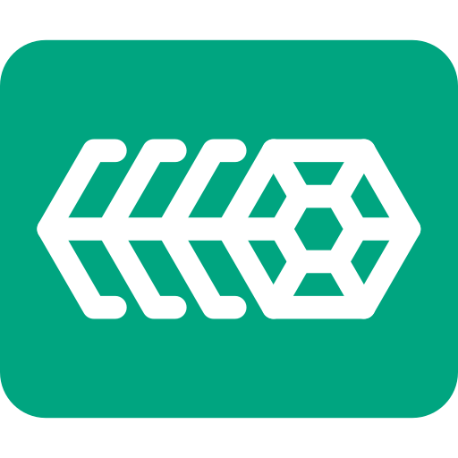 |   |
| hashdroid |  |   |
| hashicorp |  |   |
| hashicorp-light |  |   |
| hastypaste |  |   |
| hasura | 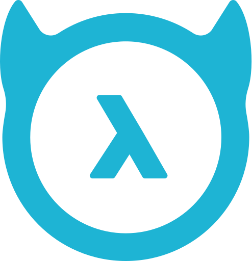 |   |
| hatsh |  |   |
| hatsh-light |  |   |
| hbo-max |  |   |
| hd-video-player |  |   |
| hd-videobox |  |  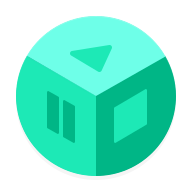 |
| hdhomerun |  |   |
| headphones |  |   |
| headscale |  |   |
| headspace |  |  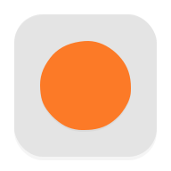 |
| healow |  |   |
| healthchecks |  |   |
| healthchecks-v2 | 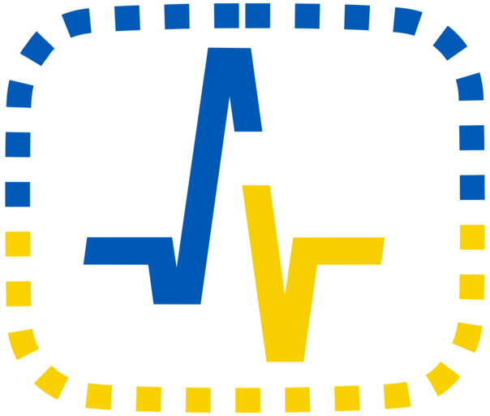 |   |
| heavens-above |  |   |
| hedgedoc |  |   |
| heimdall |  |   |
| heimdall-light |  |   |
| helium-token |  |   |
| helm |  |   |
| helo-babe |  |   |
| helper-scripts | 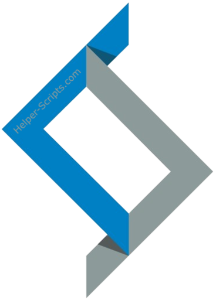 |   |
| hepsiburada |  |  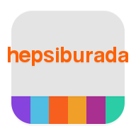 |
| here-ar |  |   |
| here-wego |  |   |
| heroku |  |   |
| hetzner | 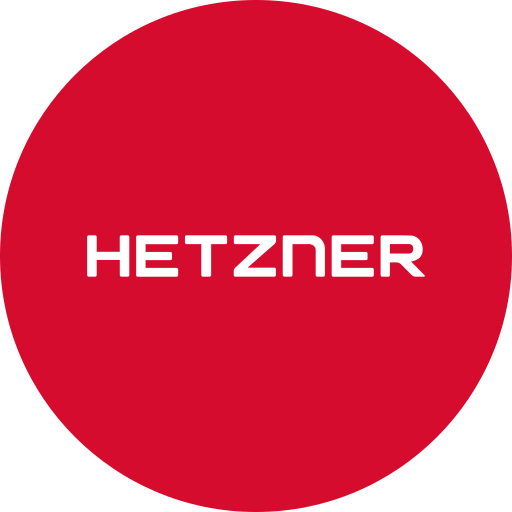 |  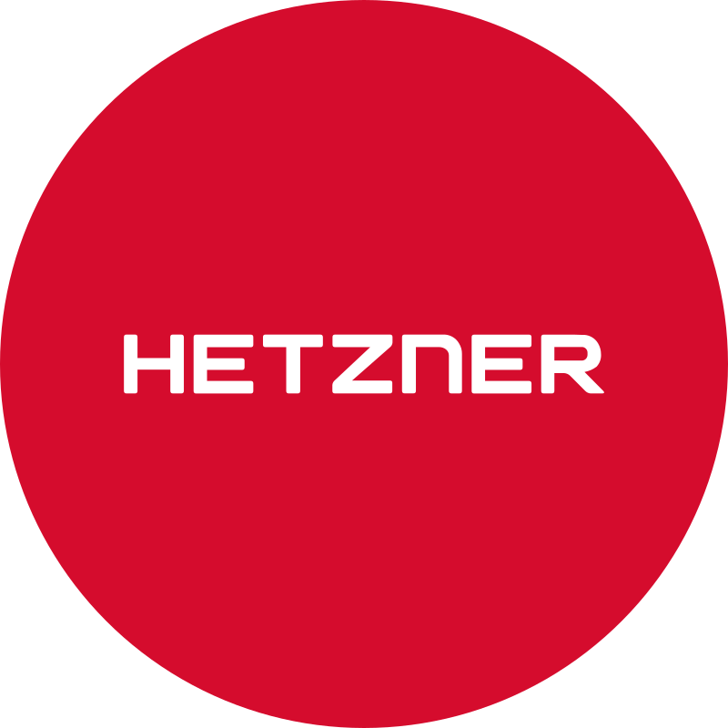 |
| hexo |  |   |
| hh |  |   |
| hi-bottle |  |   |
| hi-moment-apps |  |  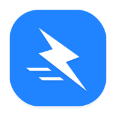 |
| hi-q-mp3-rec |  |   |
| hi-theme |  |  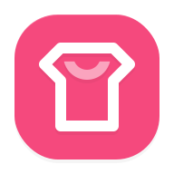 |
| hi-wallpaper |  |   |
| hidemy-name |  |   |
| hifiberry |  |   |
| hikvision-logo |  |   |
| hilook-logo |  |   |
| hios-launcher |  |   |
| hipchat |  |   |
| hive |  |   |
| hoarder |  |   |
| hoarder-light |  |   |
| holo-launcher |  |   |
| holo-launcher-froyo |  |   |
| holo-launcher-hd |  |   |
| holo-launcher-plus |  |   |
| homarr | 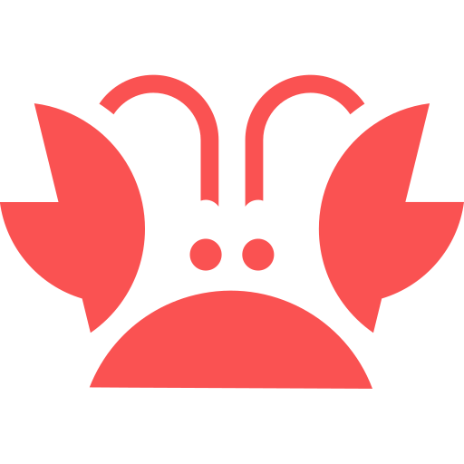 |   |
| home-assistant | 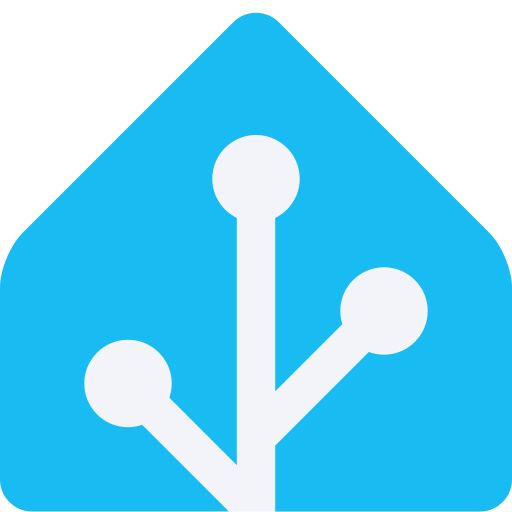 |   |
| home-assistant-alt | 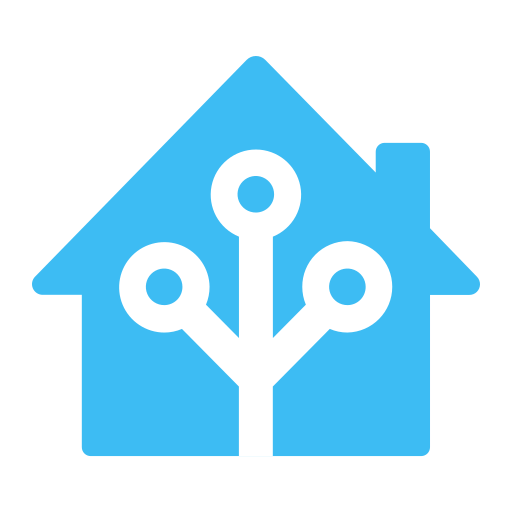 |   |
| home-assistant-light | 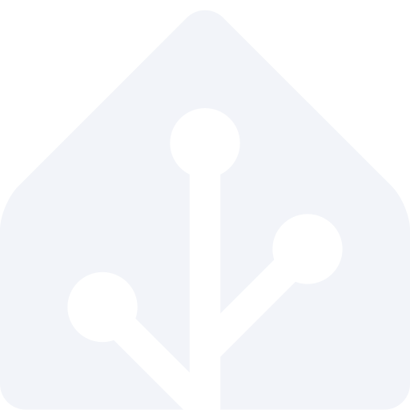 |   |
| home-workout |  |  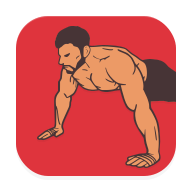 |
| home-workouts-gym-pro |  |  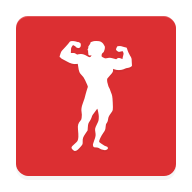 |
| homebox | 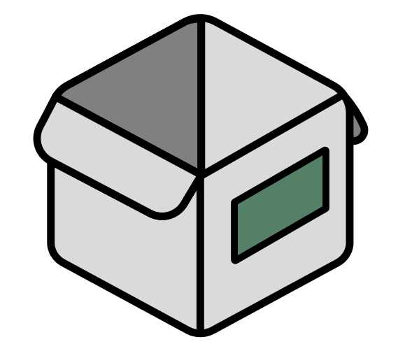 |   |
| homebrew |  |   |
| homebridge |  |   |
| homepage | 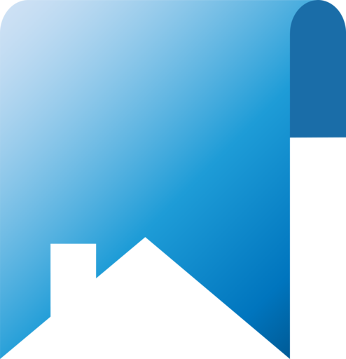 |   |
| homer | 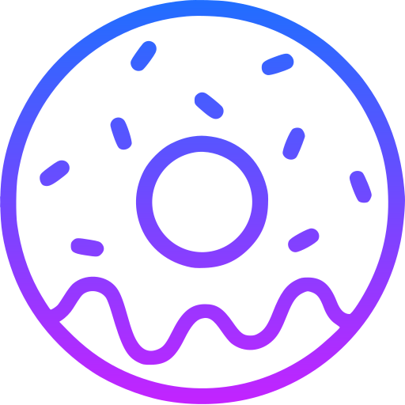 |  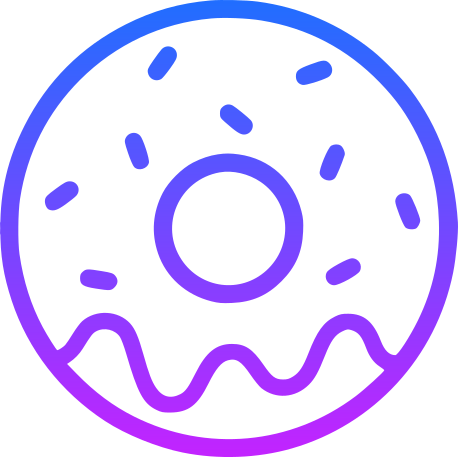 |
| homeseer | 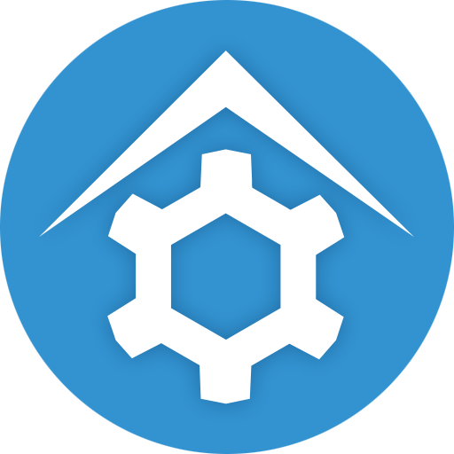 |   |
| homesnap |  |  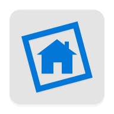 |
| homey |  |  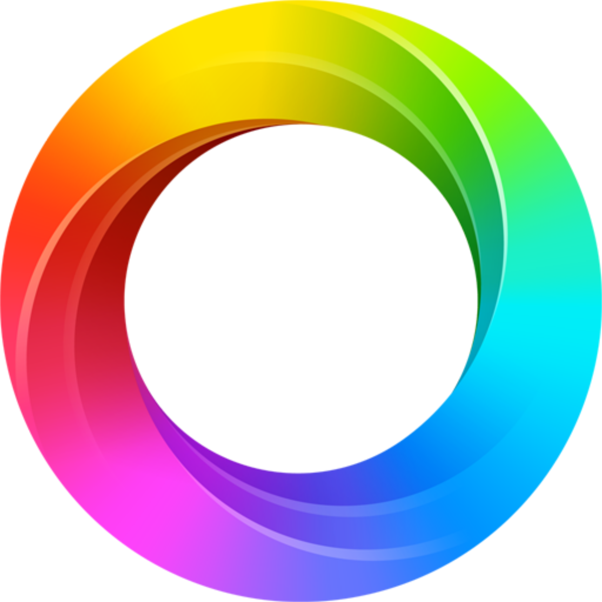 |
| homify |  |   |
| honeygain |  |   |
| hoobs |  |   |
| hoppscotch |  |   |
| hortusfox |  |   |
| hostinger | 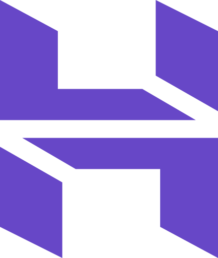 |   |
| hot-schedules |  |   |
| hotels-com |  |   |
| hotio | 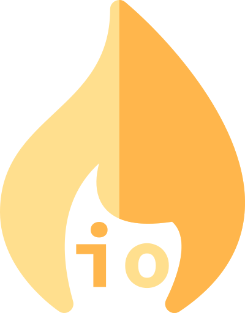 |   |
| hotmart-sparkle |  |   |
| hound |  |   |
| houzz |  |  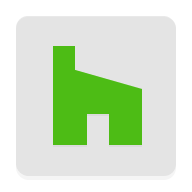 |
| hp |  |   |
| hp-dark |  |   |
| hp-light |  |   |
| htc-videoplayer |  |   |
| html |  |   |
| http-custom |  |   |
| huawei | 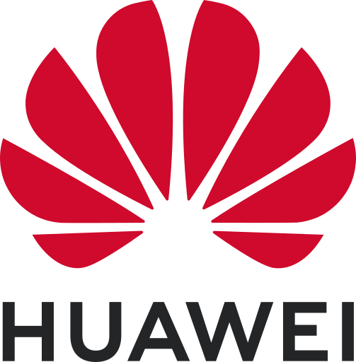 |   |
| huawei-appgallery |  |   |
| huawei-backup |  |   |
| huawei-health |  |   |
| huawei-hi-care |  |   |
| huawei-theme-manager |  |   |
| hubitat | 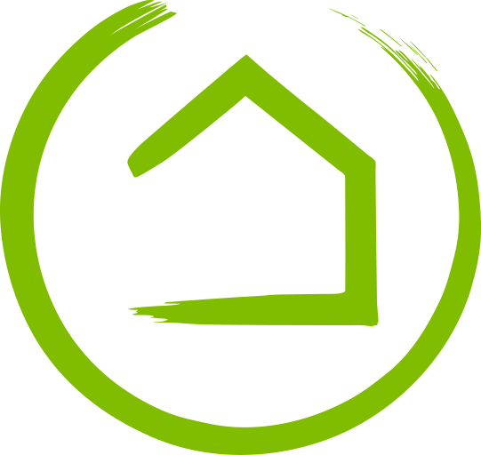 |   |
| hubstaff |  |   |
| hue |  |   |
| hugging-face |  |   |
| huginn |  |   |
| hugo |  |   |
| humhub | 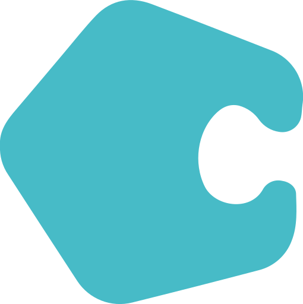 |   |
| hurry |  |   |
| hydra |  |   |
| hydro |  |  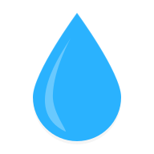 |
| hyperion |  |   |
| hyperion-launcher |  |   |
| hyperion-launcher-supreme |  |   |

[[HOME](..)][[#](directory.md)][[A](directory-a.md)][[B](directory-b.md)][[C](directory-c.md)][[D](directory-d.md)][[E](directory-e.md)][[F](directory-f.md)][[G](directory-g.md)][[H](directory-h.md)][[I](directory-i.md)][[J](directory-j.md)][[K](directory-k.md)][[L](directory-l.md)][[M](directory-m.md)][[N](directory-n.md)][[O](directory-o.md)][[P](directory-p.md)][[Q](directory-q.md)][[R](directory-r.md)][[S](directory-s.md)][[T](directory-t.md)][[U](directory-u.md)][[V](directory-v.md)][[W](directory-w.md)][[X](directory-x.md)][[Y](directory-y.md)][[Z](directory-z.md)]

