# Awesome Dashboard Icons

[[HOME](../README.md)][[#](directory.md)][[A](directory-a.md)][[B](directory-b.md)][[C](directory-c.md)][[D](directory-d.md)][[E](directory-e.md)][[F](directory-f.md)][[G](directory-g.md)][[H](directory-h.md)][[I](directory-i.md)][[J](directory-j.md)][[K](directory-k.md)][[L](directory-l.md)][[M](directory-m.md)][[N](directory-n.md)][[O](directory-o.md)][[P](directory-p.md)][[Q](directory-q.md)][[R](directory-r.md)][[S](directory-s.md)][[T](directory-t.md)][[U](directory-u.md)][[V](directory-v.md)][[W](directory-w.md)][[X](directory-x.md)][[Y](directory-y.md)][[Z](directory-z.md)]

# Directory: I

| Icon Name | PNG | SVG |
|-----------|-----|-----|
| i2p |  |  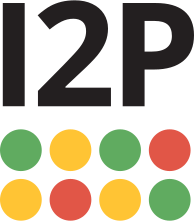 |
| i2p-light | 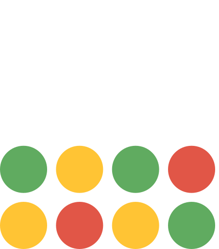 |   |
| i2pd |  |   |
| ibispaint-x | 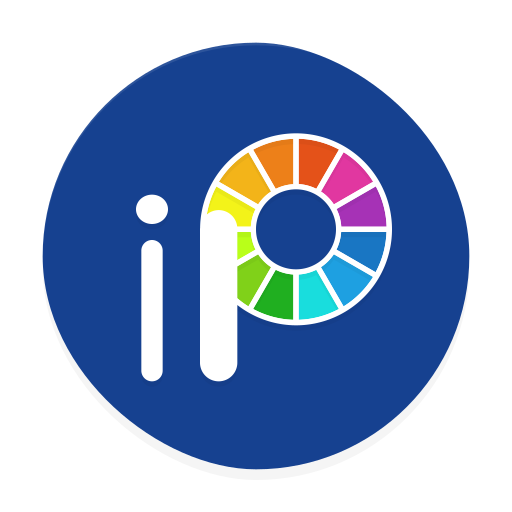 |   |
| ibkr-mobile |  |   |
| ibm-logo | 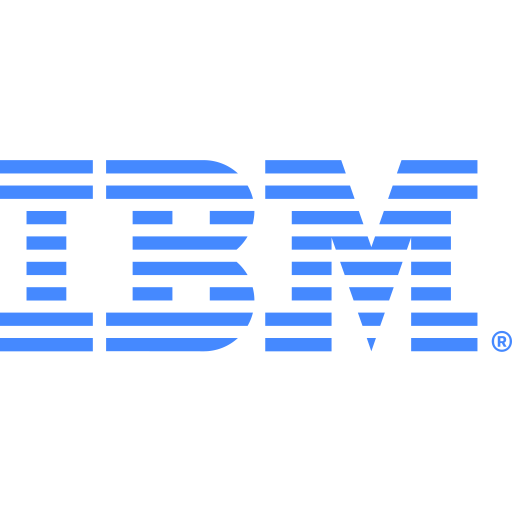 |   |
| ibm-logo-dark |  |   |
| ibm-rebus | 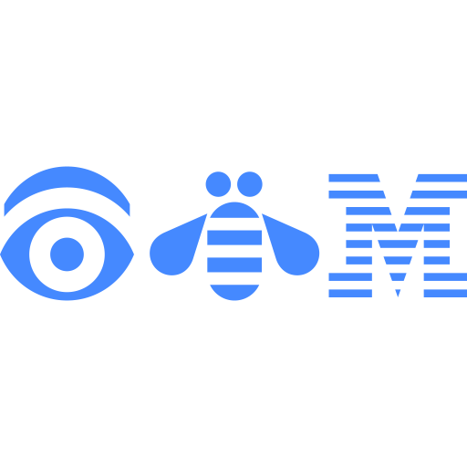 |   |
| ibm-rebus-dark |  |   |
| icarros |  |   |
| icecast | 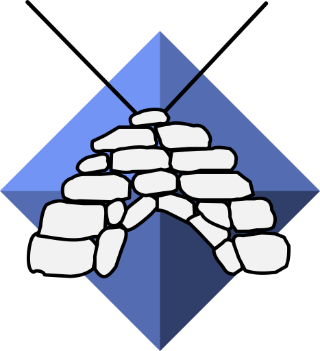 |  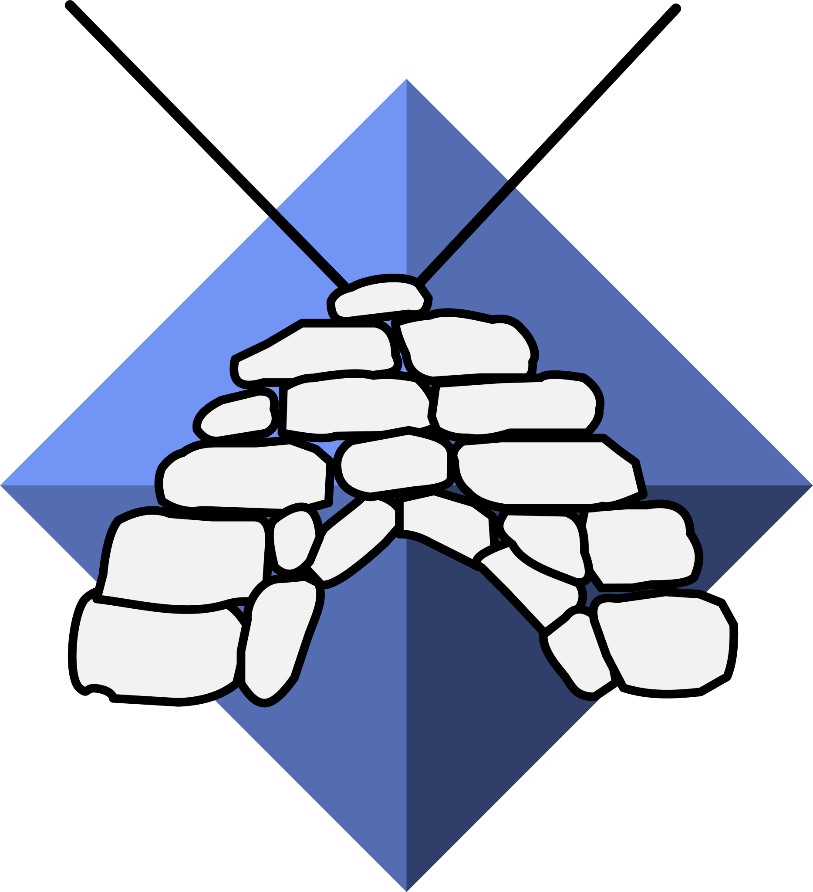 |
| iceraven |  |   |
| icinga | 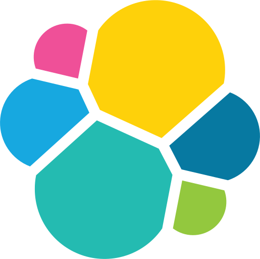 |   |
| icq |  |   |
| icsimport |  |   |
| idealista |  |   |
| idle-daddy | 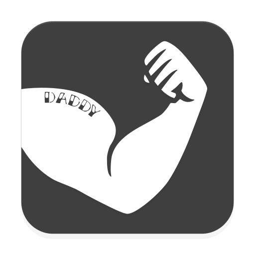 |  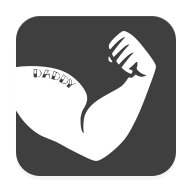 |
| idn |  |   |
| idrac |  |   |
| ifood |  |   |
| ifttt | 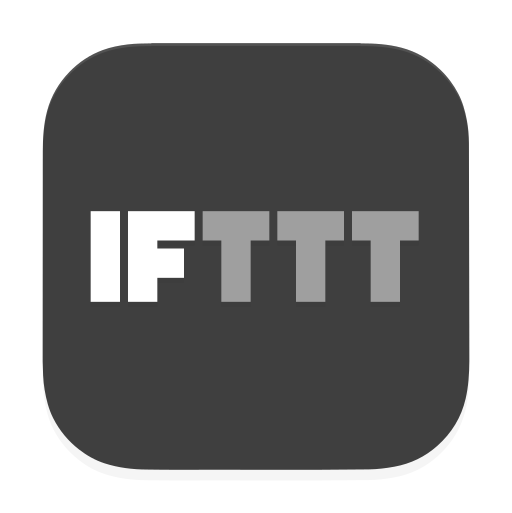 |   |
| ihatemoney |  |   |
| iherb |  |   |
| ijoy-music-player |  |   |
| ikea |  |   |
| ile-de-beaute | 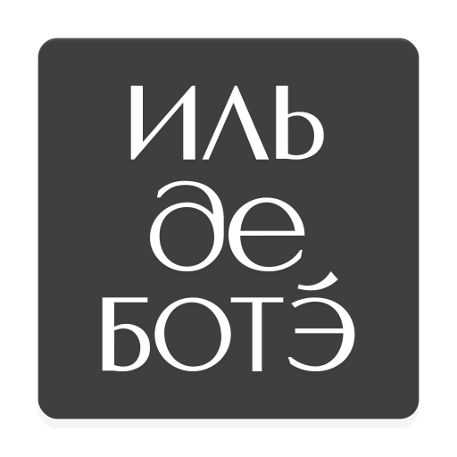 |  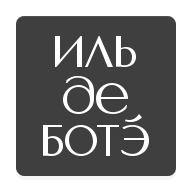 |
| ilo |  |   |
| imagepipe |  |  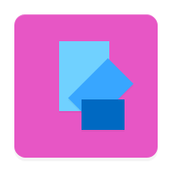 |
| imagin | 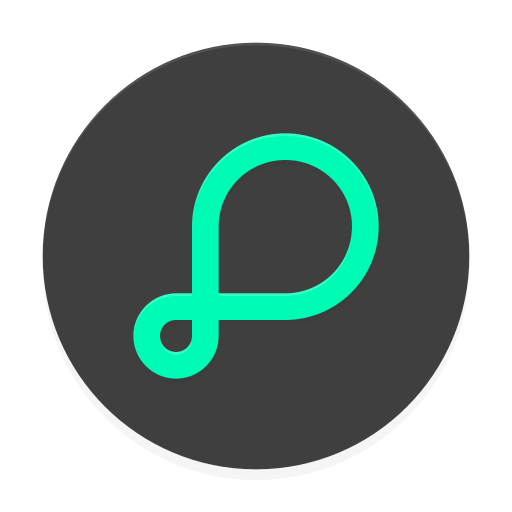 |  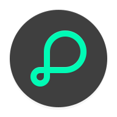 |
| imdb |  |   |
| imgur |  |   |
| immich | 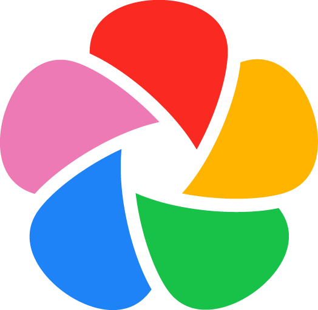 |   |
| immich-kiosk | 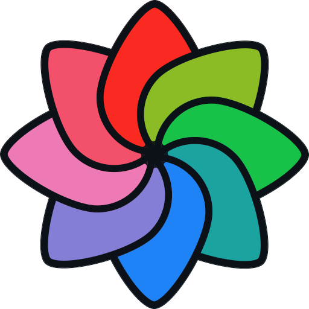 |  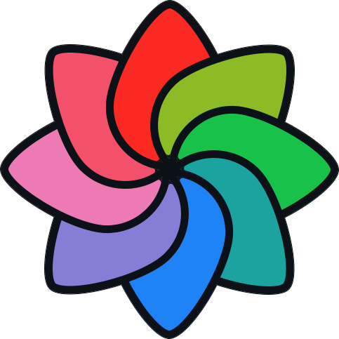 |
| imo |  |   |
| inbrowser |  |   |
| incognito-browser |  |   |
| indeed-job-search |  |   |
| indriver |  |   |
| infinity | 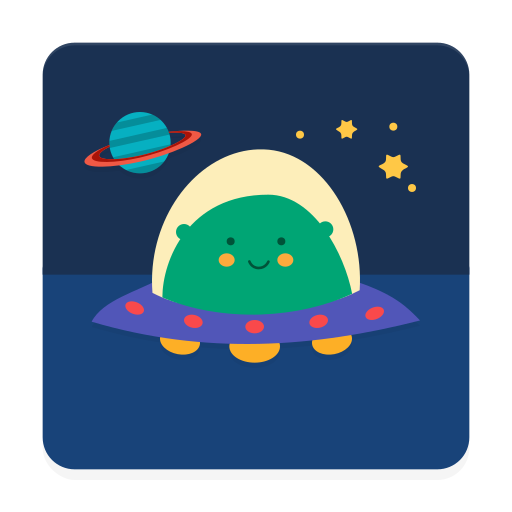 |   |
| influx | 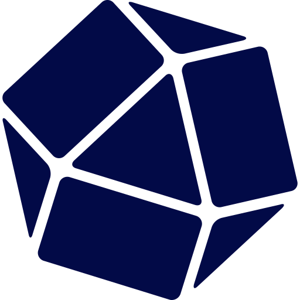 |   |
| influxdb |  |   |
| infoblox |  |   |
| ing-banking |  |  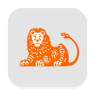 |
| ingenuity-eq-player | 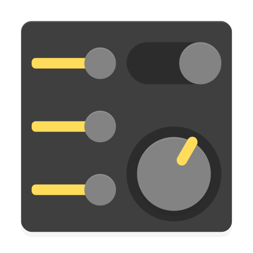 |   |
| inkhunter |  |  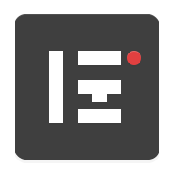 |
| inkscape | 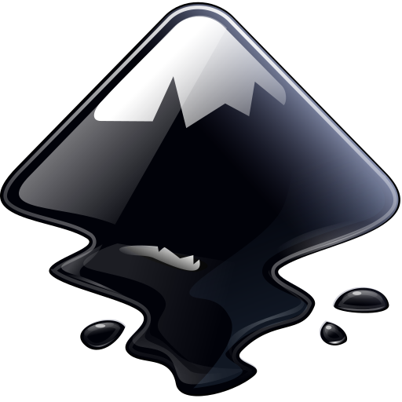 |   |
| inoreader |  |   |
| insanelymac |  |   |
| inshorts |  |   |
| inshot |  |   |
| instagram |  |   |
| intel | 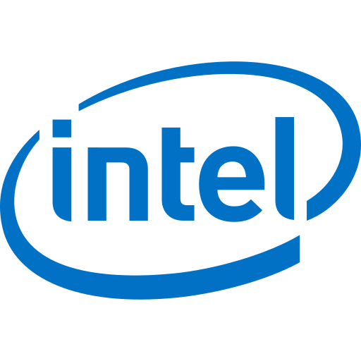 |   |
| intel-logo | 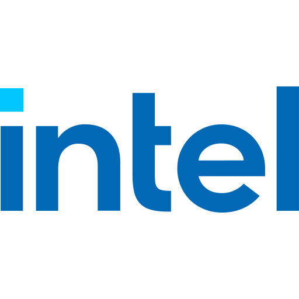 |   |
| intercept-x | 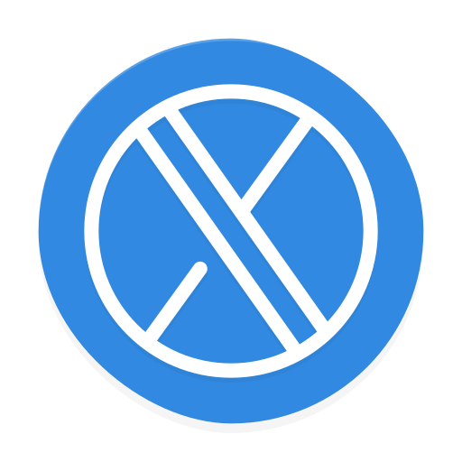 |   |
| inventree | 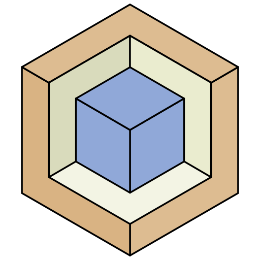 |  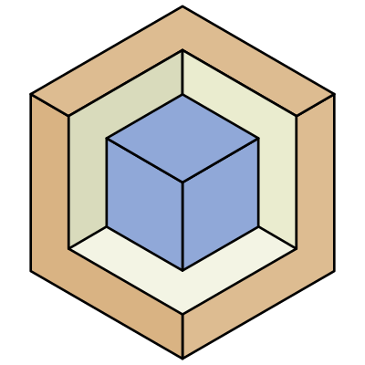 |
| invidious | 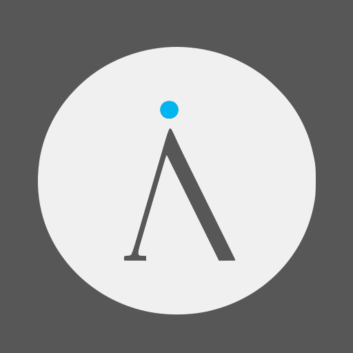 |   |
| invisioncommunity |  |   |
| invizible-pro | 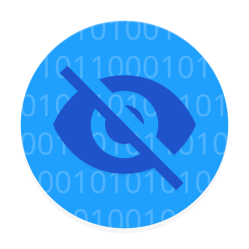 |  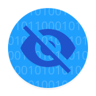 |
| invoiceninja |  |   |
| invoiceninja-light |  |   |
| invoke-ai | 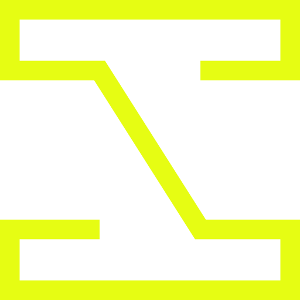 |   |
| iobroker |  |   |
| ionos |  |   |
| ionos-dark |  |   |
| ionos-light |  |   |
| ipboard |  |   |
| ipcamtalk |  |   |
| ipfs | 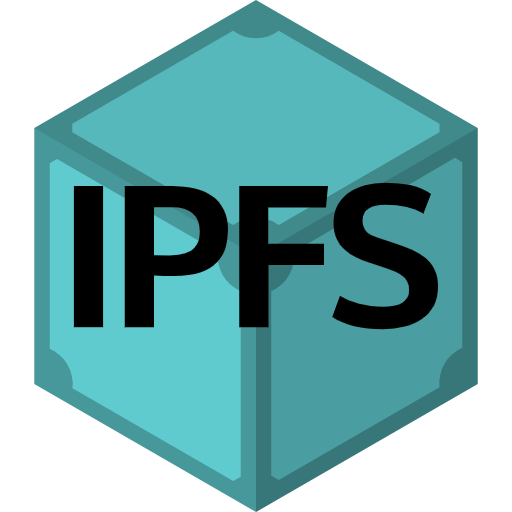 |  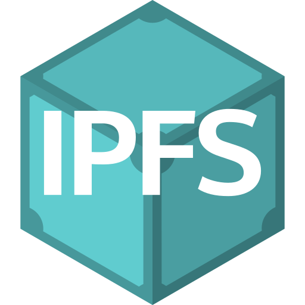 |
| ippb-mobile | 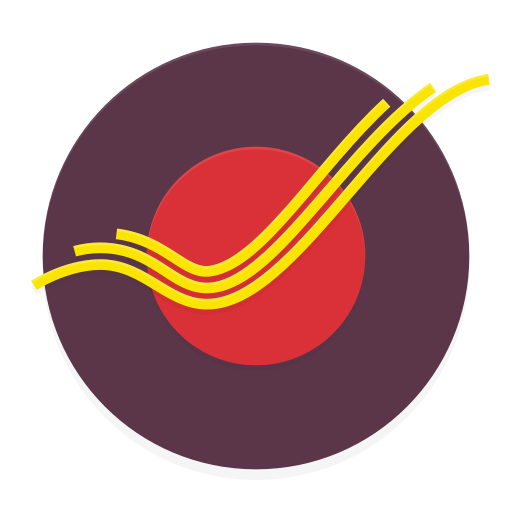 |   |
| iptv |  |   |
| irc |  |   |
| irccloud |  |   |
| irccloud-enterprise |  |   |
| iredmail |  |   |
| iron-browser |  |   |
| is-phone-encrypted |  |   |
| ispconfig | 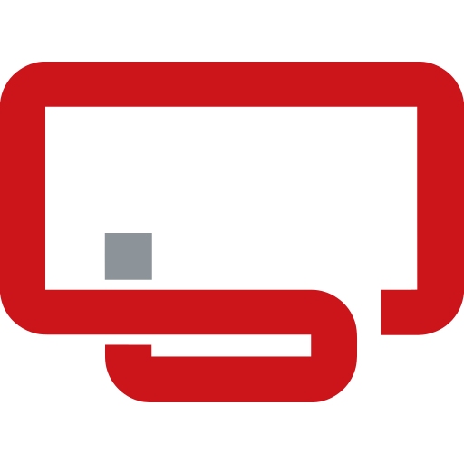 |   |
| ispy |  |   |
| istanbulkart | 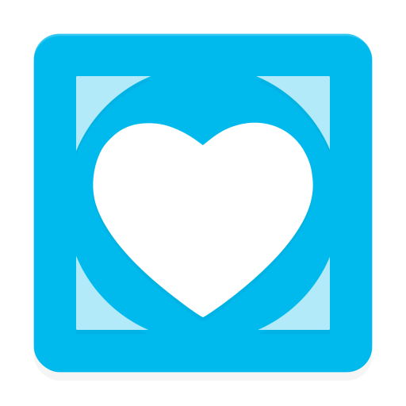 |  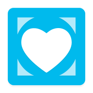 |
| istio | 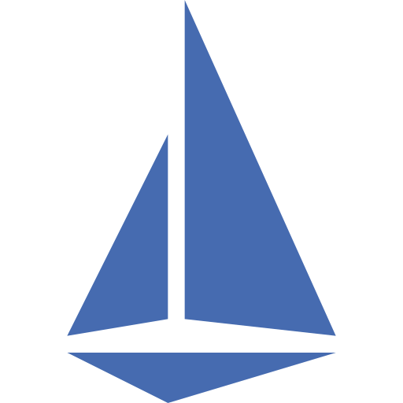 |   |
| it-tools |  |   |
| it-tools-light |  |   |
| itau |  |   |
| itinerary |  |   |
| ivvovtech-music-player |  |   |
| ixsystems |  |   |

[[HOME](../README.md)][[#](directory.md)][[A](directory-a.md)][[B](directory-b.md)][[C](directory-c.md)][[D](directory-d.md)][[E](directory-e.md)][[F](directory-f.md)][[G](directory-g.md)][[H](directory-h.md)][[I](directory-i.md)][[J](directory-j.md)][[K](directory-k.md)][[L](directory-l.md)][[M](directory-m.md)][[N](directory-n.md)][[O](directory-o.md)][[P](directory-p.md)][[Q](directory-q.md)][[R](directory-r.md)][[S](directory-s.md)][[T](directory-t.md)][[U](directory-u.md)][[V](directory-v.md)][[W](directory-w.md)][[X](directory-x.md)][[Y](directory-y.md)][[Z](directory-z.md)]

