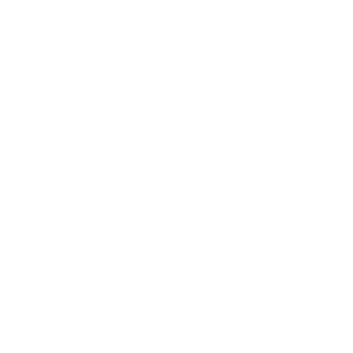

# Awesome Dashboard Icons

[[HOME](../README.md)][[#](directory.md)][[A](directory-a.md)][[B](directory-b.md)][[C](directory-c.md)][[D](directory-d.md)][[E](directory-e.md)][[F](directory-f.md)][[G](directory-g.md)][[H](directory-h.md)][[I](directory-i.md)][[J](directory-j.md)][[K](directory-k.md)][[L](directory-l.md)][[M](directory-m.md)][[N](directory-n.md)][[O](directory-o.md)][[P](directory-p.md)][[Q](directory-q.md)][[R](directory-r.md)][[S](directory-s.md)][[T](directory-t.md)][[U](directory-u.md)][[V](directory-v.md)][[W](directory-w.md)][[X](directory-x.md)][[Y](directory-y.md)][[Z](directory-z.md)]

# Directory: L

| Icon Name | PNG | SVG |
|-----------|-----|-----|
| l-speed |  |   |
| la-banque-postale |  |   |
| la-mia-banca |  |   |
| lamoda |  |   |
| lampa |  |   |
| lancache |  |   |
| language-tool |  |   |
| lanraragi |  |   |
| lanting |  |   |
| lanxchange |  |   |
| lark |  |   |
| lark-player |  |   |
| lastfm |  |   |
| lastpass |  |   |
| latex |  |   |
| latex-logo |  |   |
| launchbox |  |   |
| lawnchair-launcher |  |   |
| lawnchair-settings |  |   |
| lawnicons |  |   |
| laya-music-player |  |   |
| lazada |  |   |
| lazy-media-deluxe |  |   |
| lazylibrarian |  |   |
| lbry |  |   |
| leanote |  |   |
| leantime |  |   |
| learning |  |   |
| ledger |  |   |
| ledger-live |  |   |
| left-4-dead-2 |  |   |
| lemmur |  |   |
| lemmy |  |   |
| lemmy-light |  |   |
| lemonldap-ng |  |   |
| lemonldapng |  |   |
| lenovo-logo |  |   |
| lenskart |  |   |
| lenta |  |   |
| leroy-merlin |  |   |
| lets-encrypt |  |   |
| letual |  |   |
| lexis-audio-editor |  |   |
| libby |  |   |
| libera-chat |  |   |
| liberapay |  |   |
| liberapay-light |  |   |
| libreav |  |   |
| libreddit |  |   |
| libremdb |  |   |
| librenms |  |   |
| librenms-light |  |   |
| libreoffice |  |   |
| libreoffice-impress-remote |  |   |
| librephotos |  |   |
| librephotos-light |  |   |
| librera-pro |  |   |
| librespeed |  |   |
| libretorrent |  |   |
| libretranslator |  |   |
| librex |  |   |
| librey |  |   |
| lidarr |  |   |
| lidl |  |   |
| life-reminders |  |   |
| life360 |  |   |
| lifecell |  |   |
| lifeograph |  |   |
| lifesum |  |   |
| lightning-terminal |  |   |
| lightning-web-browser |  |   |
| lightsoff |  |   |
| lighttpd |  |   |
| likee |  |   |
| likee-lite |  |   |
| lime-hd-tv |  |   |
| linconnect |  |   |
| line |  |   |
| line-lite |  |   |
| lineageos |  |   |
| linex |  |   |
| linkace |  |   |
| linkding |  |   |
| linkedin |  |   |
| linkstack |  |   |
| linksys |  |   |
| linkwarden |  |   |
| linkwarden-light |  |   |
| linode |  |   |
| linphone |  |   |
| linux |  |   |
| linux-foundation |  |   |
| linux-mint |  |   |
| linuxserver-io |  |   |
| liremdb |  |   |
| listen-audiobook-player |  |   |
| listen-moe |  |   |
| listmonk |  |   |
| listonic |  |   |
| listy |  |   |
| litecoin |  |   |
| lithium |  |   |
| litter-web-browser |  |   |
| little-alchemy |  |   |
| littlelink-custom |  |   |
| live-x-live |  |   |
| liverpool-shoppingapp |  |   |
| lnbits |  |   |
| lobe-chat |  |   |
| localcast-for-chromecast |  |   |
| locals |  |   |
| locals-light |  |   |
| locker |  |   |
| lockwise |  |   |
| logisim |  |   |
| logitech-gaming |  |   |
| logitech-logo |  |   |
| logitech-logo-legacy |  |   |
| logitech-logo-legacy-light |  |   |
| logitech-logo-light |  |   |
| logstash |  |   |
| loki |  |   |
| longhorn |  |   |
| love |  |   |
| lowes |  |   |
| lsio |  |   |
| lte-cleaner |  |   |
| lua |  |   |
| lubelogger |  |   |
| lucid-launcher |  |   |
| lucid-launcher-pro |  |   |
| lucidchart |  |   |
| lucky-patcher |  |   |
| lux |  |   |
| lux-black |  |   |
| lux-dark |  |   |
| lxc |  |   |
| lxde |  |   |
| lxde-light |  |   |
| lychee |  |   |
| lyft |  |   |
| lynx |  |   |

[[HOME](../README.md)][[#](directory.md)][[A](directory-a.md)][[B](directory-b.md)][[C](directory-c.md)][[D](directory-d.md)][[E](directory-e.md)][[F](directory-f.md)][[G](directory-g.md)][[H](directory-h.md)][[I](directory-i.md)][[J](directory-j.md)][[K](directory-k.md)][[L](directory-l.md)][[M](directory-m.md)][[N](directory-n.md)][[O](directory-o.md)][[P](directory-p.md)][[Q](directory-q.md)][[R](directory-r.md)][[S](directory-s.md)][[T](directory-t.md)][[U](directory-u.md)][[V](directory-v.md)][[W](directory-w.md)][[X](directory-x.md)][[Y](directory-y.md)][[Z](directory-z.md)]

