# Awesome Dashboard Icons

[[HOME](..)][[#](directory.md)][[A](directory-a.md)][[B](directory-b.md)][[C](directory-c.md)][[D](directory-d.md)][[E](directory-e.md)][[F](directory-f.md)][[G](directory-g.md)][[H](directory-h.md)][[I](directory-i.md)][[J](directory-j.md)][[K](directory-k.md)][[L](directory-l.md)][[M](directory-m.md)][[N](directory-n.md)][[O](directory-o.md)][[P](directory-p.md)][[Q](directory-q.md)][[R](directory-r.md)][[S](directory-s.md)][[T](directory-t.md)][[U](directory-u.md)][[V](directory-v.md)][[W](directory-w.md)][[X](directory-x.md)][[Y](directory-y.md)][[Z](directory-z.md)]

# Directory: M

| Icon Name | PNG | SVG |
|-----------|-----|-----|
| m-launcher |  |   |
| m-video |  |   |
| maadhaar |  |   |
| mabook |  |   |
| macrodroid |  |   |
| maf-carrefour |  |   |
| magic-font |  |   |
| magic-font-swap |  |   |
| magic-home |  |   |
| magic-poser |  |   |
| magicplan |  |   |
| magisk |  |   |
| magnit |  |   |
| magnit-dostavka |  |   |
| mail-ru-agent |  |   |
| mail-ru-cloud |  |   |
| mailcow |  |   |
| mailcowsogo |  |   |
| mailfence |  |   |
| mailhog |  |   |
| mailinabox |  |   |
| mailu |  |   |
| mainsail |  |   |
| maintainerr |  |   |
| mak |  |   |
| makemkv |  |   |
| makemytrip |  |   |
| maloja | 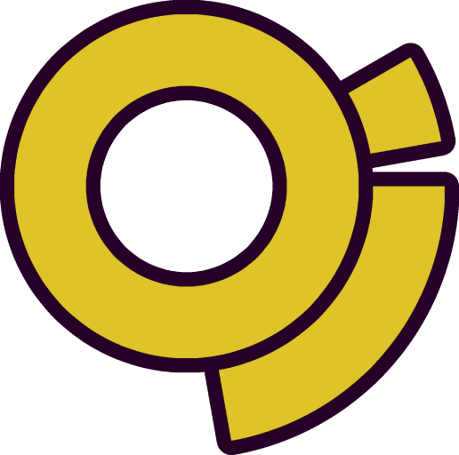 |   |
| mame4all |  |   |
| mame4droid |  |   |
| managemyhealth |  |   |
| mango |  |   |
| manjaro |  |   |
| manjaro-linux | 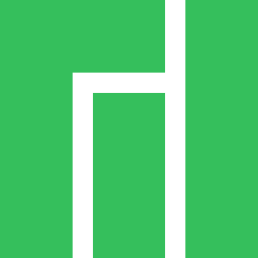 |   |
| mantisbt |  |   |
| manyfold | 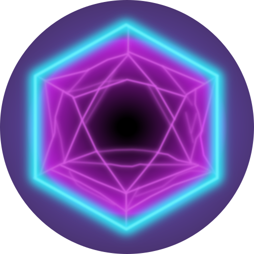 |  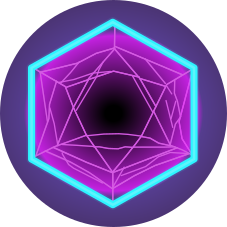 |
| maple |  |   |
| maple-player |  |   |
| mapmyrun |  |  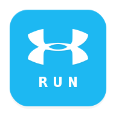 |
| mappy |  |   |
| maptiler |  |  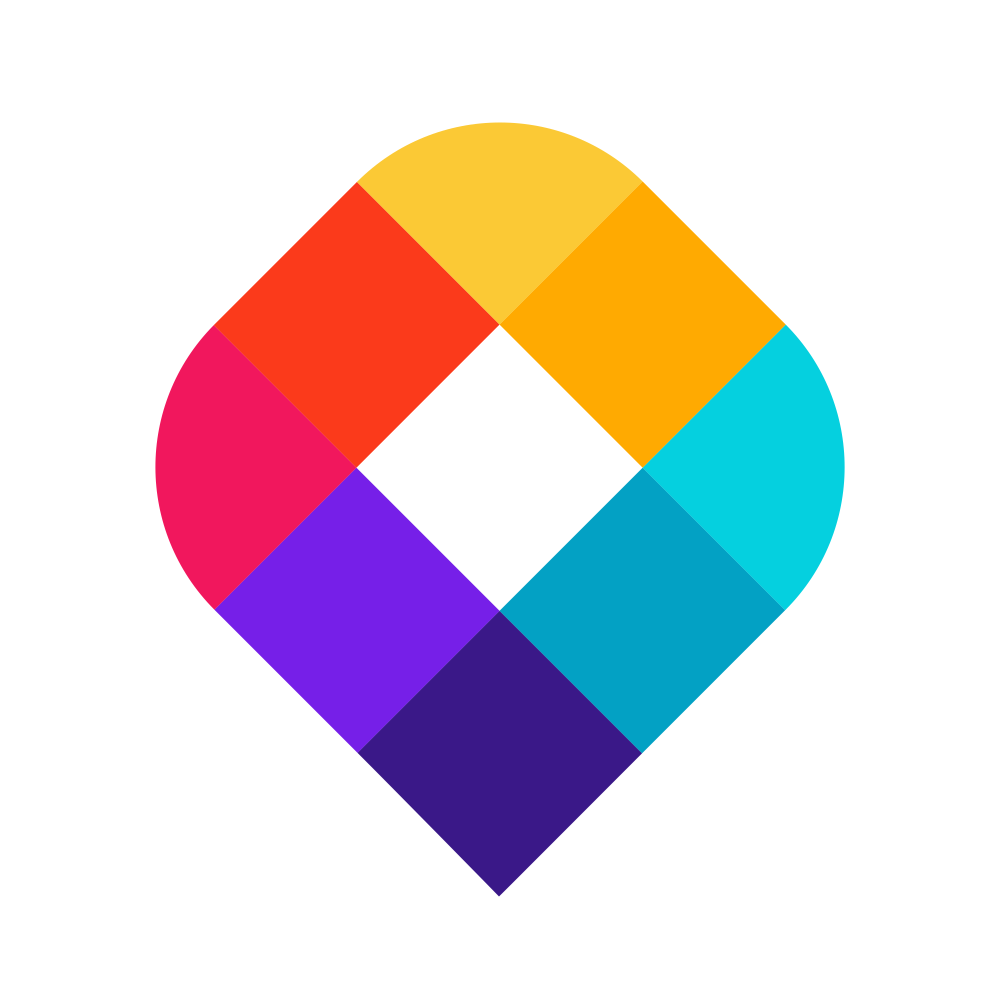 |
| marble-behaim |  |   |
| marginalia |  |   |
| mariadb |  |   |
| markdown |  |   |
| markdown-dark |  |   |
| markor |  |   |
| marktplaats |  |   |
| marvel-comics |  |   |
| master-for-amazfit |  |   |
| mastodon |  |   |
| matlab |  |   |
| matlog |  |   |
| matomo | 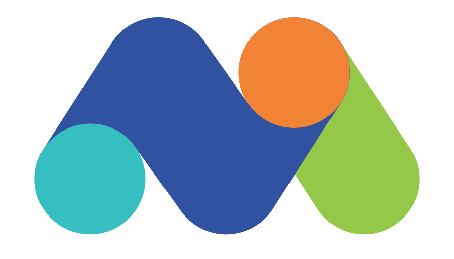 |   |
| matrix |  |   |
| matrix-light |  |   |
| matrix-logo |  |   |
| matrix-logo-light |  |   |
| matrix-synapse |  |   |
| matrix-synapse-light |  |   |
| mattermost |  |  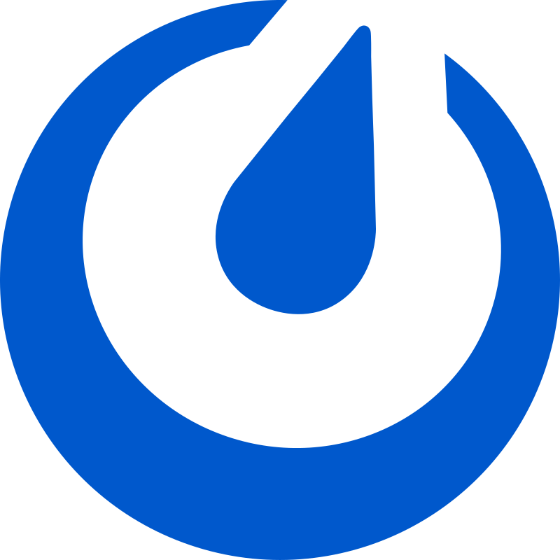 |
| mattermost-classic |  |  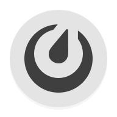 |
| mattermost-dark |  |   |
| mautic |  |   |
| mautic-light |  |   |
| maxima |  |   |
| maxmind-logo |  |   |
| maxthon-browser |  |   |
| mayan-edms |  |   |
| mayan-edms-light |  |   |
| mcdonalds |  |   |
| mcmyadmin |  |   |
| mealie |  |   |
| mediaget |  |   |
| mediainfo |  |   |
| mediamonkey |  |   |
| mediathekview |  |   |
| mediawiki |  |  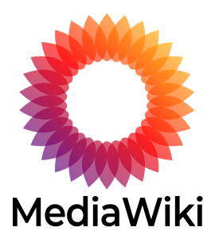 |
| medibang-paint |  |   |
| medical |  |   |
| meditation-timer-beta |  |   |
| medium-reader |  |   |
| medusa |  |   |
| mega |  |   |
| mega-nz |  |   |
| megabonus |  |   |
| megafon |  |  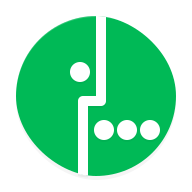 |
| memcached |  |   |
| meme-generator |  |  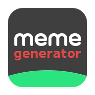 |
| memos |  |   |
| mempool | 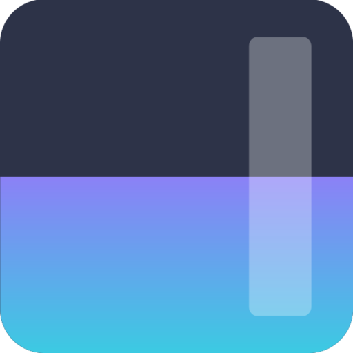 |   |
| memrise |  |   |
| mental-health |  |   |
| meraki |  |   |
| mercado-libre |  |   |
| mercado-pago |  |   |
| mercurial |  |   |
| mercury-browser |  |   |
| mercusys-logo |  |   |
| merriam-webster-dictionary |  |   |
| meshcentral |  |   |
| meshtastic |  |  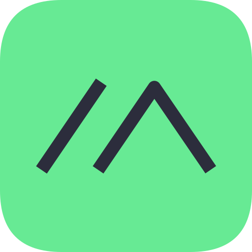 |
| met-service |  |   |
| meta | 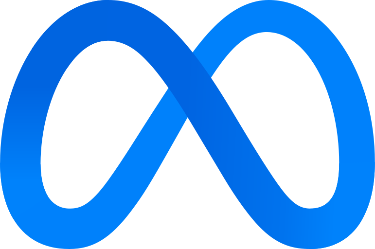 |   |
| metabase | 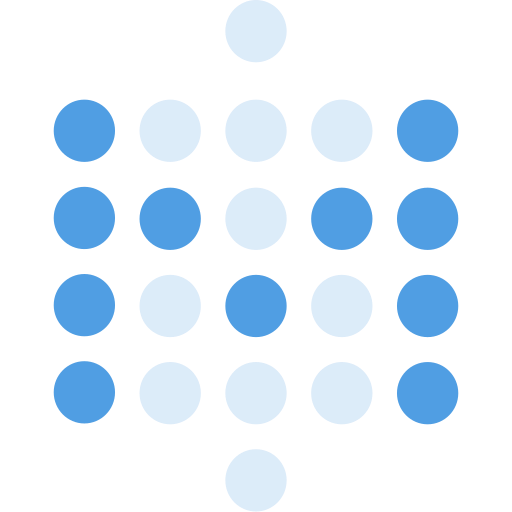 |   |
| metamask |  |   |
| metlink |  |   |
| metro-store |  |   |
| metro-zone |  |   |
| metronome |  |   |
| metube |  |   |
| meu-tim |  |   |
| meu-vivo |  |   |
| mezzo-player |  |   |
| mgba |  |  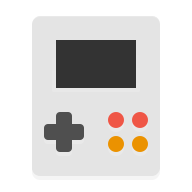 |
| mi-remote |  |   |
| mi-services-and-comments |  |   |
| mi-telcel |  |  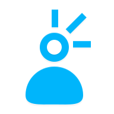 |
| microbin |  |   |
| microscope |  |   |
| microsoft |  |   |
| microsoft-appmanager |  |   |
| microsoft-azure |  |   |
| microsoft-azure-authenticator |  |   |
| microsoft-bing |  |   |
| microsoft-copilot | 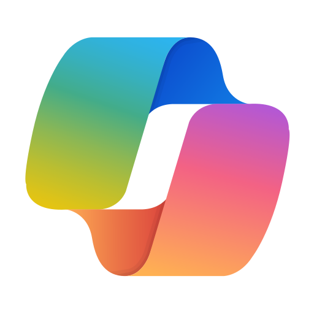 |   |
| microsoft-edge |  |   |
| microsoft-excel |  |   |
| microsoft-exchange |  |   |
| microsoft-gamepass |  |   |
| microsoft-launcher |  |   |
| microsoft-lens |  |   |
| microsoft-office |  |   |
| microsoft-onedrive |  |   |
| microsoft-onenote |  |   |
| microsoft-outlook |  |   |
| microsoft-powerpoint |  |   |
| microsoft-powershell |  |   |
| microsoft-rdc |  |   |
| microsoft-sharepoint | 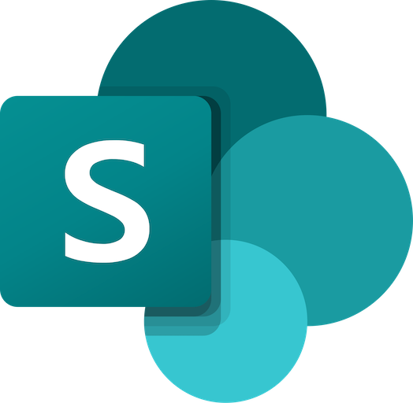 |   |
| microsoft-sql-server |  |   |
| microsoft-swiftkey |  |   |
| microsoft-teams |  |  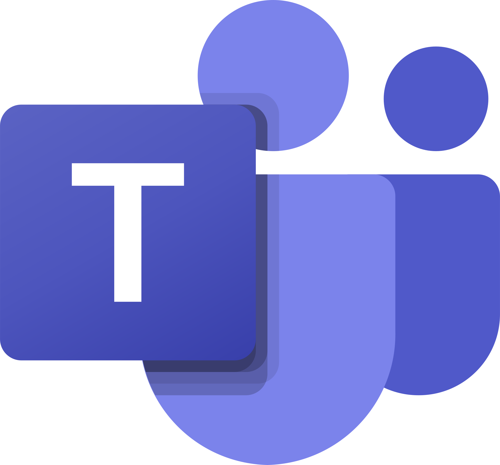 |
| microsoft-todo |  |   |
| microsoft-translator |  |   |
| microsoft-word |  |   |
| microsoft-xbox |  |   |
| microsoft365-admin-center |  |   |
| midjourney |  |   |
| midjourney-light | 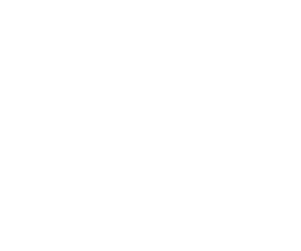 |   |
| migrate |  |   |
| migrate-flasher |  |   |
| migration-management |  |   |
| mikrotik |  |   |
| mindustry |  |   |
| mine-video-player |  |   |
| minecraft |  |   |
| mineos | 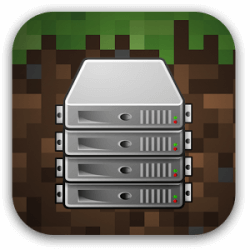 |   |
| minha-escola-sp |  |  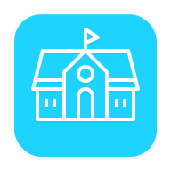 |
| miniflux |  |   |
| miniflux-light |  |   |
| minikube |  |   |
| minimizer-for-youtube |  |   |
| minimserver |  |   |
| minio |  |   |
| minio-light |  |   |
| miracast |  |   |
| misp |  |   |
| miui-backup |  |   |
| miui-browser |  |   |
| miui-community |  |   |
| miui-feedback |  |   |
| miui-games |  |   |
| miui-market |  |   |
| miui-mi-drop |  |   |
| miui-mi-video |  |   |
| miui-mipay |  |   |
| miui-notes |  |   |
| miui-scanner |  |   |
| miui-screen-recorder |  |   |
| miui-security |  |   |
| miui-shop |  |   |
| miui-smarthome |  |   |
| miui-themeeditor |  |   |
| miui-virtualsim |  |   |
| mixcloud |  |   |
| mixplorer |  |   |
| mkb-bank |  |   |
| mkdocs |  |   |
| mkvtoolnix |  |   |
| mlite |  |   |
| mnemosyne |  |   |
| mobaxterm | 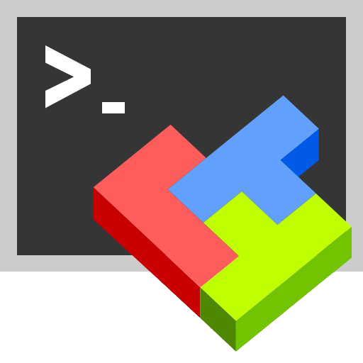 |   |
| mobizen |  |   |
| moboplayer |  |   |
| mobotix |  |   |
| modrinth | 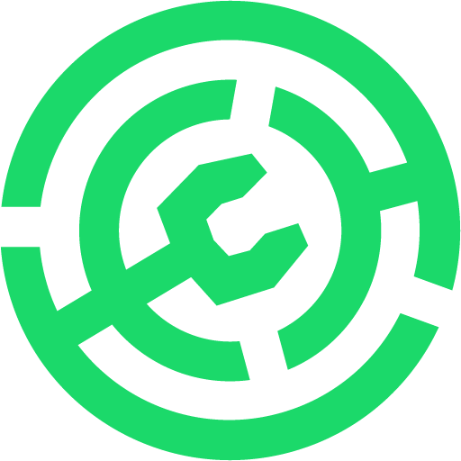 |   |
| mojeek |  |   |
| molecule |  |   |
| molotov |  |   |
| mon-espace |  |   |
| monarch-money |  |   |
| mondaycom |  |   |
| mondly-languages |  |   |
| monero |  |   |
| money-manager |  |   |
| moneydance |  |   |
| mongodb |  |   |
| monica |  |   |
| monit |  |   |
| monobank |  |   |
| monoic-black |  |   |
| month |  |   |
| moodle |  |   |
| moonlight |  |   |
| moretv |  |   |
| motioneye |  |   |
| motp |  |   |
| movie-hd |  |   |
| mozilla |  |   |
| mp3-player-white |  |   |
| mpd |  |   |
| mpdroid |  |   |
| mpm |  |   |
| mpv |  |   |
| mqtt |  |   |
| mr-time |  |   |
| mstream |  |   |
| msx |  |   |
| mts |  |  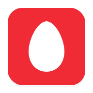 |
| mttcross-player |  |   |
| mullvad |  |   |
| mullvad-browser |  |   |
| mullvad-vpn |  |   |
| multi-scrobbler |  |   |
| mumble | 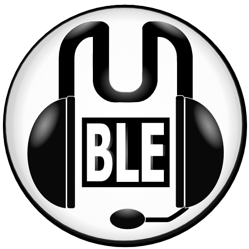 |   |
| munin |  |  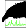 |
| musescore |  |   |
| mushrooms-app |  |   |
| music-folder-player |  |   |
| music-go |  |   |
| music-go-plus |  |   |
| music-hero |  |   |
| music-player-go |  |   |
| music-speed-changer |  |   |
| musicbrainz |  |   |
| musicolet-music-player |  |   |
| musicplayer-mp3 |  |   |
| musicplayer-rocket |  |   |
| musix-player |  |   |
| musixmatch |  |   |
| mvideoplayer |  |   |
| mx-player |  |   |
| my-calendar |  |   |
| my-data-manager |  |   |
| my-fitness-pal |  |   |
| my-iml |  |   |
| my-net-diary |  |  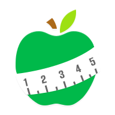 |
| my-shows |  |   |
| myheritage |  |   |
| myim3 |  |   |
| myjio |  |   |
| mylar |  |   |
| mymail |  |   |
| mypay |  |   |
| myq |  |   |
| myspeed |  |   |
| mysql |  |   |
| mysugr |  |   |
| mytherapy |  |   |

[[HOME](..)][[#](directory.md)][[A](directory-a.md)][[B](directory-b.md)][[C](directory-c.md)][[D](directory-d.md)][[E](directory-e.md)][[F](directory-f.md)][[G](directory-g.md)][[H](directory-h.md)][[I](directory-i.md)][[J](directory-j.md)][[K](directory-k.md)][[L](directory-l.md)][[M](directory-m.md)][[N](directory-n.md)][[O](directory-o.md)][[P](directory-p.md)][[Q](directory-q.md)][[R](directory-r.md)][[S](directory-s.md)][[T](directory-t.md)][[U](directory-u.md)][[V](directory-v.md)][[W](directory-w.md)][[X](directory-x.md)][[Y](directory-y.md)][[Z](directory-z.md)]

