# Awesome Dashboard Icons

[[HOME](..)][[#](directory.md)][[A](directory-a.md)][[B](directory-b.md)][[C](directory-c.md)][[D](directory-d.md)][[E](directory-e.md)][[F](directory-f.md)][[G](directory-g.md)][[H](directory-h.md)][[I](directory-i.md)][[J](directory-j.md)][[K](directory-k.md)][[L](directory-l.md)][[M](directory-m.md)][[N](directory-n.md)][[O](directory-o.md)][[P](directory-p.md)][[Q](directory-q.md)][[R](directory-r.md)][[S](directory-s.md)][[T](directory-t.md)][[U](directory-u.md)][[V](directory-v.md)][[W](directory-w.md)][[X](directory-x.md)][[Y](directory-y.md)][[Z](directory-z.md)]

# Directory: N

| Icon Name | PNG | SVG |
|-----------|-----|-----|
| n-track-studio |  |  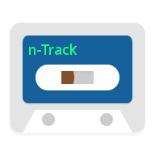 |
| n7player |  |  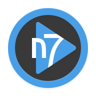 |
| n8n | 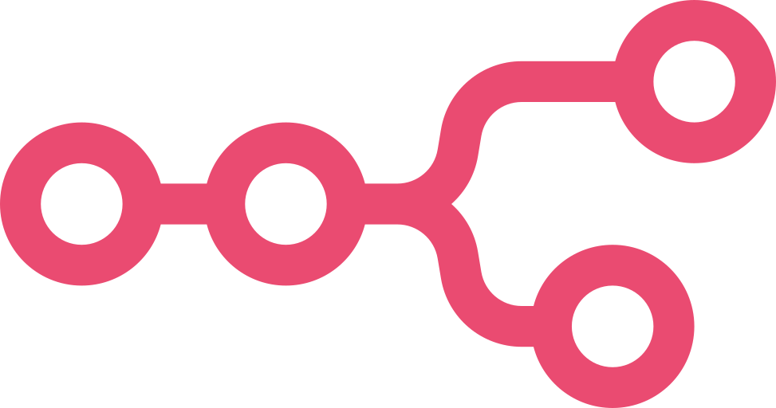 |   |
| nagarik-app |  |  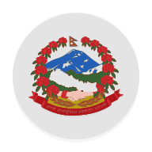 |
| nagios |  |   |
| nasa |  |   |
| natwest |  |   |
| naukricom |  |   |
| nautical-backup |  |   |
| naver-mail |  |   |
| naver-mybox |  |   |
| naver-series |  |   |
| navidrome |  |  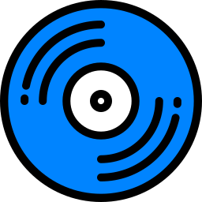 |
| nba |  |   |
| ncell-app |  |   |
| ncore |  |   |
| nebulo |  |   |
| neko |  |   |
| neko-light |  |   |
| nekogram |  |   |
| nekogram-x |  |   |
| neo4j | 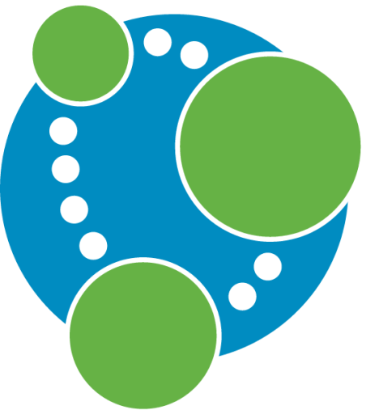 |   |
| neocities | 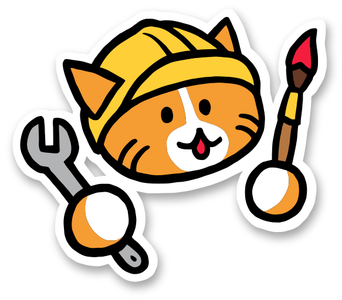 |   |
| neonlink | 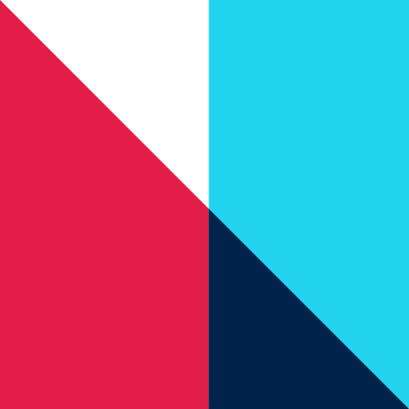 |   |
| nepal-telecom |  |   |
| nessus |  |   |
| netalertx |  |   |
| netapp | 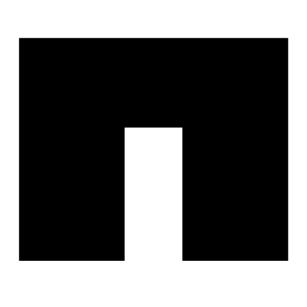 |   |
| netapp-light |  |  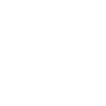 |
| netatmo |  |   |
| netbird |  |   |
| netboot |  |   |
| netbootxyz |  |   |
| netbox | 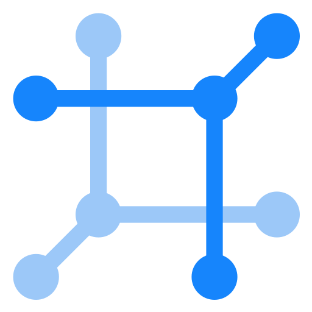 |   |
| netcam-studio |  |   |
| netdata |  |  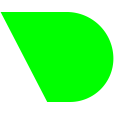 |
| netflix |  |   |
| netgear |  |   |
| netgear-orbi |  |   |
| netguard |  |   |
| netlify | 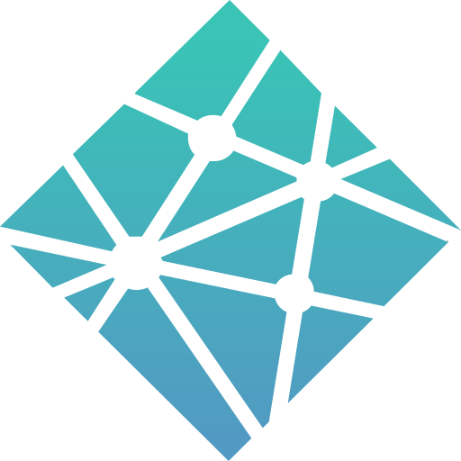 |   |
| netlify-dark |  |   |
| netlify-light |  |   |
| netmaker |  |   |
| netsurf | 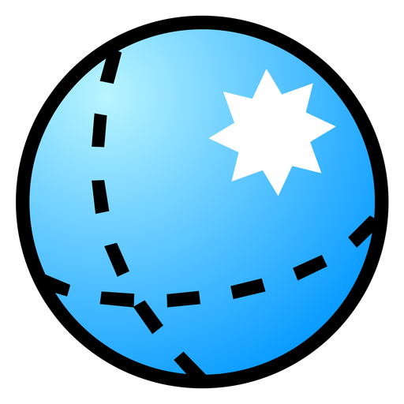 |  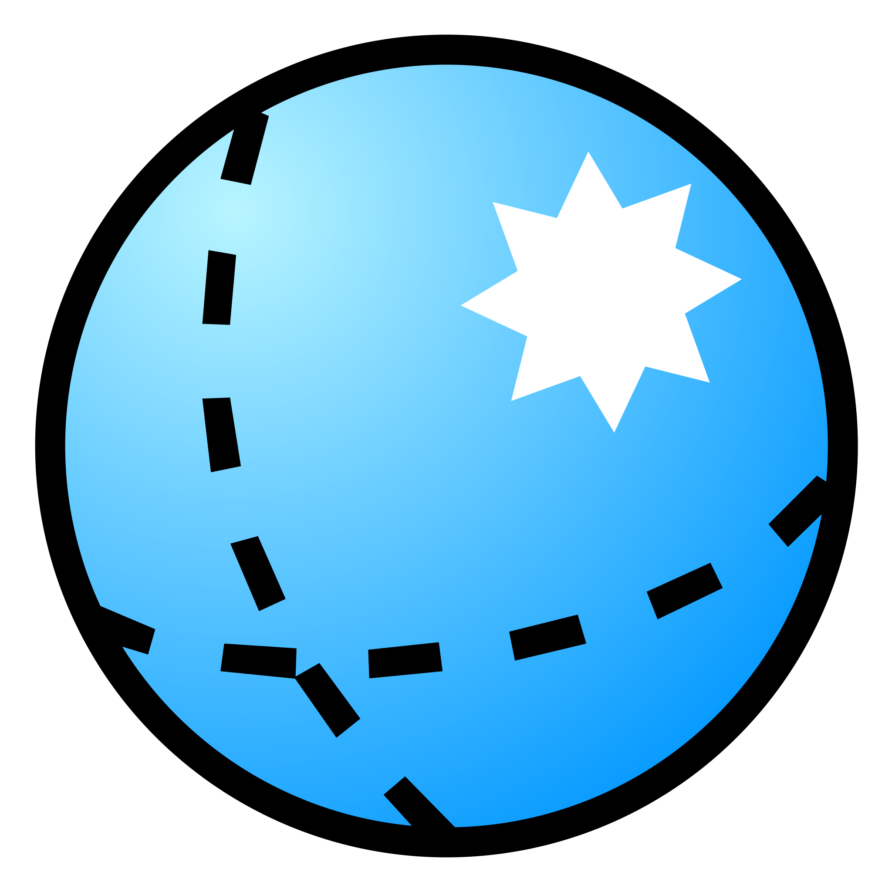 |
| network-analyzer |  |   |
| network-cell-info-lite |  |  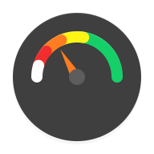 |
| network-tools |  |   |
| network-ups-tools |  |   |
| network-weathermap |  |   |
| neutron-music-player |  |   |
| new-sakpole |  |   |
| newchic |  |   |
| newegg |  |   |
| newpipe |  |   |
| news-break |  |   |
| newsblur |  |   |
| next-browser |  |  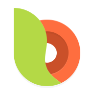 |
| nextcloud |  |  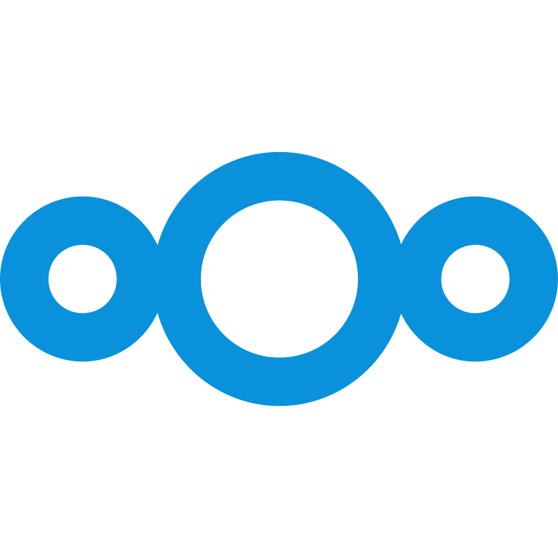 |
| nextcloud-blue |  |   |
| nextcloud-calendar |  |   |
| nextcloud-contacts |  |   |
| nextcloud-cookbook |  |   |
| nextcloud-cospend |  |   |
| nextcloud-deck |  |   |
| nextcloud-files |  |   |
| nextcloud-light |  |   |
| nextcloud-ncdownloader |  |   |
| nextcloud-news |  |   |
| nextcloud-notes |  |   |
| nextcloud-photos |  |   |
| nextcloud-talk |  |   |
| nextcloud-tasks |  |   |
| nextcloud-timemanager |  |   |
| nextdns |  |   |
| nexterm |  |   |
| nextjs | 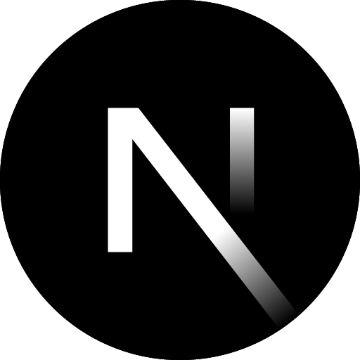 |  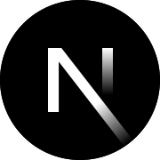 |
| nextpvr |  |   |
| nginx |  |  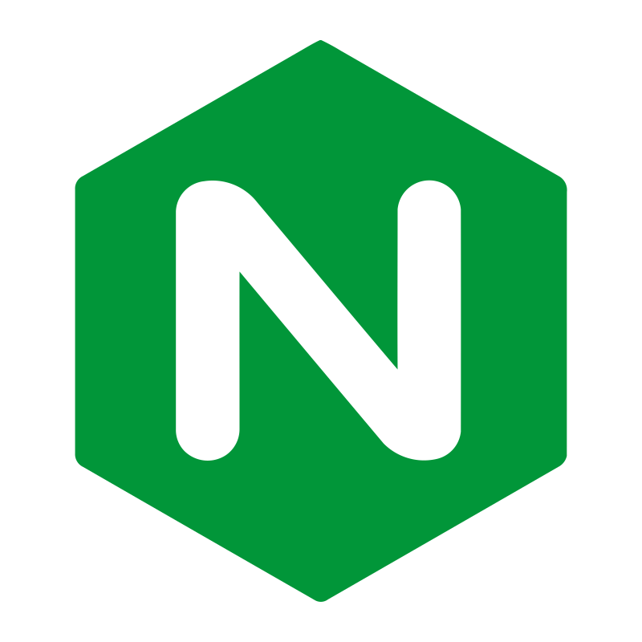 |
| nginx-proxy-manager |  |   |
| nhl |  |   |
| niagara-launcher |  |   |
| nicotine-plus | 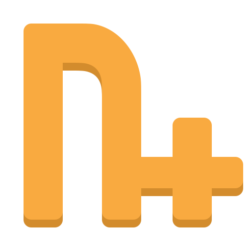 |   |
| nightscout | 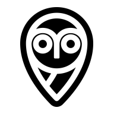 |   |
| nightscout-light |  |   |
| nightshift |  |   |
| nike-run-club |  |   |
| nike-training |  |   |
| nimo-tv |  |   |
| nitroshare |  |   |
| nitter | 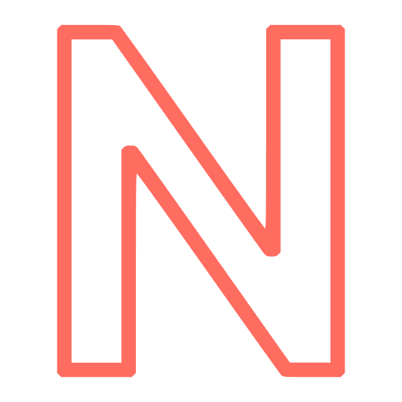 |  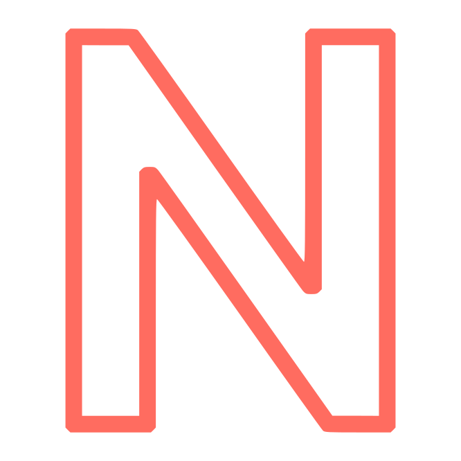 |
| nixos |  |   |
| nlnet-foundation |  |   |
| nlnet-labs |  |   |
| nocobase |  |   |
| nocobase-light | 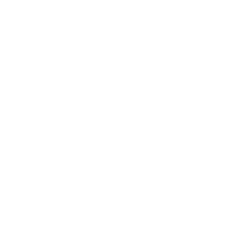 |   |
| nocodb | 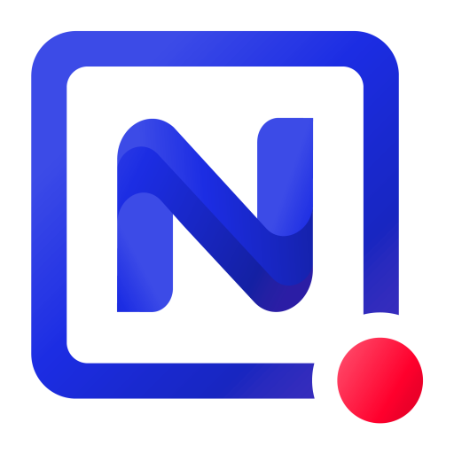 |   |
| node-red |  |  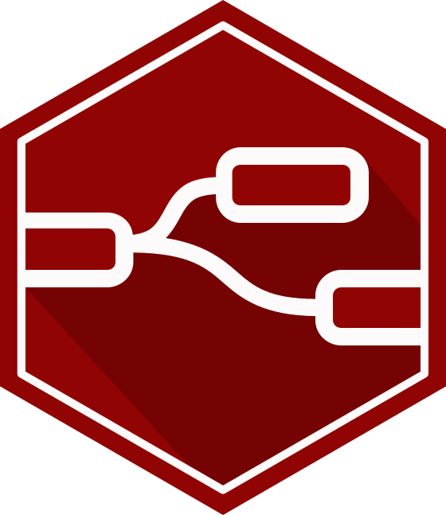 |
| nodejs | 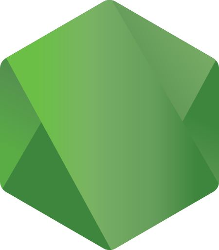 |  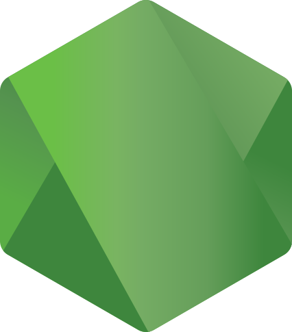 |
| nodejs-alt |  |   |
| nomachine |  |   |
| nomad |  |   |
| nomie |  |  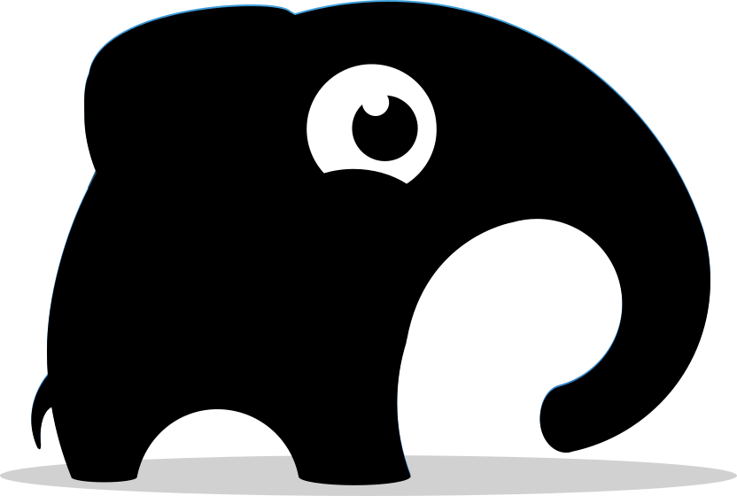 |
| noon |  |  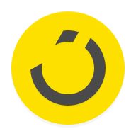 |
| nord-vpn |  |   |
| nordvpn | 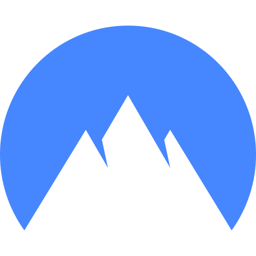 |   |
| notally |  |   |
| note-crypt-pro |  |   |
| notesnook |  |  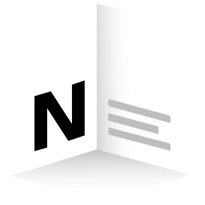 |
| notesnook-light |  |   |
| notifiarr |  |   |
| notification-widget |  |   |
| notify-for-mi-band |  |   |
| notion | 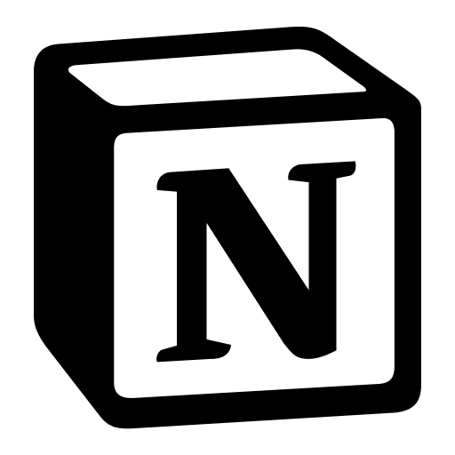 |  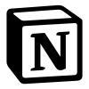 |
| notion-light |  |   |
| noto |  |   |
| nougat-launcher |  |   |
| nova-launcher |  |   |
| nova-launcher-settings |  |   |
| nova-video-player |  |   |
| novaposhtaa |  |   |
| nowshowing |  |   |
| noxcleaner |  |  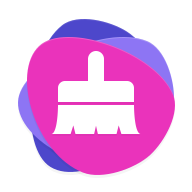 |
| nozbe |  |   |
| npm |  |   |
| nrg-player |  |   |
| ntfy |  |   |
| ntfy-light |  |   |
| ntop |  |   |
| ntopng |  |   |
| nubank |  |   |
| num |  |   |
| nut |  |  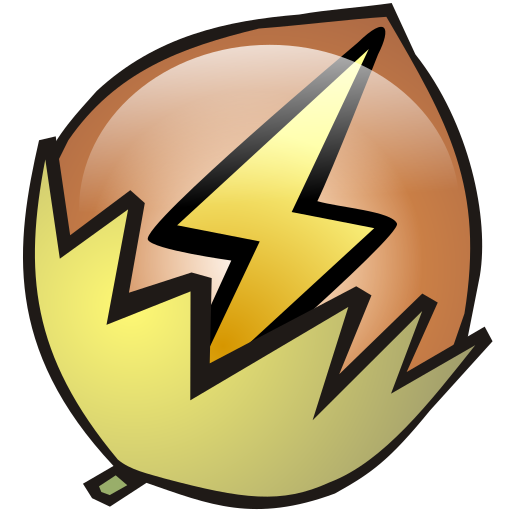 |
| nutstore |  |   |
| nvidia |  |   |
| nvidia-logo |  |   |
| nxfilter |  |   |
| nxlog |  |   |
| nytimes |  |   |
| nz-blood |  |  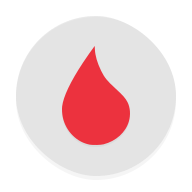 |
| nz-covid-tracer |  |   |
| nzb360 |  |   |
| nzbget |  |   |
| nzbhydra |  |   |
| nzbhydra2 |  |  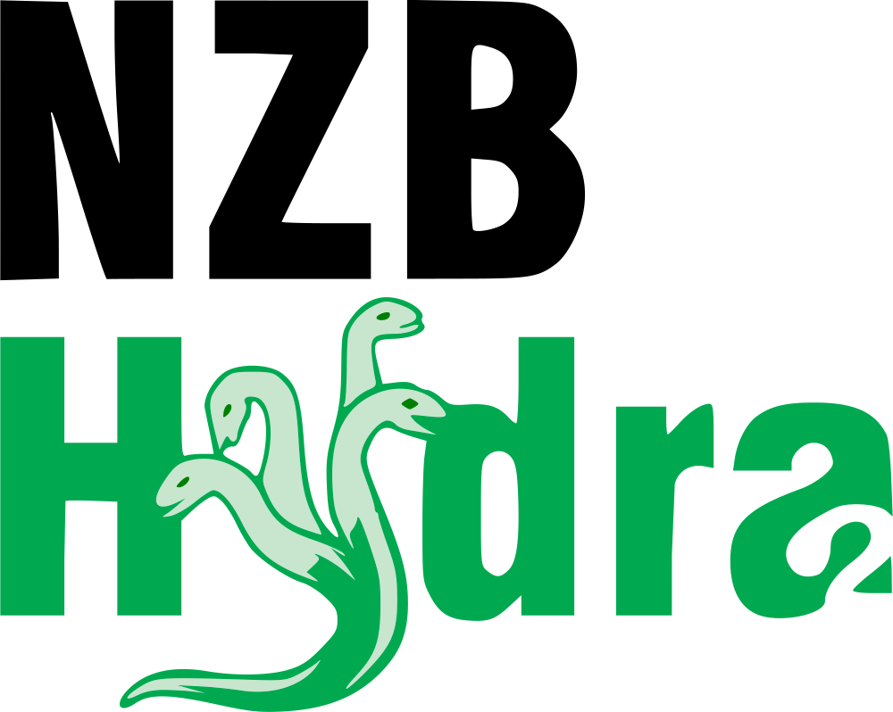 |
| nzbhydra2-light |  |   |

[[HOME](..)][[#](directory.md)][[A](directory-a.md)][[B](directory-b.md)][[C](directory-c.md)][[D](directory-d.md)][[E](directory-e.md)][[F](directory-f.md)][[G](directory-g.md)][[H](directory-h.md)][[I](directory-i.md)][[J](directory-j.md)][[K](directory-k.md)][[L](directory-l.md)][[M](directory-m.md)][[N](directory-n.md)][[O](directory-o.md)][[P](directory-p.md)][[Q](directory-q.md)][[R](directory-r.md)][[S](directory-s.md)][[T](directory-t.md)][[U](directory-u.md)][[V](directory-v.md)][[W](directory-w.md)][[X](directory-x.md)][[Y](directory-y.md)][[Z](directory-z.md)]

