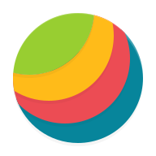

# Awesome Dashboard Icons

[[HOME](..)][[#](directory.md)][[A](directory-a.md)][[B](directory-b.md)][[C](directory-c.md)][[D](directory-d.md)][[E](directory-e.md)][[F](directory-f.md)][[G](directory-g.md)][[H](directory-h.md)][[I](directory-i.md)][[J](directory-j.md)][[K](directory-k.md)][[L](directory-l.md)][[M](directory-m.md)][[N](directory-n.md)][[O](directory-o.md)][[P](directory-p.md)][[Q](directory-q.md)][[R](directory-r.md)][[S](directory-s.md)][[T](directory-t.md)][[U](directory-u.md)][[V](directory-v.md)][[W](directory-w.md)][[X](directory-x.md)][[Y](directory-y.md)][[Z](directory-z.md)]

# Directory: O

| Icon Name | PNG | SVG |
|-----------|-----|-----|
| obd-auto-doctor |  |   |
| obico |  |   |
| obitalk-logo |  |   |
| obs-studio |  |   |
| observium |  |   |
| observo-ai |  |   |
| obsidian |  |   |
| octave |  |   |
| octo-mobile |  |   |
| octodroid |  |   |
| octoeverywhere |  |   |
| octoprint |  |   |
| oculus |  |   |
| oculus-light |  |   |
| odoo |  |   |
| office-365 |  |   |
| office-reader |  |   |
| officesuite |  |   |
| ok |  |   |
| ok-video |  |   |
| okta-verify |  |   |
| ola-party |  |   |
| olacabs |  |   |
| oldschool-editor |  |   |
| oledbuddy |  |   |
| olivetin |  |   |
| ollama |  |   |
| ollama-light |  |   |
| olx |  |   |
| omada |  |   |
| ombi |  |   |
| omega-launcher |  |   |
| omnich-player |  |   |
| omnidb |  |   |
| on-air-tv |  |   |
| one-browser |  |   |
| oneauth |  |   |
| onedev |  |   |
| onedev-light |  |   |
| oneplus-clone-phone |  |   |
| oneplus-community |  |   |
| oneplus-diagnostic |  |   |
| oneplus-store |  |   |
| onetimepass |  |   |
| onkyo-hf-player |  |   |
| onlyoffice |  |   |
| ooniprobe |  |   |
| open-camera |  |   |
| open-collective |  |   |
| open-container-initiative |  |   |
| open-keychain |  |   |
| open-resume |  |   |
| open-source-hardware |  |   |
| open-source-initiative |  |   |
| open-webui |  |   |
| open-webui-light |  |   |
| openai |  |   |
| openai-light |  |   |
| openapi-initiative |  |   |
| openbao |  |   |
| openboard |  |   |
| openbsd |  |   |
| openeats |  |   |
| opengarage |  |   |
| opengist |  |   |
| opengist-light |  |   |
| openhab |  |   |
| openhub |  |   |
| openjdk |  |   |
| openlp |  |   |
| openmaptiles |  |   |
| openmediavault |  |   |
| openmentoring |  |   |
| openoffice |  |   |
| openpass |  |   |
| openproject |  |   |
| openscan |  |   |
| opensearch |  |   |
| openspeedtest |  |   |
| opensprinkler |  |   |
| openstack |  |   |
| openstreetmap |  |   |
| opensuse |  |   |
| opentofu |  |   |
| opentogethertube |  |   |
| openttd |  |   |
| openvas |  |   |
| openvpn |  |   |
| openweather |  |   |
| openwrt |  |   |
| openzfs |  |   |
| opera |  |   |
| opera-beta |  |   |
| opera-developer |  |   |
| opera-mini |  |   |
| opera-mini-beta |  |   |
| opera-neon |  |   |
| opera-news |  |   |
| opera-news-lite |  |   |
| opera-touch |  |   |
| opnsense |  |   |
| oppo-theme-store |  |   |
| oracle |  |   |
| oracle-cloud |  |   |
| orange |  |   |
| orbitum |  |   |
| orbot |  |   |
| orcaslicer |  |   |
| orfox |  |   |
| organic-maps |  |   |
| organizr |  |   |
| orgzly |  |   |
| origin |  |   |
| orwall |  |   |
| oscarr |  |   |
| oscarr-light |  |   |
| osmand |  |   |
| osmand-plus |  |   |
| osticket |  |   |
| ostin |  |   |
| otpauth |  |   |
| otter |  |   |
| outline |  |   |
| outline-light |  |   |
| overclockers |  |   |
| overdrive |  |   |
| overdrop |  |   |
| overleaf |  |   |
| overseerr |  |   |
| ovh |  |   |
| ovia-fertility |  |   |
| ovia-pregnancy |  |   |
| ovirt |  |   |
| owasp-zap |  |   |
| owncloud |  |   |
| ownphotos |  |   |
| ownphotos-light |  |   |
| owntone |  |   |
| owntracks |  |   |
| oxygenos-11-icon-pack |  |   |
| oy |  |   |
| ozon |  |   |

[[HOME](..)][[#](directory.md)][[A](directory-a.md)][[B](directory-b.md)][[C](directory-c.md)][[D](directory-d.md)][[E](directory-e.md)][[F](directory-f.md)][[G](directory-g.md)][[H](directory-h.md)][[I](directory-i.md)][[J](directory-j.md)][[K](directory-k.md)][[L](directory-l.md)][[M](directory-m.md)][[N](directory-n.md)][[O](directory-o.md)][[P](directory-p.md)][[Q](directory-q.md)][[R](directory-r.md)][[S](directory-s.md)][[T](directory-t.md)][[U](directory-u.md)][[V](directory-v.md)][[W](directory-w.md)][[X](directory-x.md)][[Y](directory-y.md)][[Z](directory-z.md)]

