# Awesome Dashboard Icons

[[HOME](..)][[#](directory.md)][[A](directory-a.md)][[B](directory-b.md)][[C](directory-c.md)][[D](directory-d.md)][[E](directory-e.md)][[F](directory-f.md)][[G](directory-g.md)][[H](directory-h.md)][[I](directory-i.md)][[J](directory-j.md)][[K](directory-k.md)][[L](directory-l.md)][[M](directory-m.md)][[N](directory-n.md)][[O](directory-o.md)][[P](directory-p.md)][[Q](directory-q.md)][[R](directory-r.md)][[S](directory-s.md)][[T](directory-t.md)][[U](directory-u.md)][[V](directory-v.md)][[W](directory-w.md)][[X](directory-x.md)][[Y](directory-y.md)][[Z](directory-z.md)]

# Directory: R

| Icon Name | PNG | SVG |
|-----------|-----|-----|
| r |  |  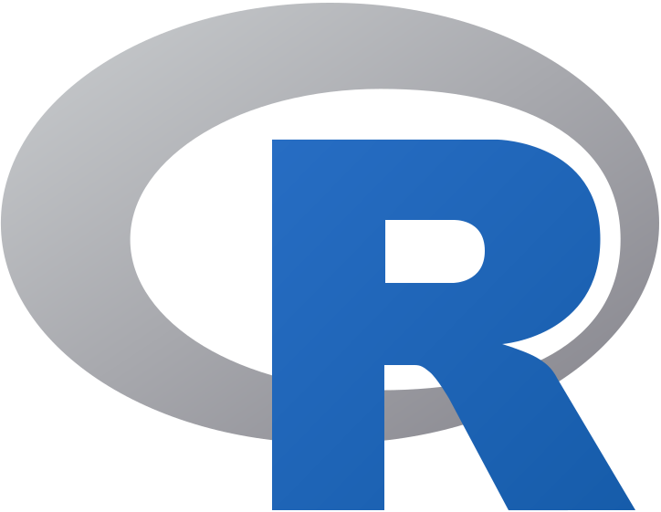 |
| rabbitmq | 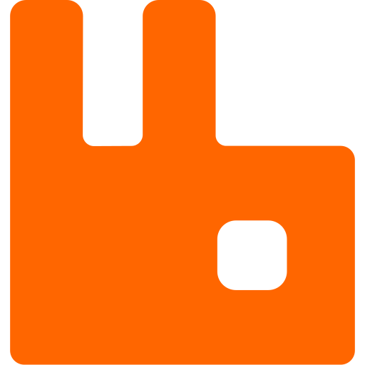 |   |
| radarr |  |   |
| radarr-light |  |   |
| radicale |  |  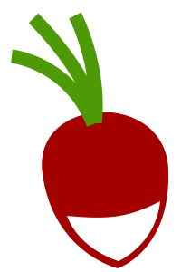 |
| radiotunes |  |   |
| raiffeisen |  |  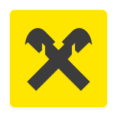 |
| raindrop |  |  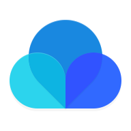 |
| rainloop |  |   |
| rainloop-light | 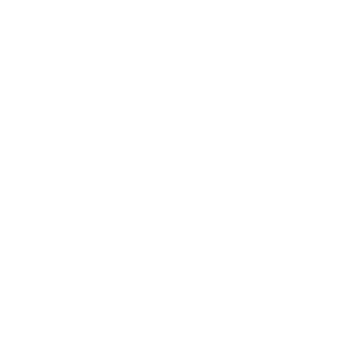 |   |
| rallly |  |   |
| rancher | 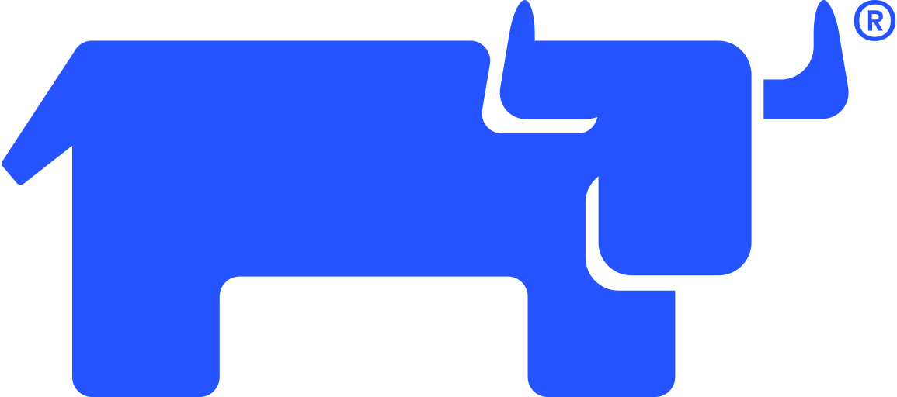 |   |
| raneto | 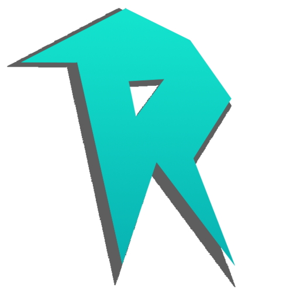 |   |
| rapid7-logo |  |   |
| rapid7-logo-light |  |   |
| rappi |  |   |
| rar |  |   |
| raritan-logo | 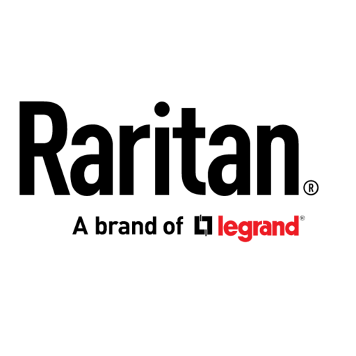 |   |
| raritan-logo-light | 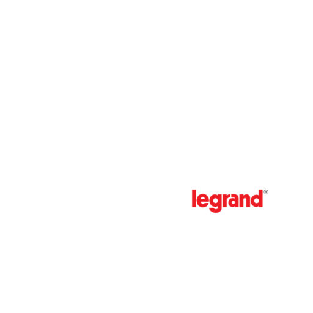 |   |
| raspap | 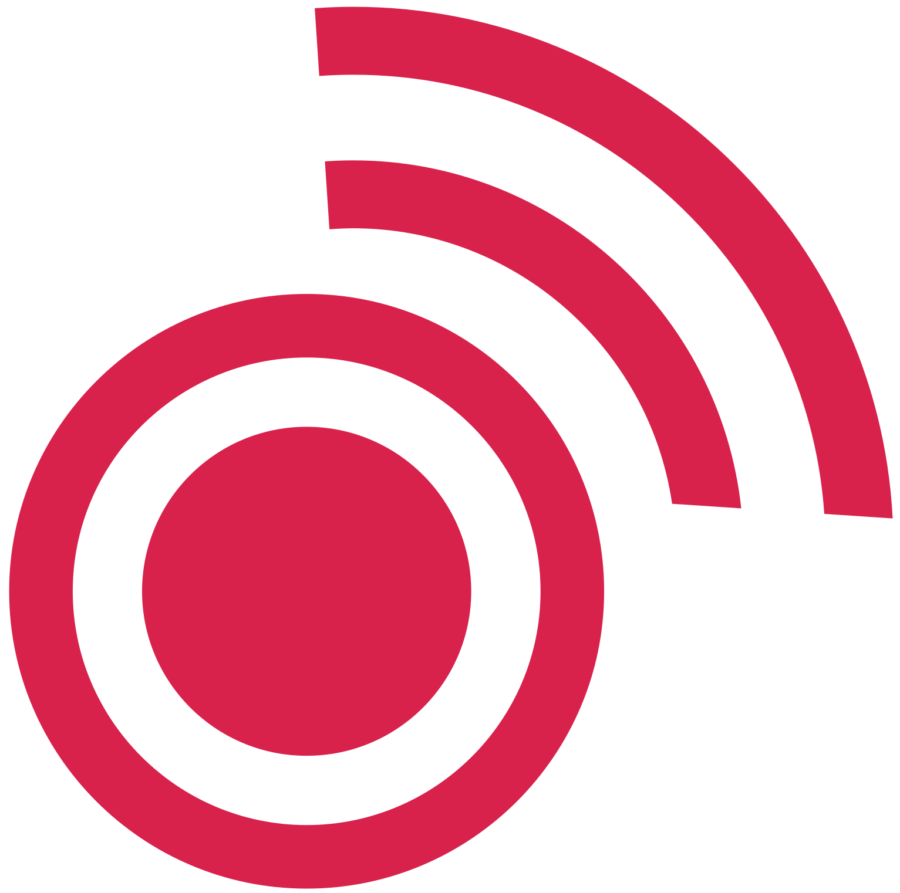 |   |
| raspberrymatic | 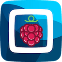 |   |
| raspberrypi | 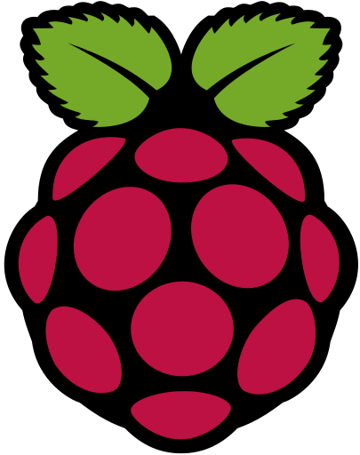 |   |
| raspcontroller |  |  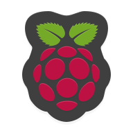 |
| rathole | 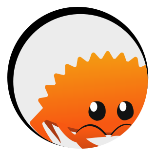 |   |
| rclone | 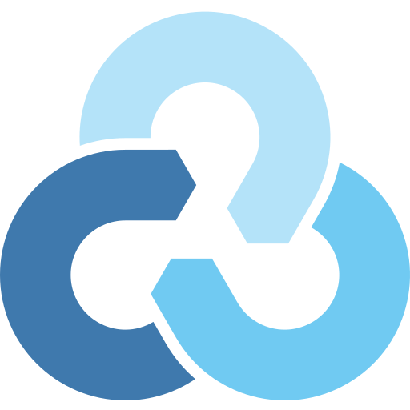 |   |
| rdt-client |  |   |
| reactive-fast-search |  |   |
| reactive-resume |  |   |
| readarr |  |   |
| readeck | 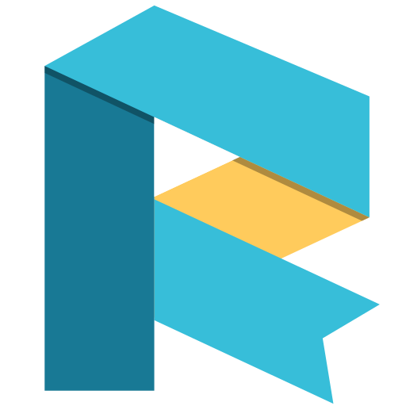 |  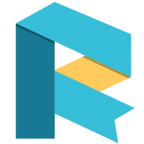 |
| readera |  |   |
| readthedocs |  |   |
| readthedocs-light |  |   |
| real-debrid |  |   |
| real-player |  |   |
| realhosting |  |   |
| realtor-com |  |   |
| recalbox | 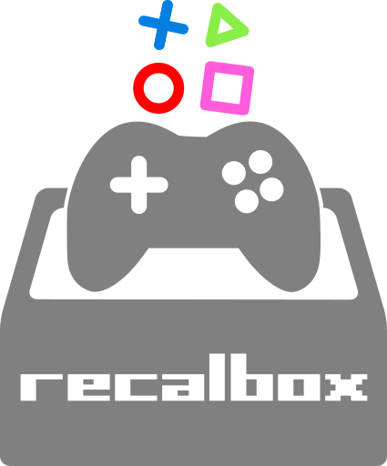 |   |
| recipesage |  |   |
| recipya |  |   |
| red-moon |  |   |
| reddit |  |   |
| redfin |  |   |
| redhat |  |   |
| redhat-openshift |  |   |
| redis |  |  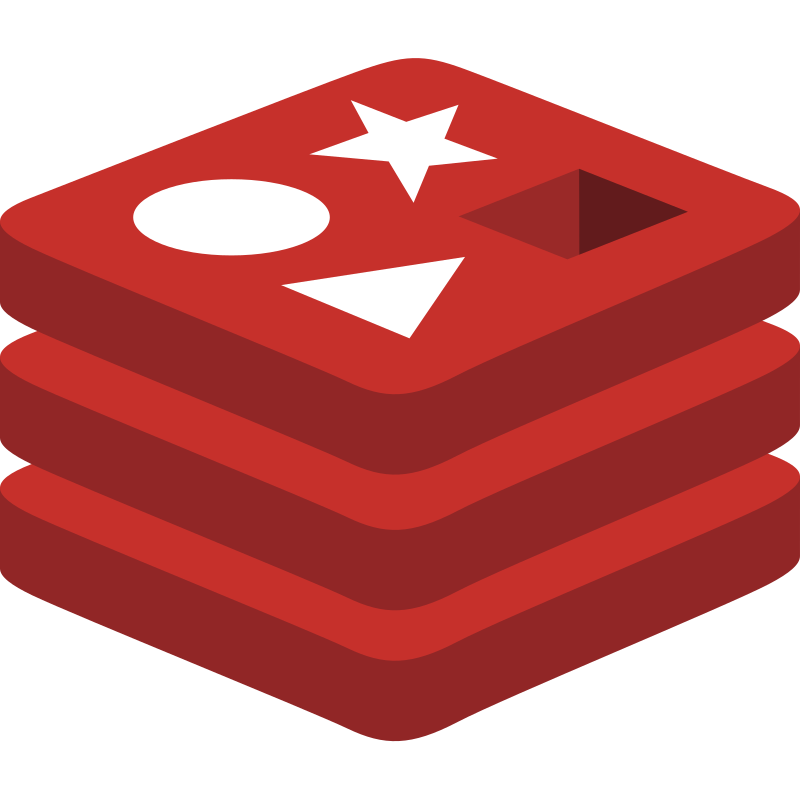 |
| redream |  |  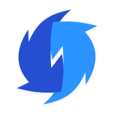 |
| reicast |  |   |
| rekor |  |   |
| relay-pro |  |   |
| relive |  |   |
| rememberthemilk |  |   |
| remind |  |   |
| reminder |  |   |
| reminders |  |   |
| remixlive |  |  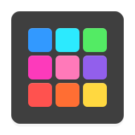 |
| remmina |  |   |
| remote-lg |  |  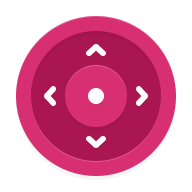 |
| remote-tv |  |  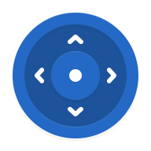 |
| remotely | 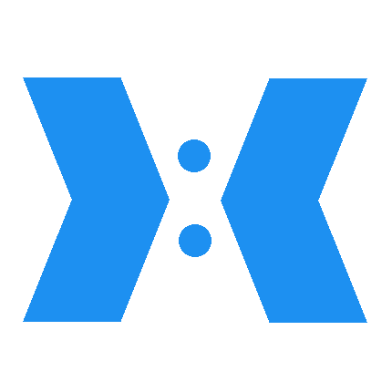 |   |
| reolink |  |   |
| repl-it |  |  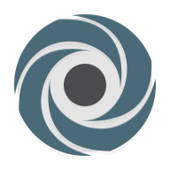 |
| reportador-vlc |  |   |
| requestly | 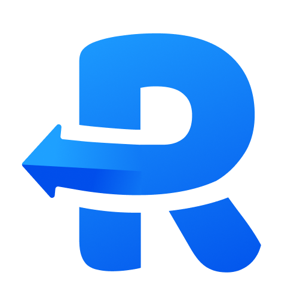 |   |
| requestrr |  |   |
| rescuetime |  |   |
| resilio-sync |  |  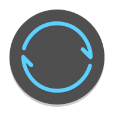 |
| resilio-sync-light | 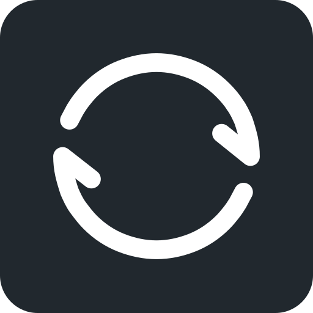 |   |
| resplash |  |  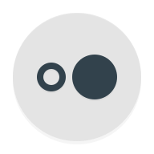 |
| restic | 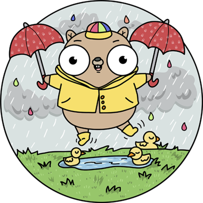 |   |
| retro-music |  |   |
| retroarch |  |  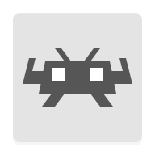 |
| revolution-irc |  |   |
| rewire |  |  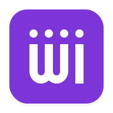 |
| rhasspy | 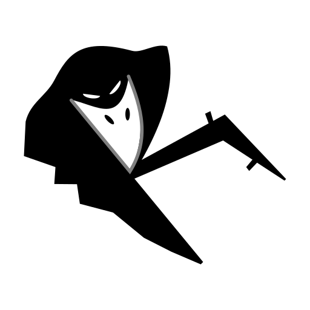 |  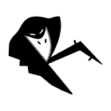 |
| rhasspy-light | 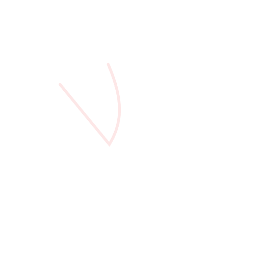 |   |
| rhodecode | 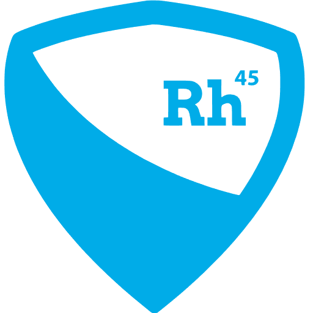 |   |
| rif-is-fun |  |  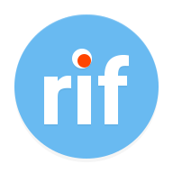 |
| rimgo | 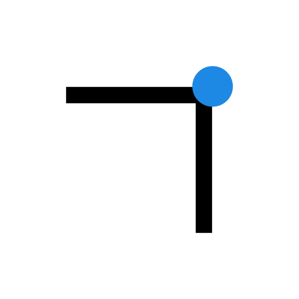 |   |
| rimgo-light | 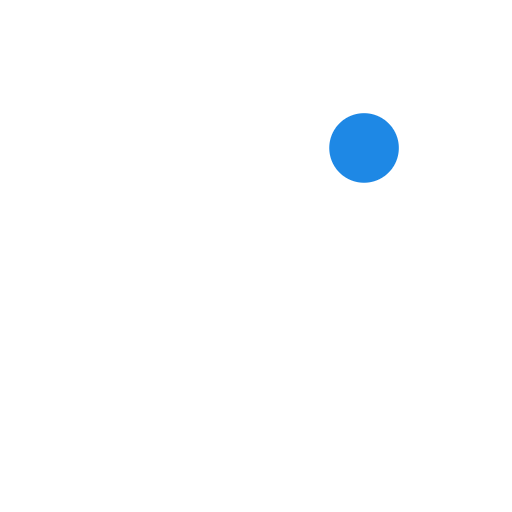 |   |
| ring |  |   |
| ringid |  |   |
| riot | 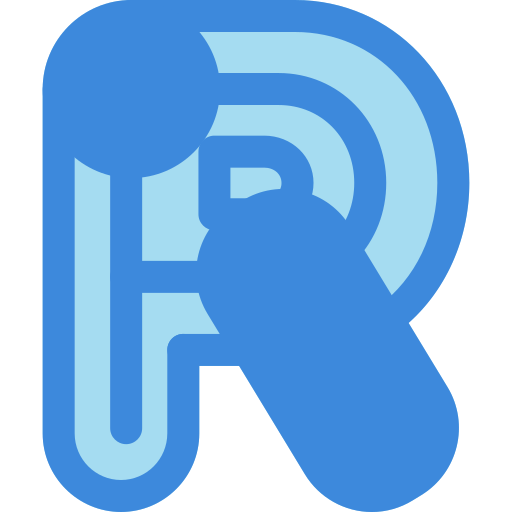 |   |
| ripple |  |  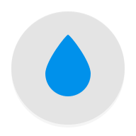 |
| riscv |  |   |
| risk-of-rain-2 |  |   |
| rive-gauche |  |  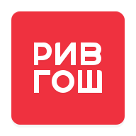 |
| robin |  |   |
| robinhood |  |  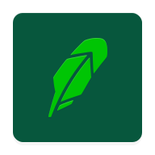 |
| roblox |  |  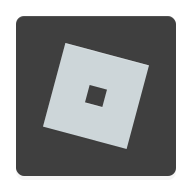 |
| robokiller |  |   |
| rocket-browser |  |   |
| rocketchat |  |   |
| rocky-linux |  |  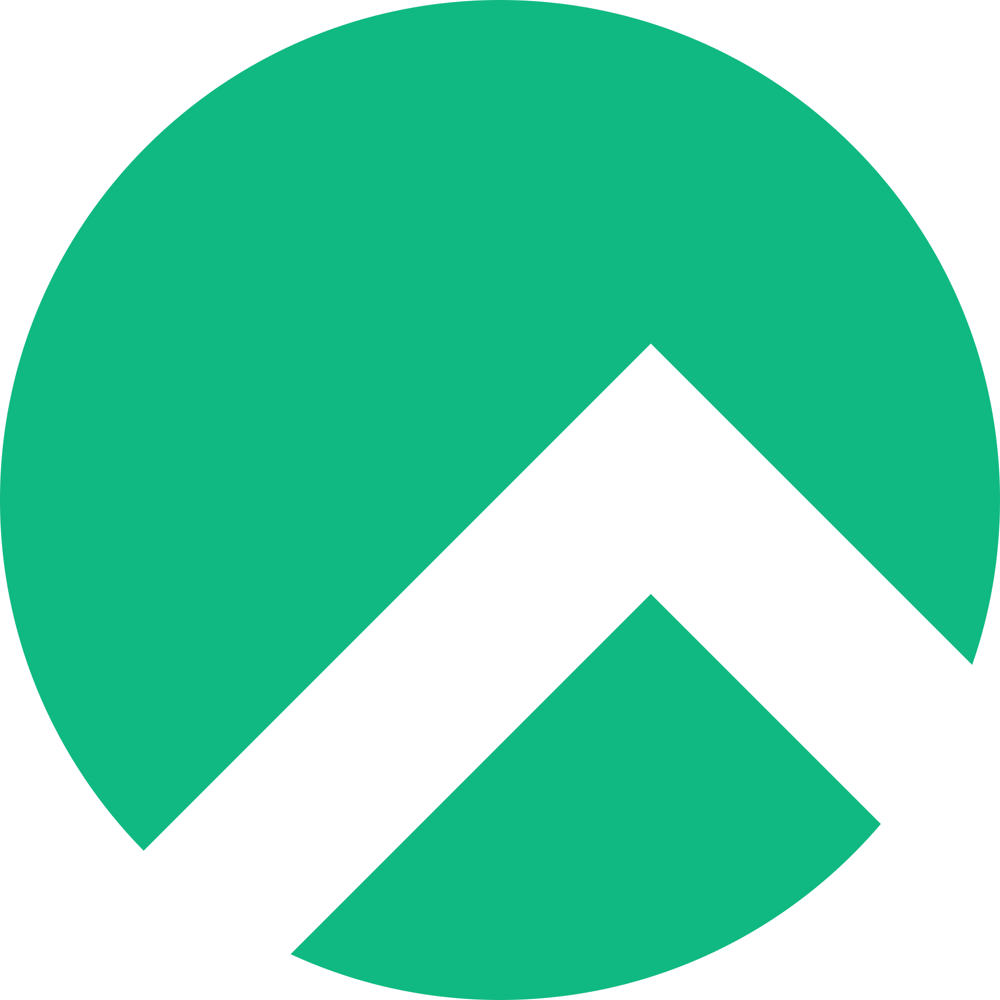 |
| roku |  |   |
| romm |  |   |
| rompya |  |   |
| rook | 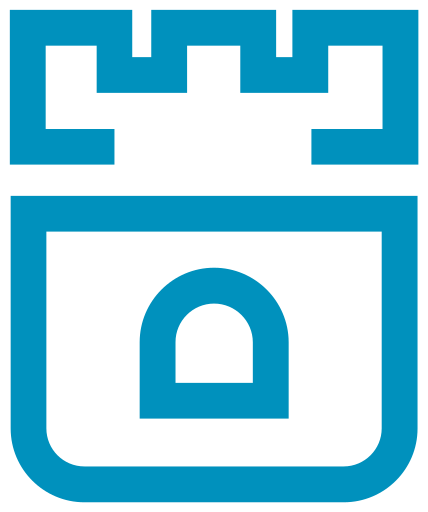 |  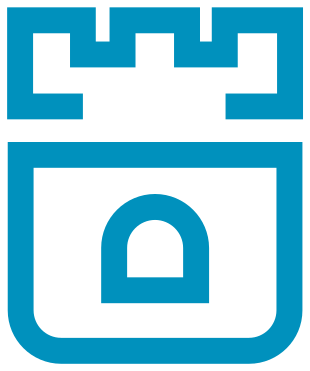 |
| room-planner |  |  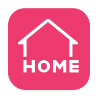 |
| root-checker |  |   |
| rosnalog |  |  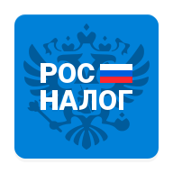 |
| roundcube |  |   |
| rounz |  |   |
| router |  |   |
| rpi-monitor |  |   |
| rport |  |   |
| rs-file-manager |  |   |
| rspamd |  |   |
| rss-bridge |  |   |
| rsshub |  |   |
| rstudio |  |   |
| ruangguru |  |   |
| ruby |  |   |
| rumble |  |   |
| rundeck |  |   |
| runeaudio |  |   |
| runkeeper |  |   |
| runonflux |  |   |
| russian-post |  |   |
| rust |  |   |
| rust-crab |  |   |
| rust-game |  |   |
| rustdesk |  |   |
| rutaxi |  |   |
| rutorrent |  |   |
| ryot |  |   |
| ryot-light |  |   |

[[HOME](..)][[#](directory.md)][[A](directory-a.md)][[B](directory-b.md)][[C](directory-c.md)][[D](directory-d.md)][[E](directory-e.md)][[F](directory-f.md)][[G](directory-g.md)][[H](directory-h.md)][[I](directory-i.md)][[J](directory-j.md)][[K](directory-k.md)][[L](directory-l.md)][[M](directory-m.md)][[N](directory-n.md)][[O](directory-o.md)][[P](directory-p.md)][[Q](directory-q.md)][[R](directory-r.md)][[S](directory-s.md)][[T](directory-t.md)][[U](directory-u.md)][[V](directory-v.md)][[W](directory-w.md)][[X](directory-x.md)][[Y](directory-y.md)][[Z](directory-z.md)]

