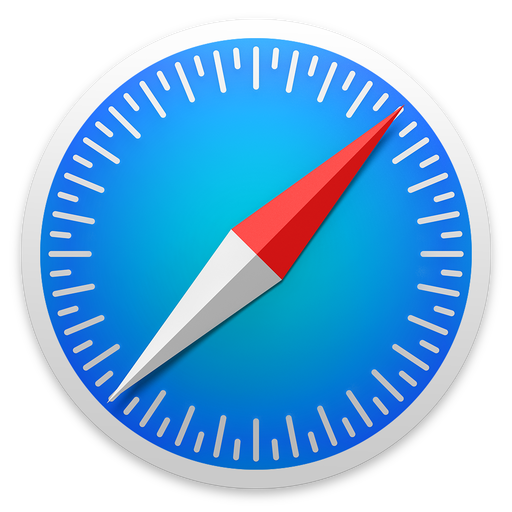
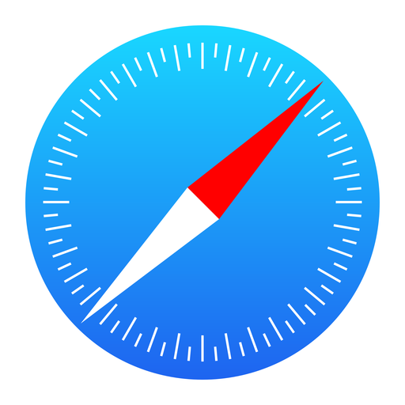
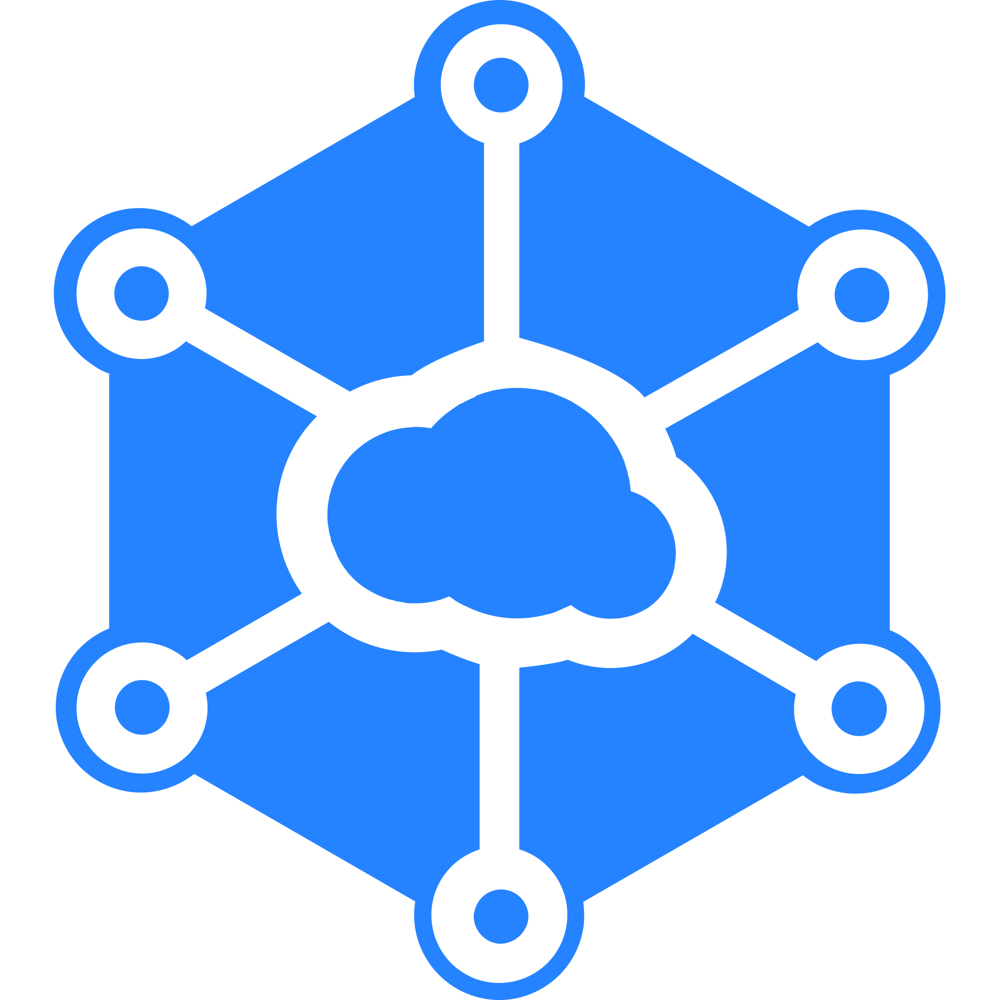

# Awesome Dashboard Icons

[[HOME](../README.md)][[#](directory.md)][[A](directory-a.md)][[B](directory-b.md)][[C](directory-c.md)][[D](directory-d.md)][[E](directory-e.md)][[F](directory-f.md)][[G](directory-g.md)][[H](directory-h.md)][[I](directory-i.md)][[J](directory-j.md)][[K](directory-k.md)][[L](directory-l.md)][[M](directory-m.md)][[N](directory-n.md)][[O](directory-o.md)][[P](directory-p.md)][[Q](directory-q.md)][[R](directory-r.md)][[S](directory-s.md)][[T](directory-t.md)][[U](directory-u.md)][[V](directory-v.md)][[W](directory-w.md)][[X](directory-x.md)][[Y](directory-y.md)][[Z](directory-z.md)]

# Directory: S

| Icon Name | PNG | SVG |
|-----------|-----|-----|
| s8-edge-music-player |  |   |
| sabnzbd |  |   |
| sabnzbd-alt |  |   |
| safari |  |   |
| safari-ios |  |   |
| safeincloud |  |   |
| sagemcom |  |   |
| sagon |  |   |
| sahibinden |  |   |
| sai |  |   |
| salad |  |   |
| salatuk |  |   |
| samsung-device-care |  |   |
| samsung-global-goals |  |   |
| samsung-health |  |   |
| samsung-internet |  |   |
| samsung-link |  |   |
| samsung-members |  |   |
| samsung-music |  |   |
| samsung-o |  |   |
| samsung-pass |  |   |
| samsung-pay |  |   |
| samsung-secure-folder |  |   |
| samsung-smart-things |  |   |
| samsung-tips |  |   |
| sandstorm |  |   |
| santander |  |   |
| santander-way |  |   |
| satisfactory |  |   |
| satisfactory-logo |  |   |
| satoshiproof |  |   |
| sber-market |  |   |
| sberbank |  |   |
| sberbank-spasibo |  |   |
| scaleway |  |   |
| scanservjs |  |   |
| schneider |  |   |
| scrcpy |  |   |
| screenconnect |  |   |
| scribd |  |   |
| scrutiny |  |   |
| scrutiny-light |  |   |
| scrypted |  |   |
| sd-maid |  |   |
| seafile |  |   |
| seagate |  |   |
| searx |  |   |
| searx-light |  |   |
| searx-logo |  |   |
| searxng |  |   |
| seconds-clock |  |   |
| secret-codes |  |   |
| secure-file-manager-beta |  |   |
| secure-settings |  |   |
| seek-jobs |  |   |
| seeneva |  |   |
| seguros-unimed |  |   |
| selfhosted |  |   |
| selfhosted-light |  |   |
| selinux |  |   |
| semaphor |  |   |
| semaphore |  |   |
| semver |  |   |
| semver-light |  |   |
| send |  |   |
| send-files-to-tv |  |   |
| sendinblue |  |   |
| sennheiser-control |  |   |
| sensu |  |   |
| sentry |  |   |
| seq |  |   |
| seriesguide |  |   |
| serpbear |  |   |
| servarr |  |   |
| servarr-light |  |   |
| server-fault |  |   |
| serviio |  |   |
| session |  |   |
| sftpgo |  |   |
| shaarli |  |   |
| shareit |  |   |
| sharik |  |   |
| shazam |  |   |
| shein |  |   |
| shell |  |   |
| shell-light |  |   |
| shell-tips |  |   |
| shell-tips-light |  |   |
| shellhub |  |   |
| shellngn |  |   |
| shelly-logo |  |   |
| shinobi |  |   |
| shiori |  |   |
| shlink |  |   |
| shoko |  |   |
| shopee |  |   |
| shopify |  |   |
| shuttle-music-player |  |   |
| siap-undip |  |   |
| sickbeard |  |   |
| sickchill |  |   |
| sickgear |  |   |
| sicoob |  |   |
| signal |  |   |
| signal-transparent |  |   |
| sigstore |  |   |
| silverbullet |  |   |
| simeji |  |   |
| simple-crypto-widget |  |   |
| simple-keyboard |  |   |
| simple-system-monitor |  |   |
| simplelogin |  |   |
| simplenote |  |   |
| simpletextcrypt |  |   |
| simplisafe |  |   |
| simply-yoga-free |  |   |
| sinusbot |  |   |
| siyuan |  |   |
| sketchbook |  |   |
| skit-premium |  |   |
| skylink-fibernet-logo |  |   |
| skype |  |   |
| skype-business |  |   |
| skype-lite |  |   |
| slaanesh |  |   |
| slack |  |   |
| sleep-as-android |  |   |
| slice |  |   |
| slidev |  |   |
| sling |  |   |
| sling-logo |  |   |
| slink |  |   |
| slink-light |  |   |
| slskd |  |   |
| smallstep |  |   |
| smart-audiobook-player |  |   |
| smart-eq |  |   |
| smart-launcher |  |   |
| smart-launcher-pro |  |   |
| smart-swf-player |  |   |
| smart-tv-remote |  |   |
| smart-watch |  |   |
| smartfox |  |   |
| smartoffice |  |   |
| smokeping |  |   |
| sms-backup |  |   |
| smssecure |  |   |
| smt-calculator |  |   |
| smt-calendar |  |   |
| smt-camera |  |   |
| smt-contacts |  |   |
| smt-dialer |  |   |
| smt-file-manager |  |   |
| smt-gallery |  |   |
| smt-keyboard |  |   |
| smt-messages |  |   |
| smt-musicplayer |  |   |
| smt-thankyou |  |   |
| smt-voicerecorder |  |   |
| snapcast |  |   |
| snapcast-logo |  |   |
| snapcast-logo-light |  |   |
| snapchat |  |   |
| snapdrop |  |   |
| snapp |  |   |
| snappymail |  |   |
| snappymail-light |  |   |
| snes9x |  |   |
| snibox |  |   |
| snipe-it |  |   |
| snippetbox |  |   |
| snooperstopper |  |   |
| snoopsnitch |  |   |
| sodexo |  |   |
| sofascore |  |   |
| software-in-the-public-interest |  |   |
| software-update |  |   |
| sogo |  |   |
| solar-system-scope |  |   |
| solid-explorer |  |   |
| solid-invoice |  |   |
| solo-launcher |  |   |
| sololearn |  |   |
| sonarqube |  |   |
| sonarr |  |   |
| sonatype-repository |  |   |
| sonatype-repository-light |  |   |
| songkick |  |   |
| sophos |  |   |
| soulseek |  |   |
| sound-meter |  |   |
| soundcloud |  |   |
| soundcloud-pulse |  |   |
| soundhound |  |   |
| soundwire |  |   |
| sourcegraph |  |   |
| sourcehut |  |   |
| sourcehut-light |  |   |
| southern-cross |  |   |
| space-engineers |  |   |
| space-engineers-light |  |   |
| spamassassin |  |   |
| spar |  |   |
| spark |  |   |
| spark-nz |  |   |
| sparkleshare |  |   |
| speaker-cleaner |  |   |
| specter-desktop |  |   |
| speech-texter |  |   |
| speechnotes |  |   |
| speedtest |  |   |
| speedtest-tracker |  |   |
| speedtest-tracker-old |  |   |
| sphinx |  |   |
| sphinx-doc |  |   |
| sphinx-relay |  |   |
| spiderfoot |  |   |
| splid |  |   |
| splunk |  |   |
| spoolman |  |   |
| sportmaster |  |   |
| spotify |  |   |
| spotify-client |  |   |
| spotnet |  |   |
| spotweb |  |   |
| sprout |  |   |
| spurs |  |   |
| sputnik-browser |  |   |
| sqlite |  |   |
| sqlitebrowser |  |   |
| sqliteprime |  |   |
| squad |  |   |
| square-home-launcher |  |   |
| square-home-settings |  |   |
| squeezebox-server |  |   |
| squidex |  |   |
| sshwifty |  |   |
| stack-exchange |  |   |
| stack-overflow |  |   |
| stalwart |  |   |
| star-chart |  |   |
| star-walk-2 |  |   |
| starmaker |  |   |
| starmoney |  |   |
| startpage-logo |  |   |
| stash |  |   |
| statefarm |  |   |
| static-web-server |  |   |
| static-web-server-white |  |   |
| statping |  |   |
| statping-ng |  |   |
| stb-proxy |  |   |
| steam |  |   |
| steam-deck |  |   |
| steam-link |  |   |
| steamdb |  |   |
| stellarium |  |   |
| stellio-player |  |   |
| sticker-maker |  |   |
| stickerly |  |   |
| stirling-pdf |  |   |
| stitcher |  |   |
| stop-call-me |  |   |
| storj |  |   |
| storm |  |   |
| strapi |  |   |
| strava |  |   |
| stream-djit |  |   |
| streama |  |   |
| stremio |  |   |
| stringis |  |   |
| stump |  |   |
| stump-logo |  |   |
| styx-browser |  |   |
| sublime-text |  |   |
| subsonic |  |   |
| substratum |  |   |
| substreamer |  |   |
| sunshine |  |   |
| sunvox |  |   |
| supabase |  |   |
| supergenpass |  |   |
| supermicro-logo |  |   |
| superproductivity |  |   |
| supersu |  |   |
| superuser |  |   |
| support |  |   |
| surespot |  |   |
| swarm |  |   |
| swarmpit |  |   |
| swf-player |  |   |
| swift |  |   |
| swiftscan |  |   |
| swizzin |  |   |
| syft |  |   |
| symmetricom-logo |  |   |
| symmetricom-logo-light |  |   |
| sympa |  |   |
| syncany |  |   |
| synclounge |  |   |
| synclounge-light |  |   |
| syncthing |  |   |
| synology |  |   |
| synology-audio-station |  |   |
| synology-calendar |  |   |
| synology-chat |  |   |
| synology-cloud-sync |  |   |
| synology-contacts |  |   |
| synology-diskstationmanager |  |   |
| synology-document-viewer |  |   |
| synology-download-station |  |   |
| synology-drive |  |   |
| synology-drive-server |  |   |
| synology-dsm |  |   |
| synology-file-station |  |   |
| synology-logo-dark |  |   |
| synology-logo-light |  |   |
| synology-logo-multicolor |  |   |
| synology-mail-plus |  |   |
| synology-mail-station |  |   |
| synology-note-station |  |   |
| synology-office |  |   |
| synology-pdfviewer |  |   |
| synology-photo-station |  |   |
| synology-photos |  |   |
| synology-surveillance-station |  |   |
| synology-text-editor |  |   |
| synology-video-station |  |   |
| synology-webstation |  |   |
| syphon |  |   |
| sysreptor |  |   |
| system76 |  |   |
| systemd |  |   |

[[HOME](../README.md)][[#](directory.md)][[A](directory-a.md)][[B](directory-b.md)][[C](directory-c.md)][[D](directory-d.md)][[E](directory-e.md)][[F](directory-f.md)][[G](directory-g.md)][[H](directory-h.md)][[I](directory-i.md)][[J](directory-j.md)][[K](directory-k.md)][[L](directory-l.md)][[M](directory-m.md)][[N](directory-n.md)][[O](directory-o.md)][[P](directory-p.md)][[Q](directory-q.md)][[R](directory-r.md)][[S](directory-s.md)][[T](directory-t.md)][[U](directory-u.md)][[V](directory-v.md)][[W](directory-w.md)][[X](directory-x.md)][[Y](directory-y.md)][[Z](directory-z.md)]

