# Awesome Dashboard Icons

[[HOME](..)][[#](directory.md)][[A](directory-a.md)][[B](directory-b.md)][[C](directory-c.md)][[D](directory-d.md)][[E](directory-e.md)][[F](directory-f.md)][[G](directory-g.md)][[H](directory-h.md)][[I](directory-i.md)][[J](directory-j.md)][[K](directory-k.md)][[L](directory-l.md)][[M](directory-m.md)][[N](directory-n.md)][[O](directory-o.md)][[P](directory-p.md)][[Q](directory-q.md)][[R](directory-r.md)][[S](directory-s.md)][[T](directory-t.md)][[U](directory-u.md)][[V](directory-v.md)][[W](directory-w.md)][[X](directory-x.md)][[Y](directory-y.md)][[Z](directory-z.md)]

# Directory: T

| Icon Name | PNG | SVG |
|-----------|-----|-----|
| t20-world-cup |  |  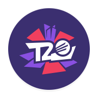 |
| tabula | 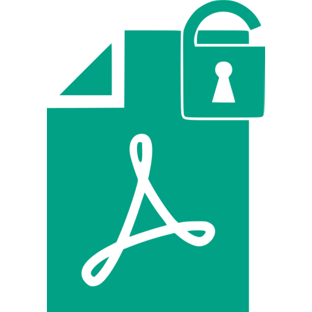 |   |
| tachiyomi |  |   |
| tacticalrmm |  |   |
| taiga | 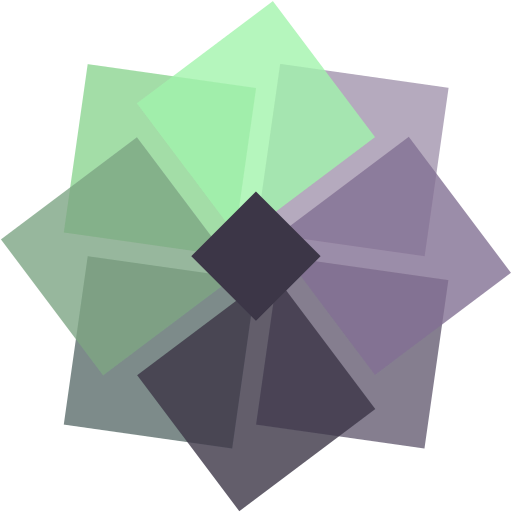 |  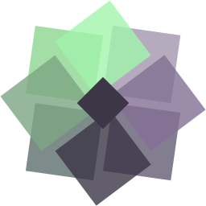 |
| tailscale |  |   |
| tailscale-light |  |   |
| talkatone |  |   |
| talos |  |   |
| tamtam-app |  |   |
| tandoor |  |   |
| tandoorrecipes |  |   |
| tangram-browser |  |   |
| tanoshi |  |   |
| tantan |  |   |
| tar1090 |  |   |
| taskade |  |   |
| taskcafe |  |   |
| tasker |  |   |
| tasker-settings |  |   |
| tasks |  |   |
| tasks-org |  |   |
| tasmoadmin |  |   |
| tasmota |  |   |
| tasmota-light | 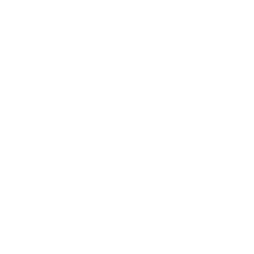 |   |
| tautulli |  |   |
| td-ameritrade |  |   |
| tdarr |  |   |
| team-fortress-2 |  |   |
| teamcity | 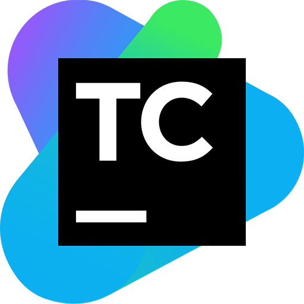 |   |
| teamspeak |  |   |
| teamspeak3 |  |   |
| teamviewer |  |   |
| teamviewer-host |  |   |
| teamviewer-quick-support |  |   |
| technitium |  |   |
| ted |  |   |
| teedy |  |   |
| tele2 |  |  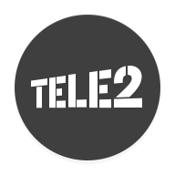 |
| telegraf | 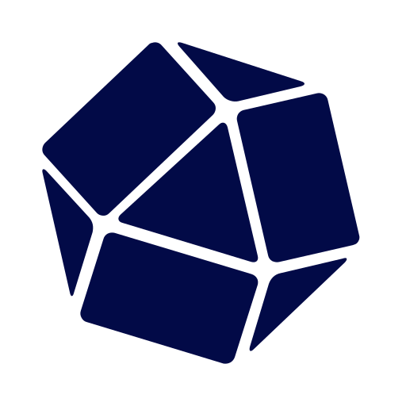 |  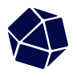 |
| telegram |  |   |
| telegram-beta |  |   |
| telegram-x |  |   |
| telekom |  |   |
| teleport | 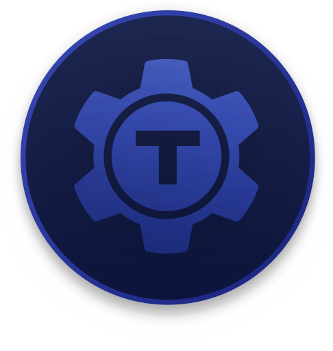 |   |
| telkomsel |  |  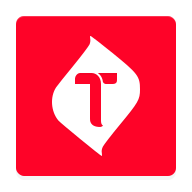 |
| tenable |  |   |
| tenda |  |   |
| terabox |  |   |
| termbot |  |   |
| terminal | 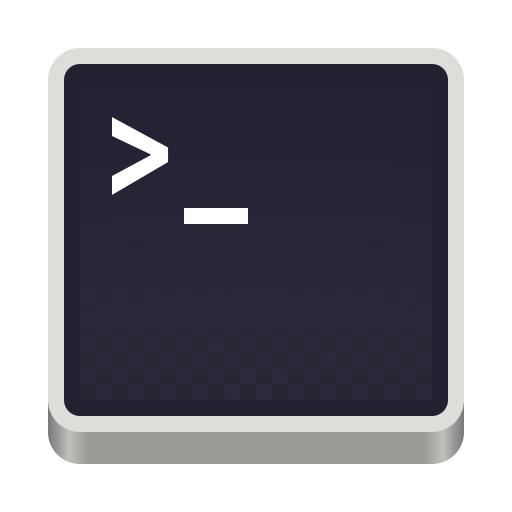 |   |
| termius |  |   |
| terraform |  |  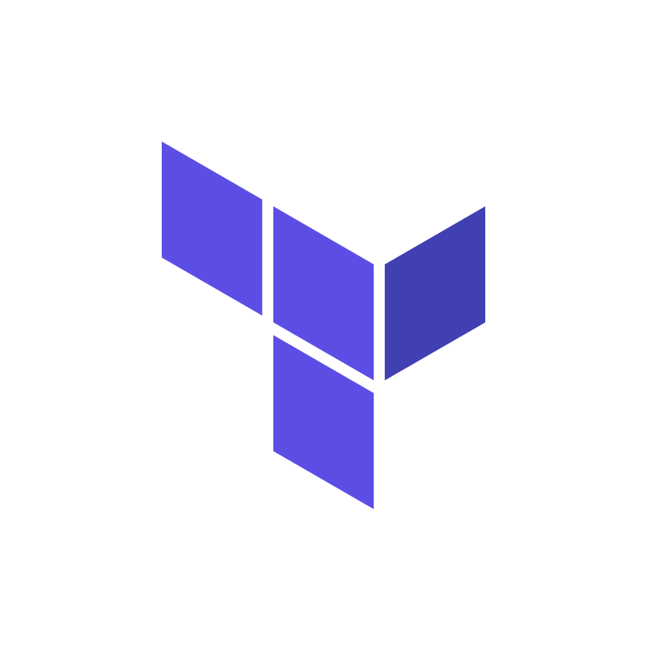 |
| terraria | 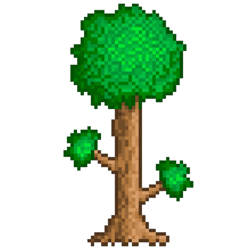 |   |
| terraria-alt | 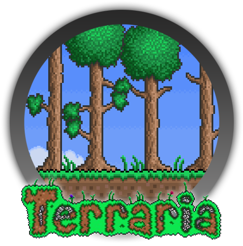 |   |
| teslamate | 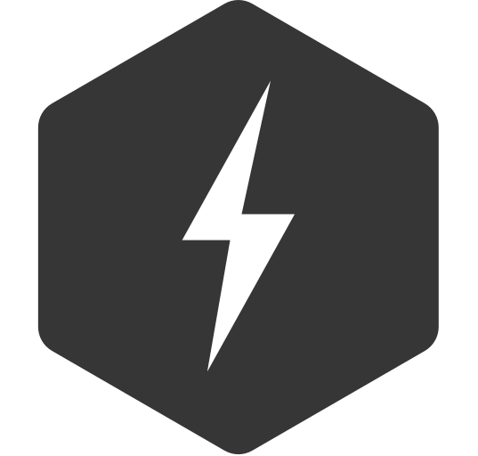 |   |
| tether |  |   |
| texaco |  |   |
| text-editor |  |   |
| textplus |  |   |
| textra |  |   |
| thanos | 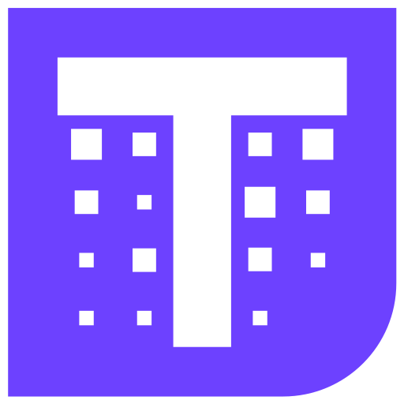 |  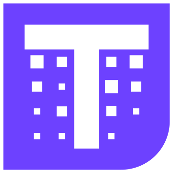 |
| the-athletic |  |   |
| the-bump |  |   |
| the-forest |  |   |
| the-pirate-bay |  |   |
| the-proxy-bay |  |   |
| thefork |  |   |
| theia |  |   |
| theia-light |  |   |
| thelounge | 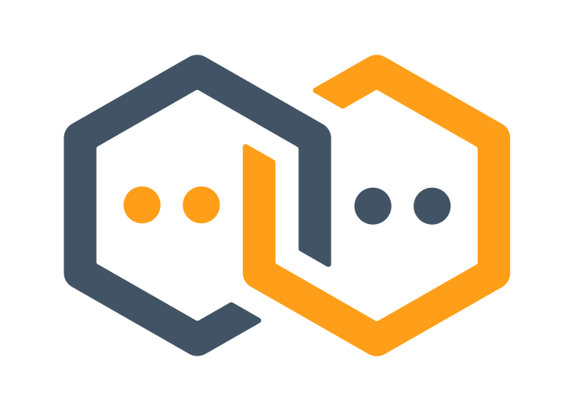 |   |
| thelounge-light |  |   |
| themepark |  |   |
| theodinproject | 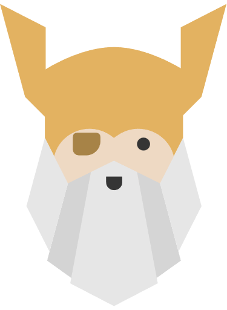 |  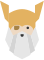 |
| thescore |  |   |
| thingsboard |  |   |
| threema |  |   |
| threema-work |  |   |
| thunar |  |   |
| thunderbird |  |   |
| thunderhub |  |   |
| thunderhub-light | 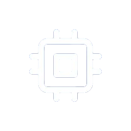 |   |
| ticktick |  |   |
| tigad |  |  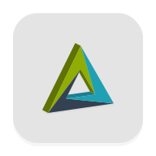 |
| tiktok |  |   |
| tiktok-downloader |  |   |
| tiktok-light |  |   |
| time-until |  |  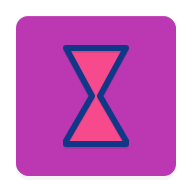 |
| timemachines |  |   |
| timemachines-light | 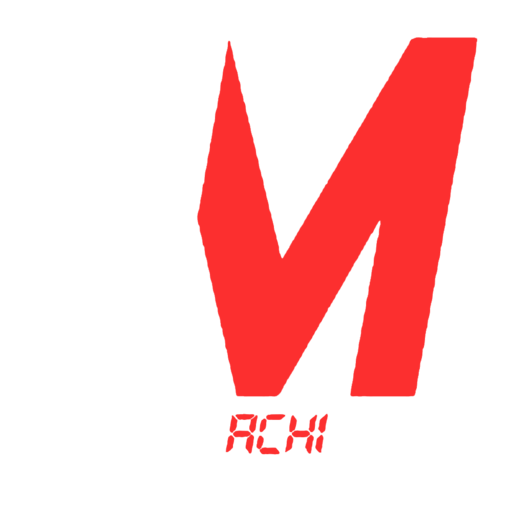 |   |
| timetagger |  |   |
| timetagger-light |  |   |
| timus |  |   |
| tinc |  |   |
| tinder |  |   |
| tinkoff |  |   |
| tiny-fax |  |   |
| tiny-tiny-rss |  |   |
| tinypilot |  |   |
| tipi | 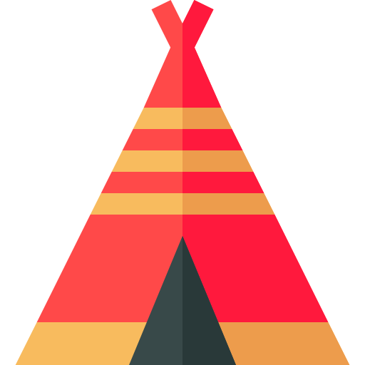 |   |
| titanium-backup |  |   |
| tix-id |  |   |
| tmobile |  |   |
| to-do-list |  |   |
| today-weather |  |   |
| todoist |  |   |
| tokocrypto |  |   |
| tokopedia |  |   |
| tolgee |  |   |
| toml |  |   |
| tooljet |  |   |
| tor | 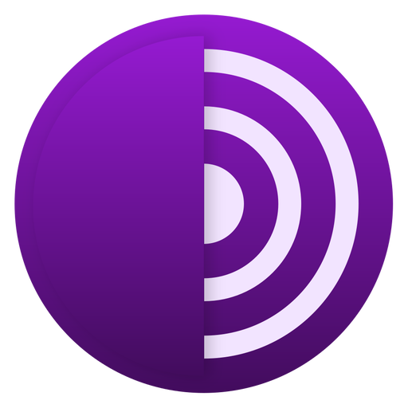 |   |
| tor-project |  |   |
| torrent-video-player-tvp |  |   |
| torrserve |  |  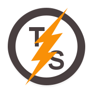 |
| torrserver | 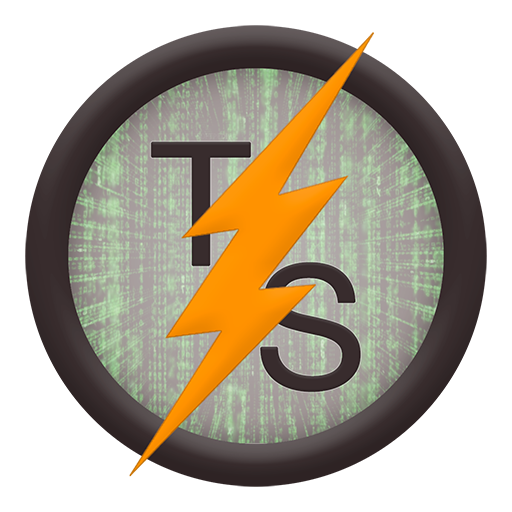 |   |
| totalcmd |  |   |
| totalplay |  |   |
| totalplay-control |  |   |
| touch-retouch |  |   |
| tp-link |  |   |
| tpplc |  |  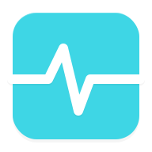 |
| traccar |  |   |
| track-and-graph |  |   |
| track24 |  |   |
| trackbook |  |   |
| trackview |  |   |
| tradingview |  |  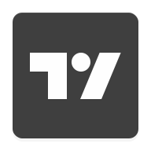 |
| traefik |  |   |
| traefik-gopher |  |  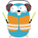 |
| traefik-proxy | 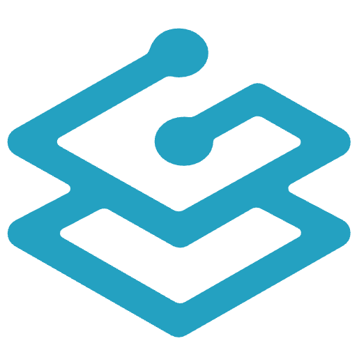 |   |
| traggo | 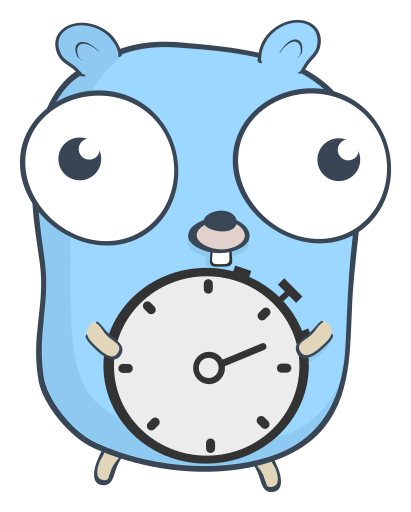 |  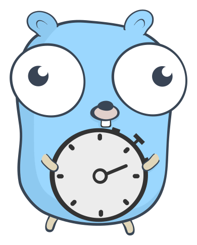 |
| trakt |  |   |
| transdrone |  |   |
| transit |  |   |
| transmission |  |   |
| trash-guides | 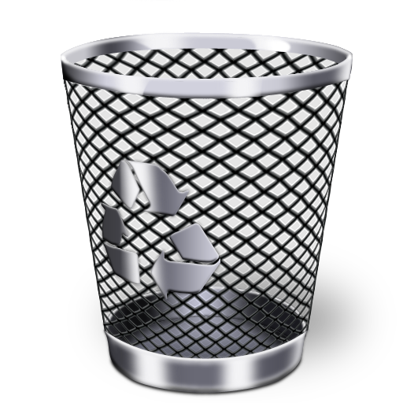 |   |
| travis-ci |  |   |
| trax-music-player |  |   |
| trello |  |   |
| trendyol |  |   |
| tresorit |  |  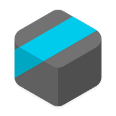 |
| trezor |  |   |
| trezor-white |  |   |
| trilium |  |   |
| trillium |  |   |
| trinity |  |  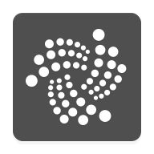 |
| trivy | 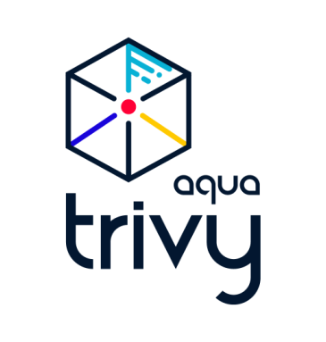 |   |
| troddit |  |   |
| trudesk |  |   |
| true-phone |  |   |
| true-phone-contacts |  |   |
| truecaller |  |   |
| truecar |  |   |
| truenas | 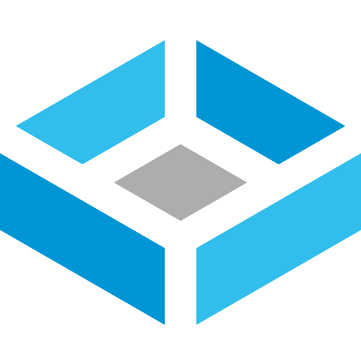 |   |
| truenas-core |  |   |
| truenas-enterprise | 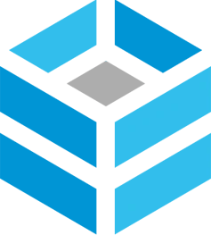 |   |
| truenas-scale |  |   |
| trulia |  |   |
| tube-archivist | 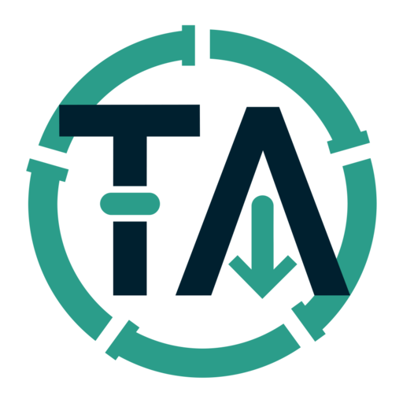 |   |
| tube-archivist-light | 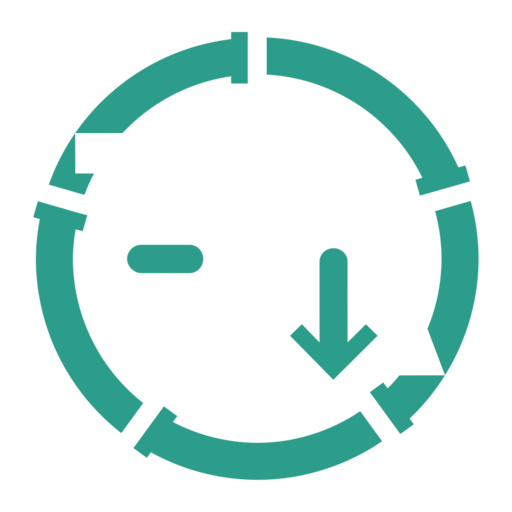 |   |
| tubearchivist | 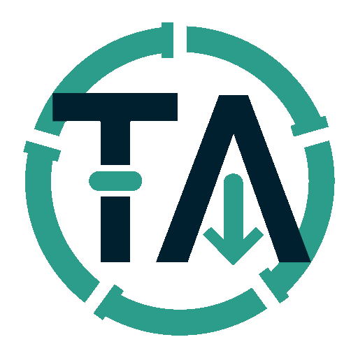 |   |
| tubesync |  |   |
| tumblr |  |   |
| tunein |  |   |
| tunein-pro |  |   |
| tunnelbear |  |  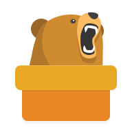 |
| tupitube |  |   |
| turbopack |  |   |
| turbopack-light |  |   |
| turtl-request |  |   |
| tusky |  |  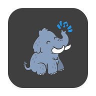 |
| tutanota |  |   |
| tux |  |   |
| tvheadend |  |   |
| tvp-vod |  |   |
| twidere |  |  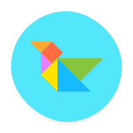 |
| twilight |  |   |
| twingate |  |   |
| twingate-light |  |   |
| twitch |  |   |
| twitter |  |   |
| twrp |  |   |
| typescript |  |   |
| typo3 |  |   |

[[HOME](..)][[#](directory.md)][[A](directory-a.md)][[B](directory-b.md)][[C](directory-c.md)][[D](directory-d.md)][[E](directory-e.md)][[F](directory-f.md)][[G](directory-g.md)][[H](directory-h.md)][[I](directory-i.md)][[J](directory-j.md)][[K](directory-k.md)][[L](directory-l.md)][[M](directory-m.md)][[N](directory-n.md)][[O](directory-o.md)][[P](directory-p.md)][[Q](directory-q.md)][[R](directory-r.md)][[S](directory-s.md)][[T](directory-t.md)][[U](directory-u.md)][[V](directory-v.md)][[W](directory-w.md)][[X](directory-x.md)][[Y](directory-y.md)][[Z](directory-z.md)]

