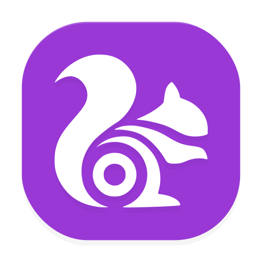
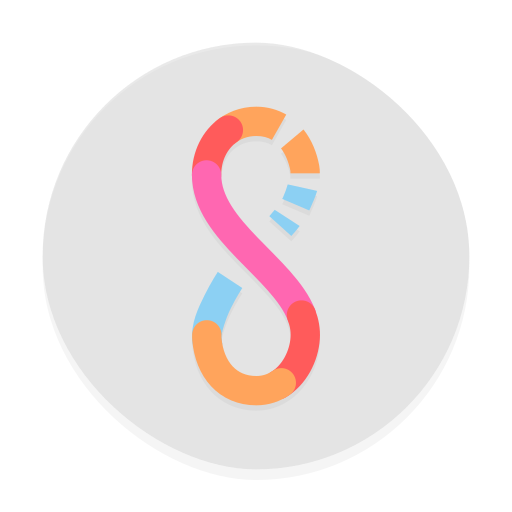
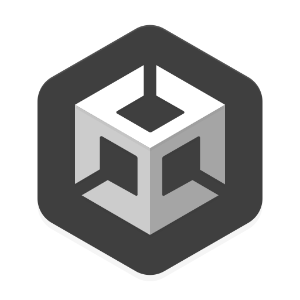
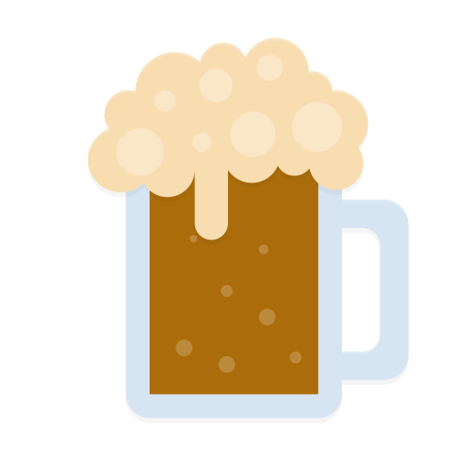
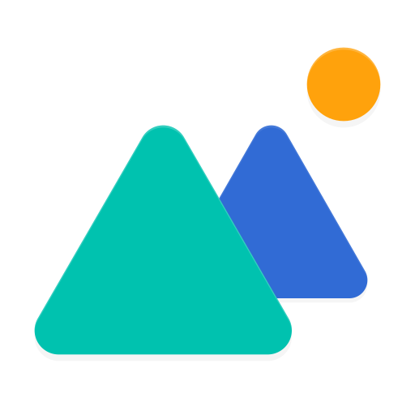
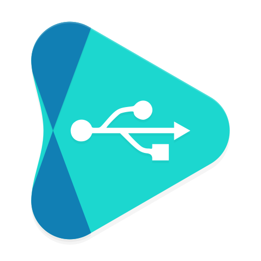
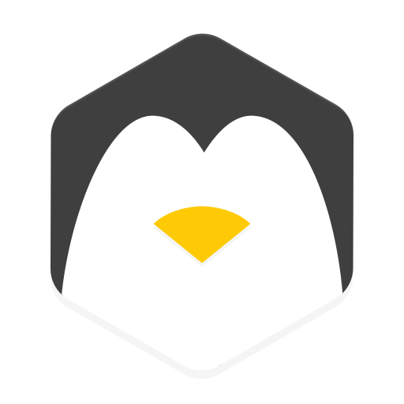

# Awesome Dashboard Icons

[[HOME](../README.md)][[#](directory.md)][[A](directory-a.md)][[B](directory-b.md)][[C](directory-c.md)][[D](directory-d.md)][[E](directory-e.md)][[F](directory-f.md)][[G](directory-g.md)][[H](directory-h.md)][[I](directory-i.md)][[J](directory-j.md)][[K](directory-k.md)][[L](directory-l.md)][[M](directory-m.md)][[N](directory-n.md)][[O](directory-o.md)][[P](directory-p.md)][[Q](directory-q.md)][[R](directory-r.md)][[S](directory-s.md)][[T](directory-t.md)][[U](directory-u.md)][[V](directory-v.md)][[W](directory-w.md)][[X](directory-x.md)][[Y](directory-y.md)][[Z](directory-z.md)]

# Directory: U

| Icon Name | PNG | SVG |
|-----------|-----|-----|
| uber-driver |  |   |
| uber-eats |  |   |
| ubiquiti |  |   |
| ubiquiti-networks |  |   |
| ubooquity |  |   |
| ubuntu |  |   |
| ubuntu-alt |  |   |
| uc-browser |  |   |
| uc-browser-mini |  |   |
| uc-browser-turbo |  |   |
| uccw |  |   |
| udemy |  |   |
| udemy-business |  |   |
| uhabits |  |   |
| ultimate-alexa |  |   |
| ultimate-guitar |  |   |
| ultimateguitar |  |   |
| umami |  |   |
| umami-analytics |  |   |
| umami-analytics-light |  |   |
| umami-light |  |   |
| umbrel |  |   |
| unbound |  |   |
| unifi |  |   |
| unifi-controller |  |   |
| unifi-protect |  |   |
| unified-remote |  |   |
| unimus |  |   |
| unip |  |   |
| unistory |  |   |
| unity |  |   |
| universal-media-server |  |   |
| unmanic |  |   |
| unraid |  |   |
| unraid-alt |  |   |
| untangle |  |   |
| untappd |  |   |
| unturned |  |   |
| unusual-wallpapers |  |   |
| updog |  |   |
| uplive |  |   |
| ups |  |   |
| upsnap |  |   |
| uptime-kuma |  |   |
| upwork |  |   |
| upwork-freelancer |  |   |
| urbackup |  |   |
| urbackup-server |  |   |
| usb-audio-player |  |   |
| user-manual |  |   |
| userland |  |   |
| utorrent |  |   |
| utox |  |   |

[[HOME](../README.md)][[#](directory.md)][[A](directory-a.md)][[B](directory-b.md)][[C](directory-c.md)][[D](directory-d.md)][[E](directory-e.md)][[F](directory-f.md)][[G](directory-g.md)][[H](directory-h.md)][[I](directory-i.md)][[J](directory-j.md)][[K](directory-k.md)][[L](directory-l.md)][[M](directory-m.md)][[N](directory-n.md)][[O](directory-o.md)][[P](directory-p.md)][[Q](directory-q.md)][[R](directory-r.md)][[S](directory-s.md)][[T](directory-t.md)][[U](directory-u.md)][[V](directory-v.md)][[W](directory-w.md)][[X](directory-x.md)][[Y](directory-y.md)][[Z](directory-z.md)]

