# Awesome Dashboard Icons

[[HOME](..)][[#](directory.md)][[A](directory-a.md)][[B](directory-b.md)][[C](directory-c.md)][[D](directory-d.md)][[E](directory-e.md)][[F](directory-f.md)][[G](directory-g.md)][[H](directory-h.md)][[I](directory-i.md)][[J](directory-j.md)][[K](directory-k.md)][[L](directory-l.md)][[M](directory-m.md)][[N](directory-n.md)][[O](directory-o.md)][[P](directory-p.md)][[Q](directory-q.md)][[R](directory-r.md)][[S](directory-s.md)][[T](directory-t.md)][[U](directory-u.md)][[V](directory-v.md)][[W](directory-w.md)][[X](directory-x.md)][[Y](directory-y.md)][[Z](directory-z.md)]

# Directory: V

| Icon Name | PNG | SVG |
|-----------|-----|-----|
| v-rising |  |   |
| vagrant |  |   |
| valetudo | 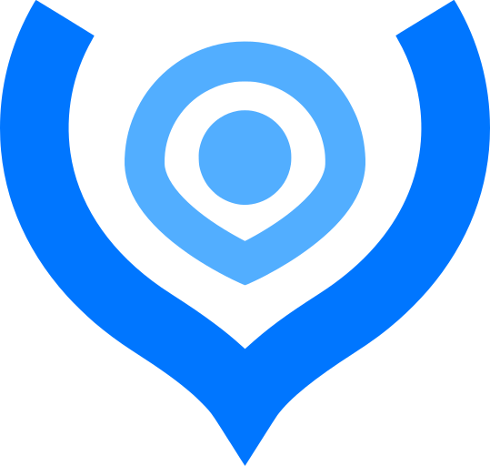 |   |
| valheim | 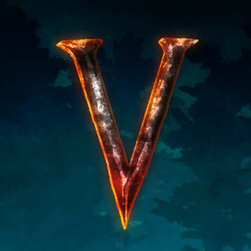 |   |
| valkey |  |   |
| vanced-manager |  |   |
| vault | 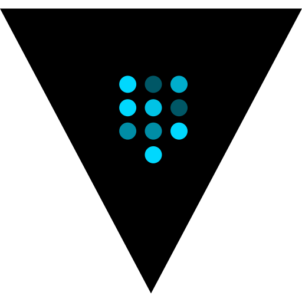 |   |
| vault-light | 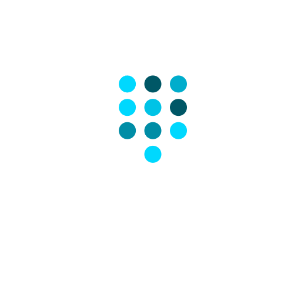 |   |
| vaultwarden |  |  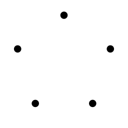 |
| vaultwarden-light |  |   |
| vc-browser |  |   |
| veeam |  |   |
| ventusky |  |  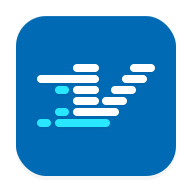 |
| vercel | 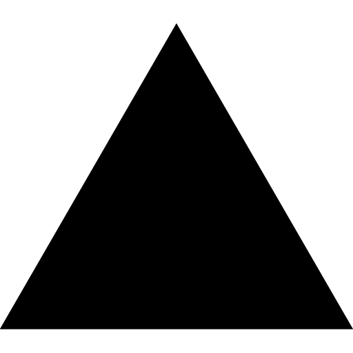 |   |
| vercel-light |  |  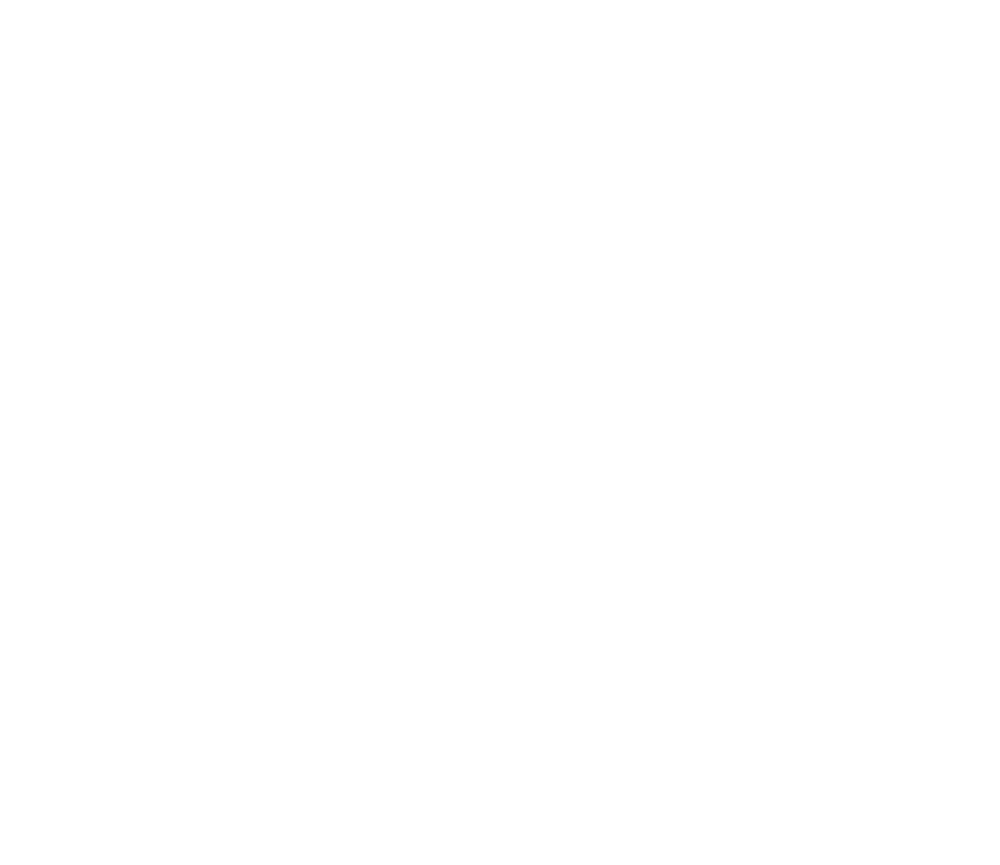 |
| verizon |  |   |
| verizon-call-filter |  |   |
| verizon-digital-secure |  |   |
| verizon-messages |  |   |
| vi |  |   |
| via-browser |  |   |
| viber |  |   |
| victoriametrics |  |   |
| victoriametrics-light |  |   |
| video-player-all-format |  |   |
| video-player-audio-player |  |   |
| video-player-perfect-hd |  |   |
| videoplayer-ultimate |  |   |
| viewtube |  |   |
| vikunja | 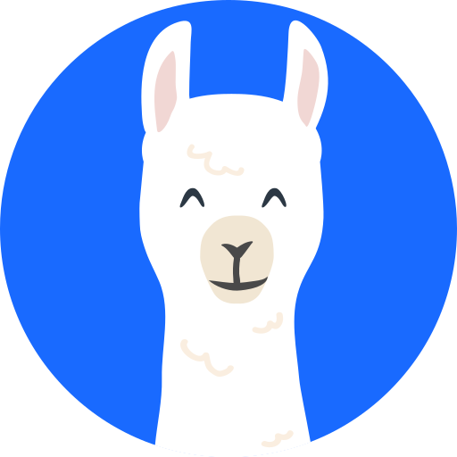 |   |
| vim |  |   |
| vimeo |  |   |
| virgin-media |  |   |
| virtualmin |  |  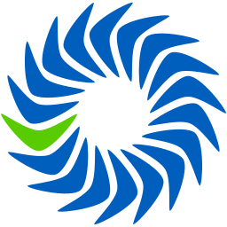 |
| virtualradarserver |  |   |
| viseron | 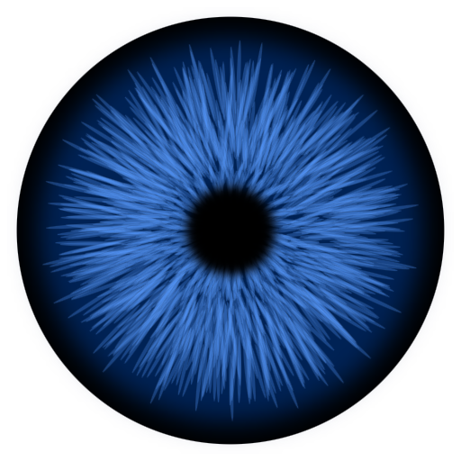 |  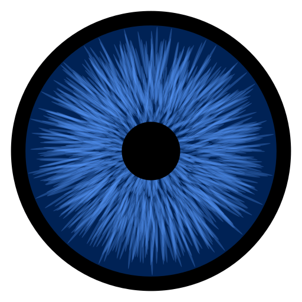 |
| visual-studio-code |  |   |
| vivaldi |  |   |
| vivaldi-snapshot |  |   |
| vivavideo |  |   |
| viviant | 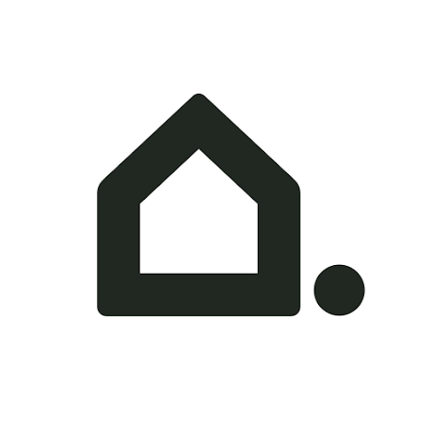 |   |
| vk |  |   |
| vk-job |  |   |
| vlc |  |   |
| vmware | 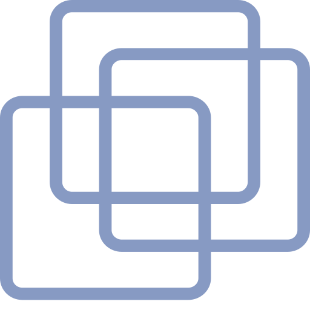 |  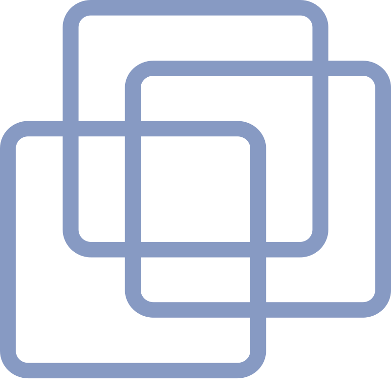 |
| vmware-esxi |  |   |
| vmware-horizon |  |   |
| vmware-vcenter |  |   |
| vmware-workstation | 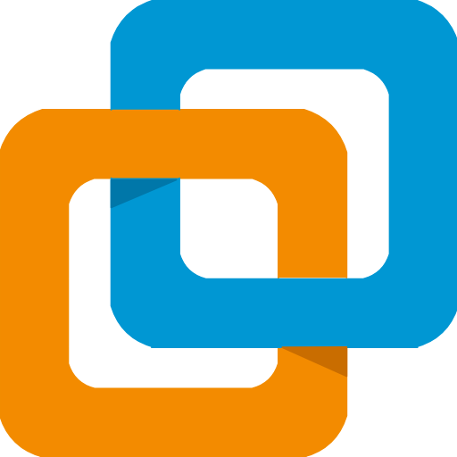 |  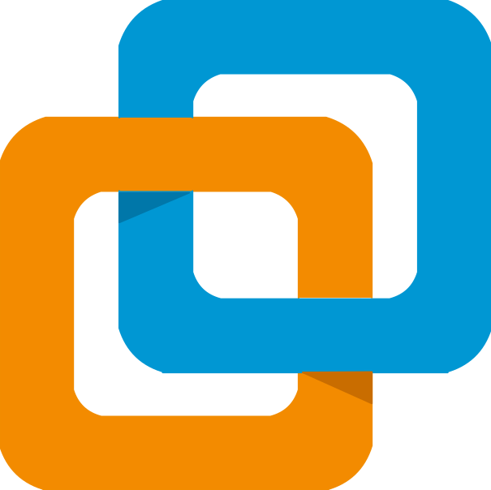 |
| vmwarehorizon |  |   |
| vn-video-editor |  |   |
| vnc-viewer |  |  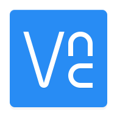 |
| vodafone |  |   |
| voice-audiobook-player |  |   |
| voip-info |  |   |
| voip-ms |  |   |
| volumio | 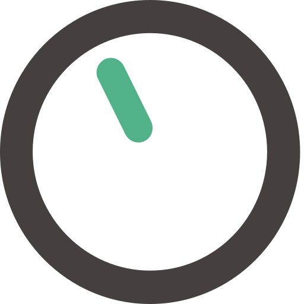 |   |
| volumio-light | 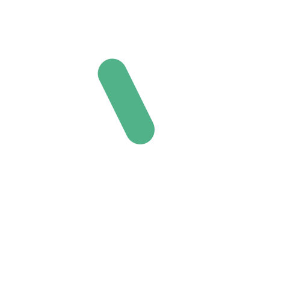 |   |
| voron |  |   |
| vplay |  |   |
| vscode |  |   |
| vseinstrumenti |  |   |
| vsemayki |  |   |
| vulkan |  |   |
| vultr | 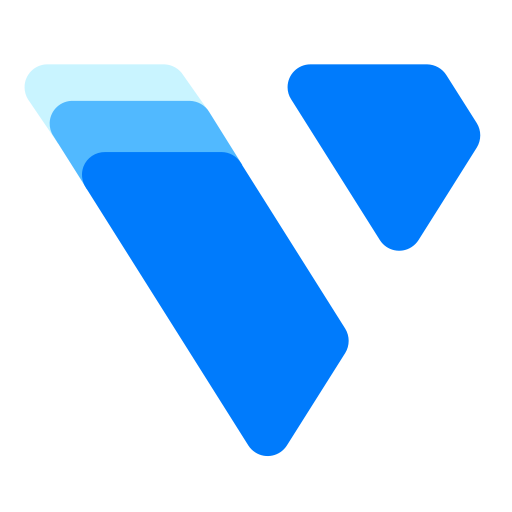 |   |
| vultr-light |  |   |
| vuplus | 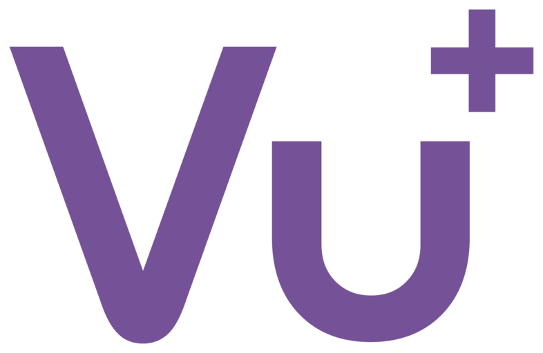 |   |
| vuze |  |   |
| vyos |  |   |

[[HOME](..)][[#](directory.md)][[A](directory-a.md)][[B](directory-b.md)][[C](directory-c.md)][[D](directory-d.md)][[E](directory-e.md)][[F](directory-f.md)][[G](directory-g.md)][[H](directory-h.md)][[I](directory-i.md)][[J](directory-j.md)][[K](directory-k.md)][[L](directory-l.md)][[M](directory-m.md)][[N](directory-n.md)][[O](directory-o.md)][[P](directory-p.md)][[Q](directory-q.md)][[R](directory-r.md)][[S](directory-s.md)][[T](directory-t.md)][[U](directory-u.md)][[V](directory-v.md)][[W](directory-w.md)][[X](directory-x.md)][[Y](directory-y.md)][[Z](directory-z.md)]

