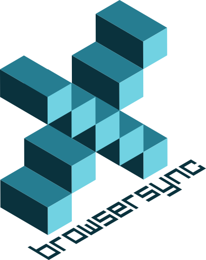
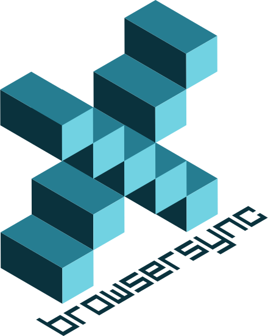
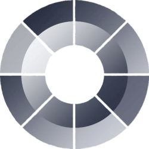

# Awesome Dashboard Icons

[[HOME](../README.md)][[#](directory.md)][[A](directory-a.md)][[B](directory-b.md)][[C](directory-c.md)][[D](directory-d.md)][[E](directory-e.md)][[F](directory-f.md)][[G](directory-g.md)][[H](directory-h.md)][[I](directory-i.md)][[J](directory-j.md)][[K](directory-k.md)][[L](directory-l.md)][[M](directory-m.md)][[N](directory-n.md)][[O](directory-o.md)][[P](directory-p.md)][[Q](directory-q.md)][[R](directory-r.md)][[S](directory-s.md)][[T](directory-t.md)][[U](directory-u.md)][[V](directory-v.md)][[W](directory-w.md)][[X](directory-x.md)][[Y](directory-y.md)][[Z](directory-z.md)]

# Directory: X

| Icon Name | PNG | SVG |
|-----------|-----|-----|
| x |  |   |
| x-light |  |   |
| xbackbone |  |   |
| xbrowsersync |  |   |
| xcp-ng |  |   |
| xda-developers |  |   |
| xen-orchestra |  |   |
| xender |  |   |
| xenoamp-music-player |  |   |
| xfce |  |   |
| xfinity-logo |  |   |
| xiaomi-wear |  |   |
| xigmanas |  |   |
| ximalaya-fm |  |   |
| xmanager-spotify |  |   |
| xml |  |   |
| xmr |  |   |
| xmrig |  |   |
| xnconvert |  |   |
| xnretro |  |   |
| xnsketch |  |   |
| xplay-music-player |  |   |
| xteve |  |   |
| xwiki |  |   |

[[HOME](../README.md)][[#](directory.md)][[A](directory-a.md)][[B](directory-b.md)][[C](directory-c.md)][[D](directory-d.md)][[E](directory-e.md)][[F](directory-f.md)][[G](directory-g.md)][[H](directory-h.md)][[I](directory-i.md)][[J](directory-j.md)][[K](directory-k.md)][[L](directory-l.md)][[M](directory-m.md)][[N](directory-n.md)][[O](directory-o.md)][[P](directory-p.md)][[Q](directory-q.md)][[R](directory-r.md)][[S](directory-s.md)][[T](directory-t.md)][[U](directory-u.md)][[V](directory-v.md)][[W](directory-w.md)][[X](directory-x.md)][[Y](directory-y.md)][[Z](directory-z.md)]

