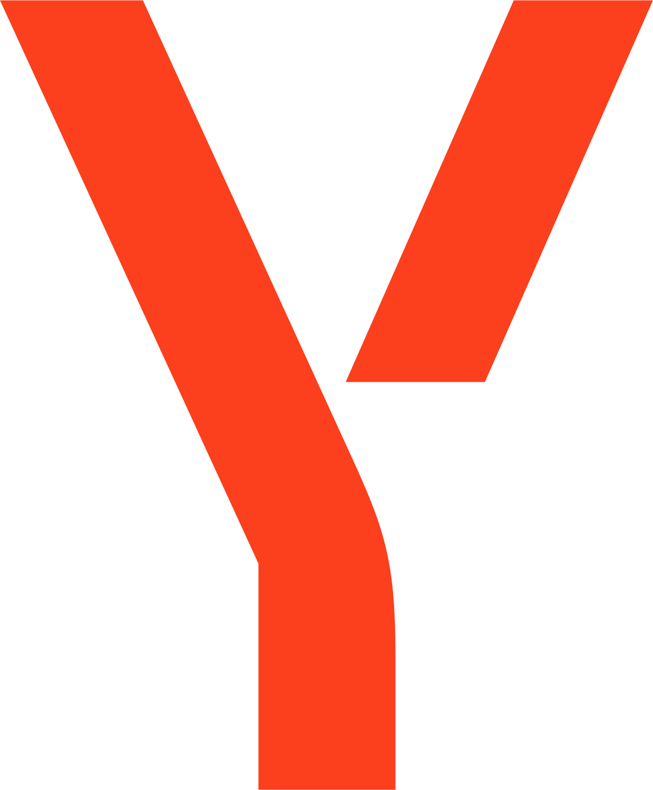
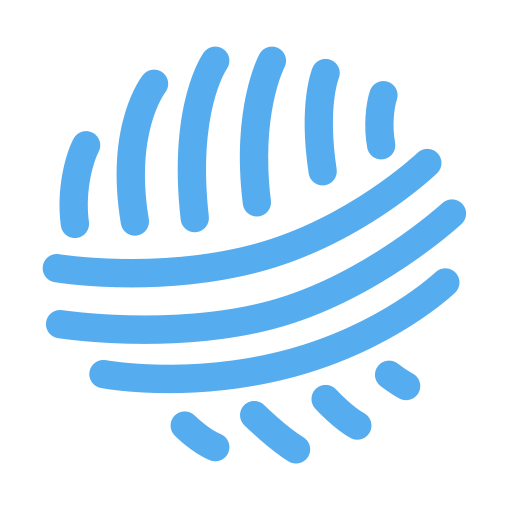
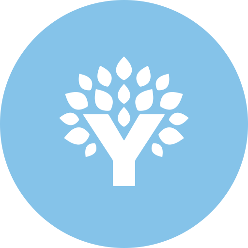
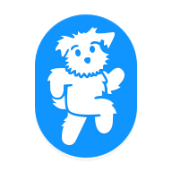
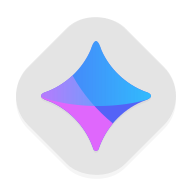
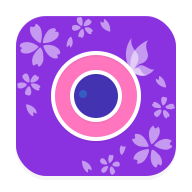

# Awesome Dashboard Icons

[[HOME](..)][[#](directory.md)][[A](directory-a.md)][[B](directory-b.md)][[C](directory-c.md)][[D](directory-d.md)][[E](directory-e.md)][[F](directory-f.md)][[G](directory-g.md)][[H](directory-h.md)][[I](directory-i.md)][[J](directory-j.md)][[K](directory-k.md)][[L](directory-l.md)][[M](directory-m.md)][[N](directory-n.md)][[O](directory-o.md)][[P](directory-p.md)][[Q](directory-q.md)][[R](directory-r.md)][[S](directory-s.md)][[T](directory-t.md)][[U](directory-u.md)][[V](directory-v.md)][[W](directory-w.md)][[X](directory-x.md)][[Y](directory-y.md)][[Z](directory-z.md)]

# Directory: Y

| Icon Name | PNG | SVG |
|-----------|-----|-----|
| yaade |  |   |
| yacht |  |   |
| yacht-light |  |   |
| yahoo |  |   |
| yahoo-fantasy |  |   |
| yahoo-finance |  |   |
| yahoo-mail |  |   |
| yaml |  |   |
| yandex |  |   |
| yarn |  |   |
| yarn-social |  |   |
| ycombinator |  |   |
| yelp |  |   |
| yemeksepeti |  |   |
| ymarks |  |   |
| ynab |  |   |
| yo-browser |  |   |
| yoga |  |   |
| yolo-browser |  |   |
| yono-sbi |  |   |
| yoomoney |  |   |
| yota |  |   |
| youcut |  |   |
| youla |  |   |
| youperfect |  |   |
| your-spotify |  |   |
| yourls-logo |  |   |
| youtube |  |   |
| youtube-dl |  |   |
| youtube-kids |  |   |
| youtube-music |  |   |
| youtube-music-vanced |  |   |
| youtube-vanced |  |   |
| yowindow |  |   |
| yts |  |   |
| yuka |  |   |
| yunohost |  |   |
| yunohost-light |  |   |
| yurtici-kargo |  |   |

[[HOME](..)][[#](directory.md)][[A](directory-a.md)][[B](directory-b.md)][[C](directory-c.md)][[D](directory-d.md)][[E](directory-e.md)][[F](directory-f.md)][[G](directory-g.md)][[H](directory-h.md)][[I](directory-i.md)][[J](directory-j.md)][[K](directory-k.md)][[L](directory-l.md)][[M](directory-m.md)][[N](directory-n.md)][[O](directory-o.md)][[P](directory-p.md)][[Q](directory-q.md)][[R](directory-r.md)][[S](directory-s.md)][[T](directory-t.md)][[U](directory-u.md)][[V](directory-v.md)][[W](directory-w.md)][[X](directory-x.md)][[Y](directory-y.md)][[Z](directory-z.md)]

