# Awesome Dashboard Icons

[[HOME](..)][[#](directory.md)][[A](directory-a.md)][[B](directory-b.md)][[C](directory-c.md)][[D](directory-d.md)][[E](directory-e.md)][[F](directory-f.md)][[G](directory-g.md)][[H](directory-h.md)][[I](directory-i.md)][[J](directory-j.md)][[K](directory-k.md)][[L](directory-l.md)][[M](directory-m.md)][[N](directory-n.md)][[O](directory-o.md)][[P](directory-p.md)][[Q](directory-q.md)][[R](directory-r.md)][[S](directory-s.md)][[T](directory-t.md)][[U](directory-u.md)][[V](directory-v.md)][[W](directory-w.md)][[X](directory-x.md)][[Y](directory-y.md)][[Z](directory-z.md)]

# Directory: Z

| Icon Name | PNG | SVG |
|-----------|-----|-----|
| z-shell |  |   |
| z-wave |  |   |
| zabbix | 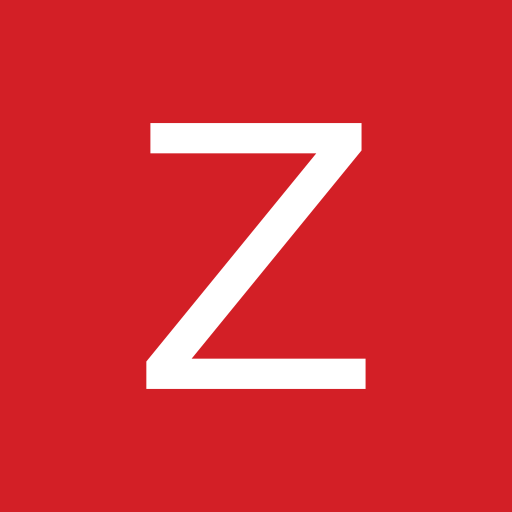 |   |
| zabbix-wide |  |   |
| zabka |  |   |
| zammad | 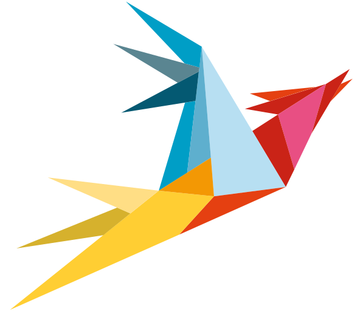 |   |
| zarchiver |  |  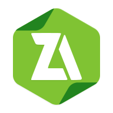 |
| zarchiver-pro |  |   |
| zdfmediathek |  |  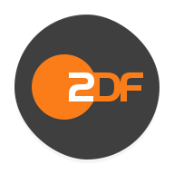 |
| zedge |  |   |
| zendesk | 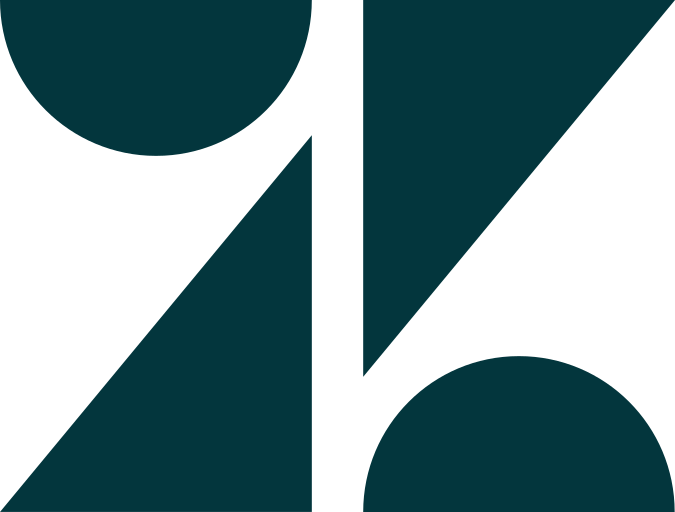 |  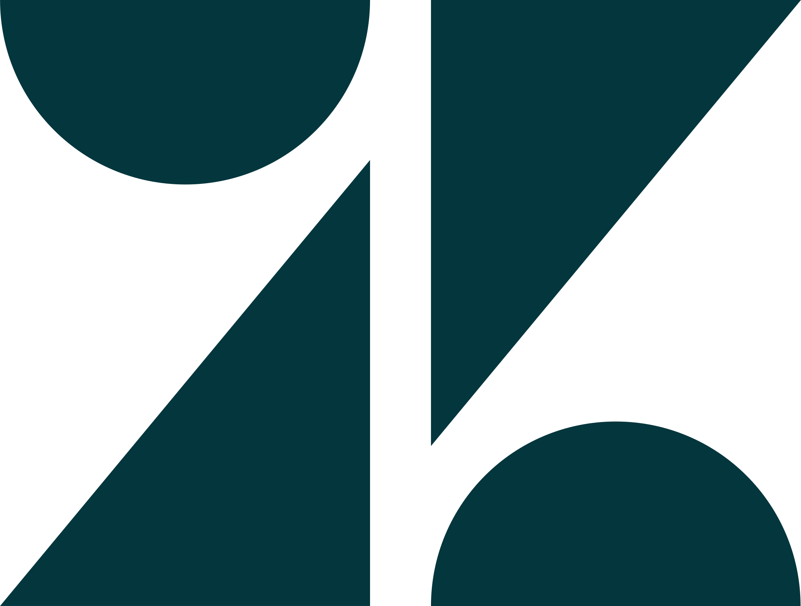 |
| zenly |  |  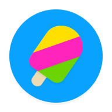 |
| zenmoney |  |  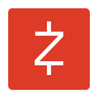 |
| zero-launcher |  |  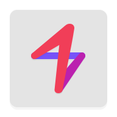 |
| zerossl |  |   |
| zerotier | 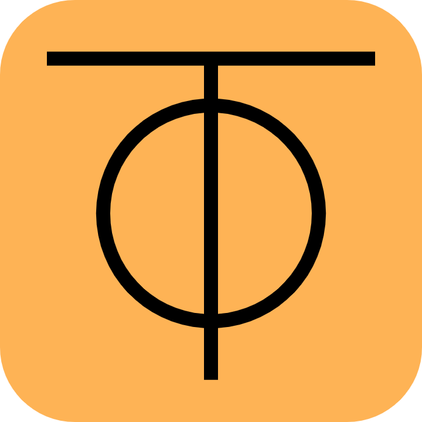 |  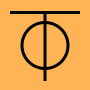 |
| zerotier-one |  |  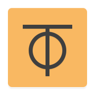 |
| zgz-video-player |  |   |
| zhanghai-files |  |   |
| zigbang |  |  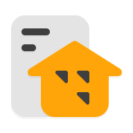 |
| zigbee |  |   |
| zigbee2mqtt |  |   |
| zipline |  |   |
| zipline-light |  |   |
| ziraat-mobile |  |  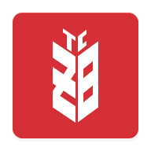 |
| zitadel | 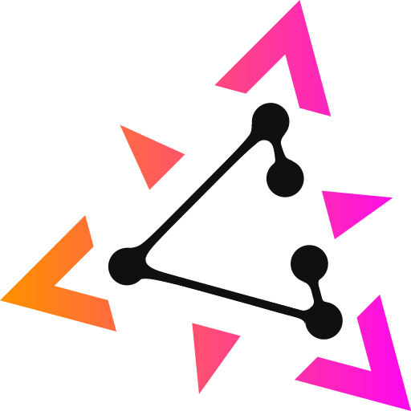 |  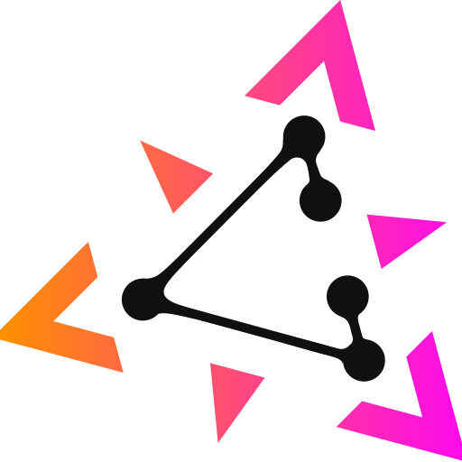 |
| zitadel-light | 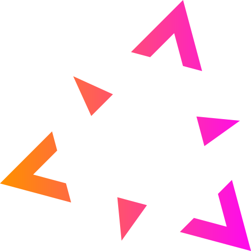 |   |
| znc | 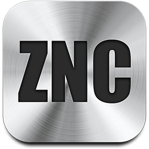 |   |
| zoho-mail |  |   |
| zohomail |  |  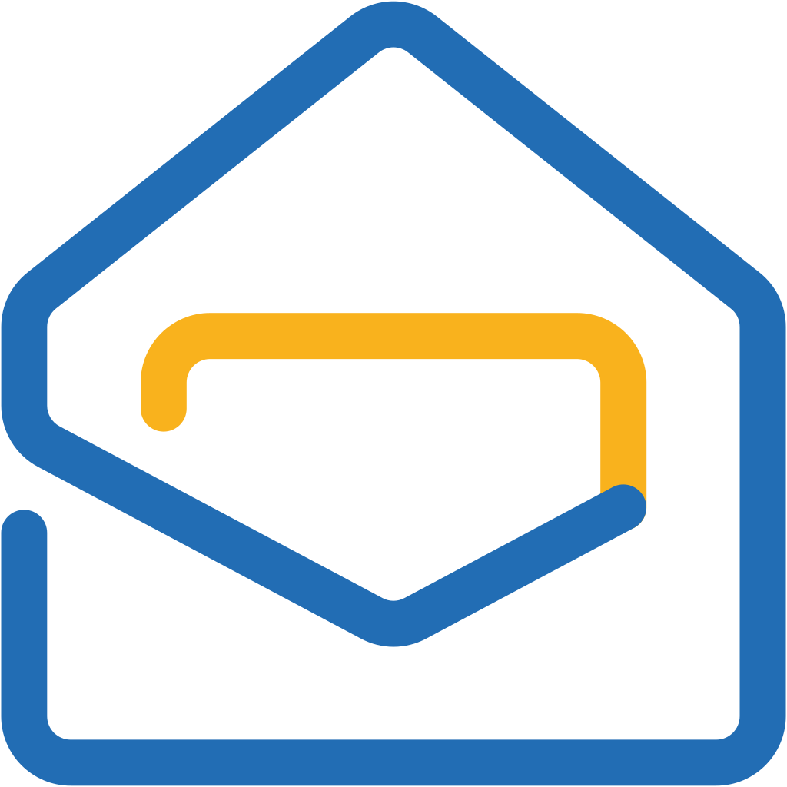 |
| zomato |  |  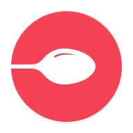 |
| zoneminder | 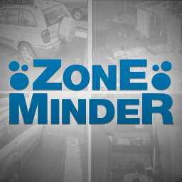 |   |
| zoom |  |   |
| zoom-alt | 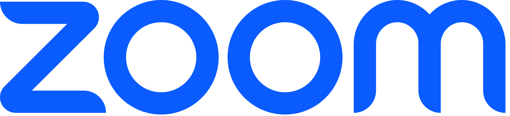 |   |
| zoraxy | 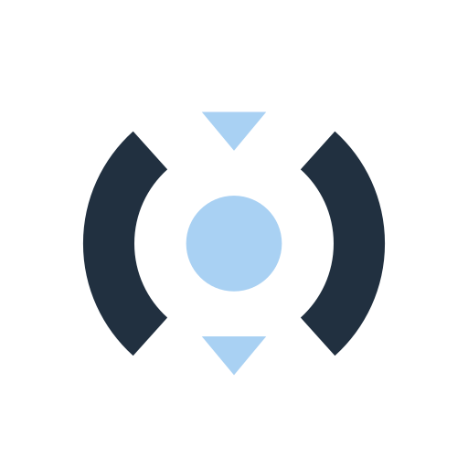 |  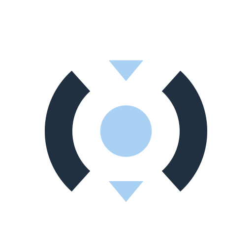 |
| zulip | 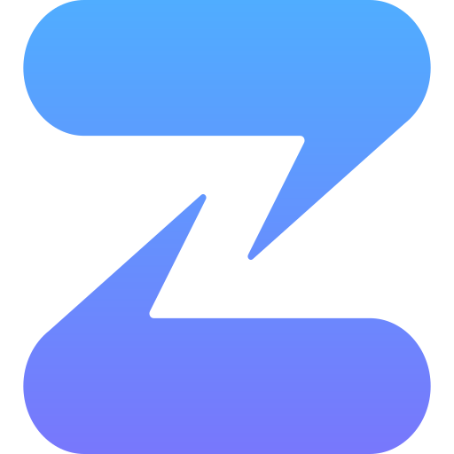 |  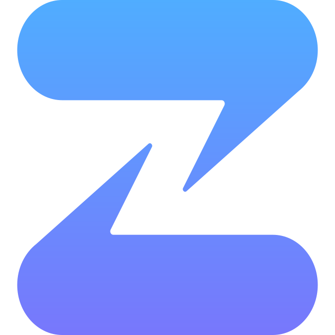 |
| zwavejs |  |   |
| zyxel-communications | 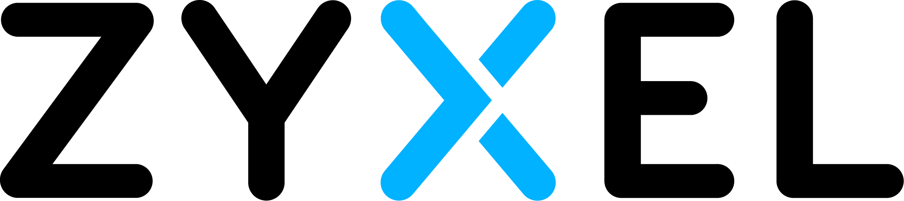 |   |
| zyxel-networks |  |   |

[[HOME](..)][[#](directory.md)][[A](directory-a.md)][[B](directory-b.md)][[C](directory-c.md)][[D](directory-d.md)][[E](directory-e.md)][[F](directory-f.md)][[G](directory-g.md)][[H](directory-h.md)][[I](directory-i.md)][[J](directory-j.md)][[K](directory-k.md)][[L](directory-l.md)][[M](directory-m.md)][[N](directory-n.md)][[O](directory-o.md)][[P](directory-p.md)][[Q](directory-q.md)][[R](directory-r.md)][[S](directory-s.md)][[T](directory-t.md)][[U](directory-u.md)][[V](directory-v.md)][[W](directory-w.md)][[X](directory-x.md)][[Y](directory-y.md)][[Z](directory-z.md)]

