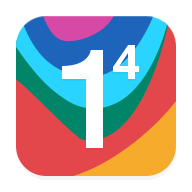
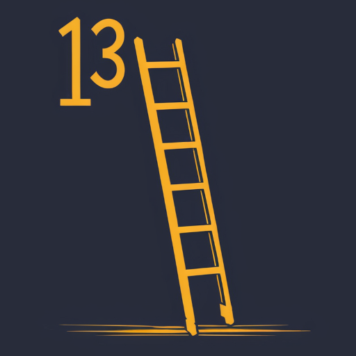
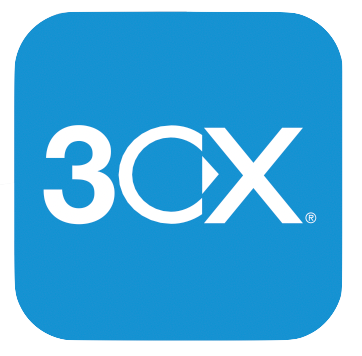

# Awesome Dashboard Icons

[[HOME](../README.md)][[#](directory.md)][[A](directory-a.md)][[B](directory-b.md)][[C](directory-c.md)][[D](directory-d.md)][[E](directory-e.md)][[F](directory-f.md)][[G](directory-g.md)][[H](directory-h.md)][[I](directory-i.md)][[J](directory-j.md)][[K](directory-k.md)][[L](directory-l.md)][[M](directory-m.md)][[N](directory-n.md)][[O](directory-o.md)][[P](directory-p.md)][[Q](directory-q.md)][[R](directory-r.md)][[S](directory-s.md)][[T](directory-t.md)][[U](directory-u.md)][[V](directory-v.md)][[W](directory-w.md)][[X](directory-x.md)][[Y](directory-y.md)][[Z](directory-z.md)]

# Directory: Numbers

| Icon Name | PNG | SVG |
|-----------|-----|-----|
| 100-can |  |   |
| 1111 |  |   |
| 13ft |  |   |
| 1dm-browser-plus |  |   |
| 1dm-plus |  |   |
| 1password |  |   |
| 1weather |  |   |
| 2fas-auth |  |   |
| 2fauth |  |   |
| 2fauth-light |  |   |
| 2gis |  |   |
| 321-mediaplayer |  |   |
| 3cx |  |   |
| 3d-creator |  |   |
| 4g-browser |  |   |
| 4pda |  |   |
| 5etools |  |   |
| 7-days-to-die |  |   |
| 8g-browser |  |   |
| 99 |  |   |
| 99-motorista |  |   |
| 9gag |  |   |

[[HOME](../README.md)][[#](directory.md)][[A](directory-a.md)][[B](directory-b.md)][[C](directory-c.md)][[D](directory-d.md)][[E](directory-e.md)][[F](directory-f.md)][[G](directory-g.md)][[H](directory-h.md)][[I](directory-i.md)][[J](directory-j.md)][[K](directory-k.md)][[L](directory-l.md)][[M](directory-m.md)][[N](directory-n.md)][[O](directory-o.md)][[P](directory-p.md)][[Q](directory-q.md)][[R](directory-r.md)][[S](directory-s.md)][[T](directory-t.md)][[U](directory-u.md)][[V](directory-v.md)][[W](directory-w.md)][[X](directory-x.md)][[Y](directory-y.md)][[Z](directory-z.md)]

