# Awesome Dashboard Icons

[[HOME](../README.md)][[#](gallery.md)][[A](gallery-a.md)][[B](gallery-b.md)][[C](gallery-c.md)][[D](gallery-d.md)][[E](gallery-e.md)][[F](gallery-f.md)][[G](gallery-g.md)][[H](gallery-h.md)][[I](gallery-i.md)][[J](gallery-j.md)][[K](gallery-k.md)][[L](gallery-l.md)][[M](gallery-m.md)][[N](gallery-n.md)][[O](gallery-o.md)][[P](gallery-p.md)][[Q](gallery-q.md)][[R](gallery-r.md)][[S](gallery-s.md)][[T](gallery-t.md)][[U](gallery-u.md)][[V](gallery-v.md)][[W](gallery-w.md)][[X](gallery-x.md)][[Y](gallery-y.md)][[Z](gallery-z.md)]

# Gallery: F

### PNGs (195 Icons)

   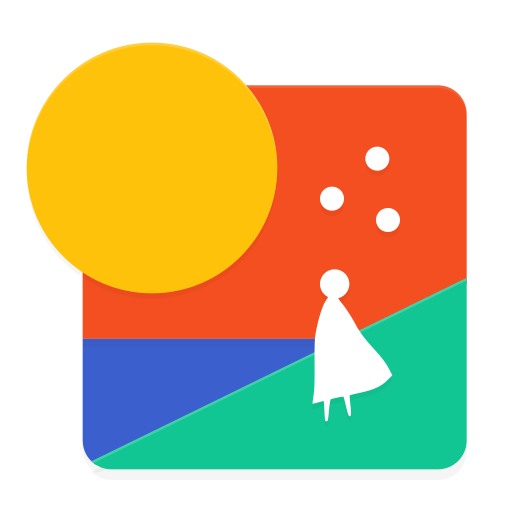     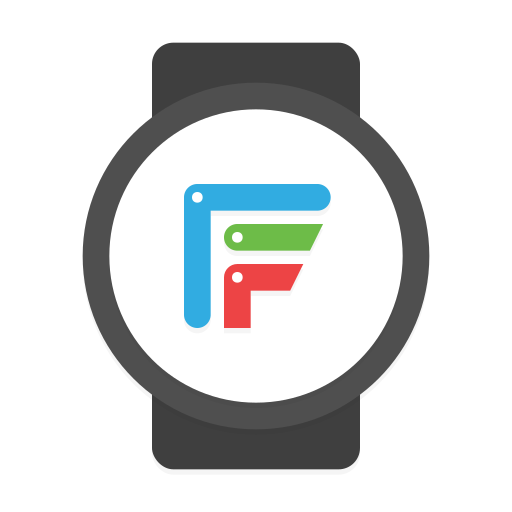      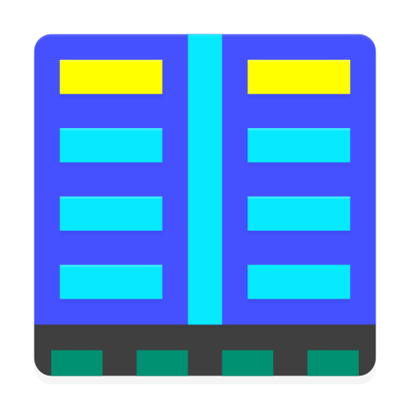                            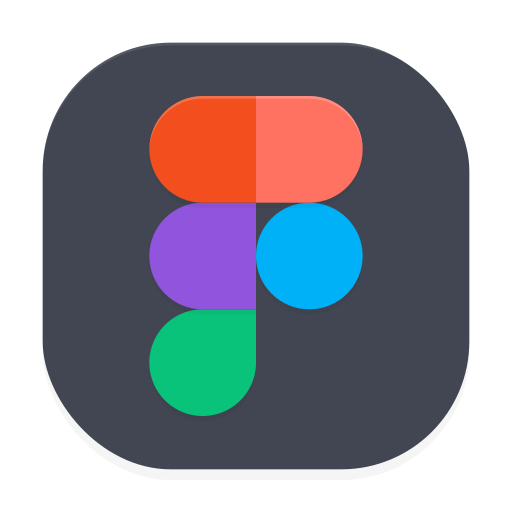                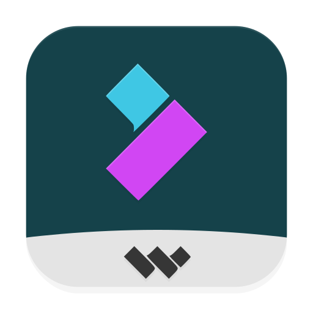                       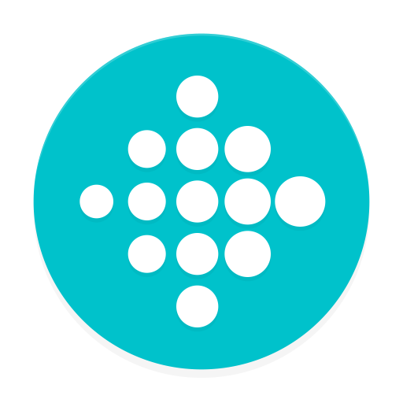               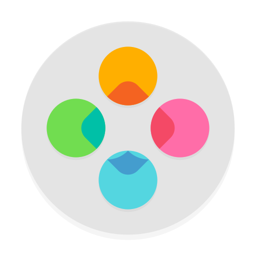  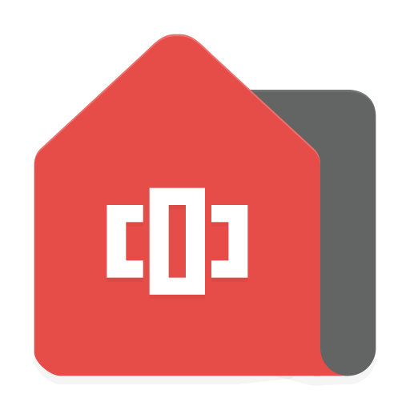 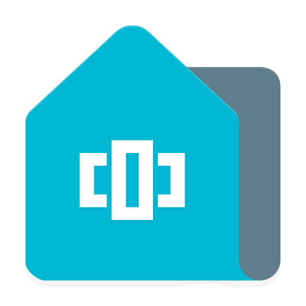            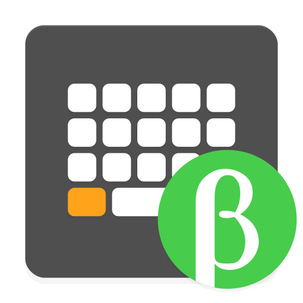  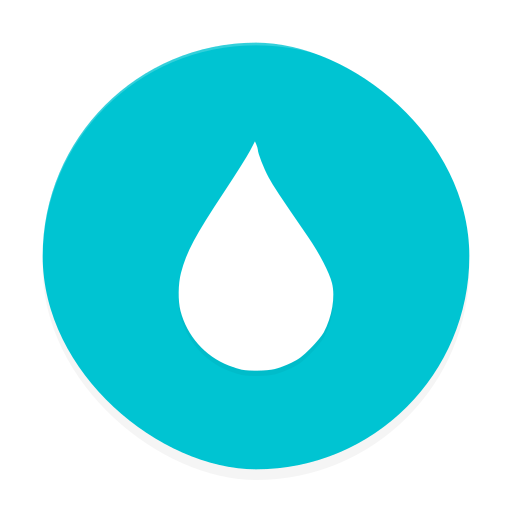                            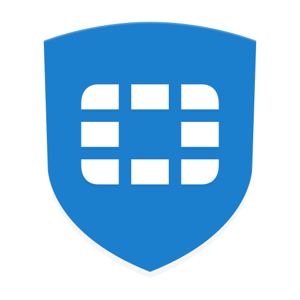     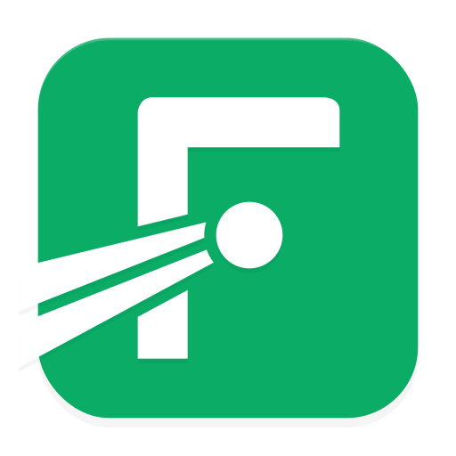  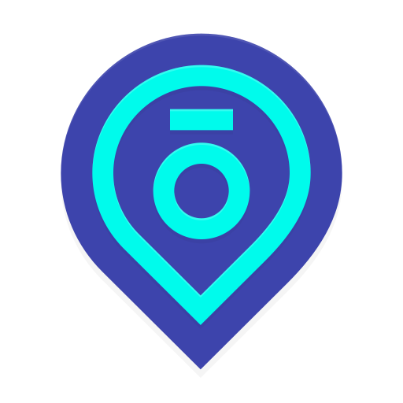   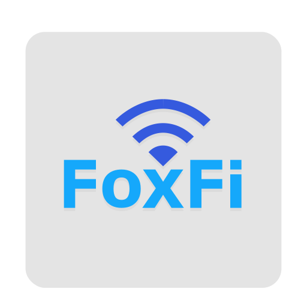      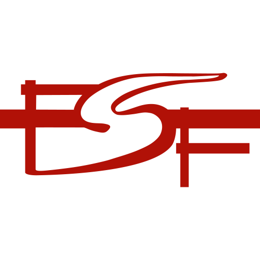    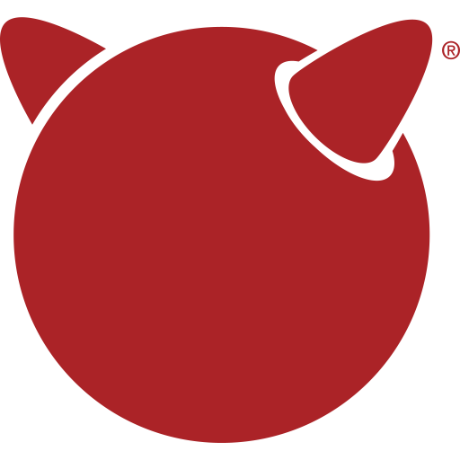 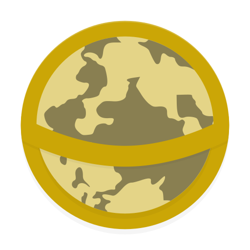             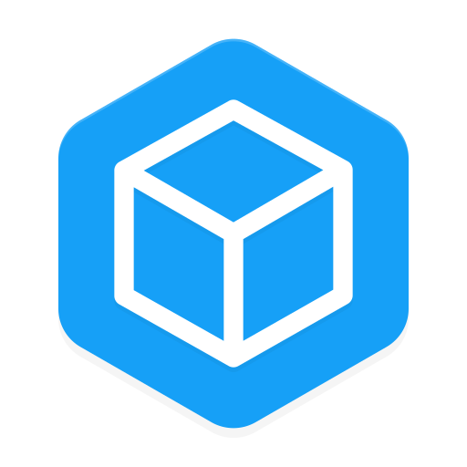   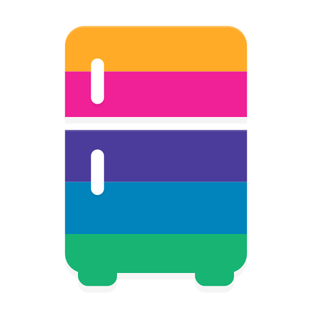        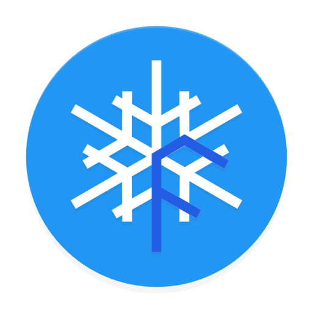 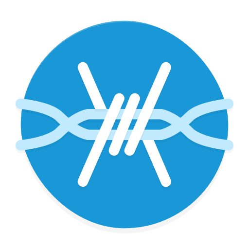       

### SVGs (165 Icons)

                                                                            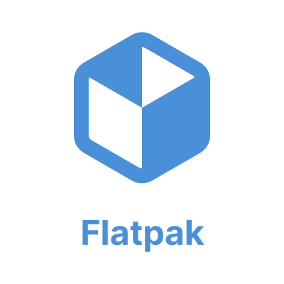                                                                                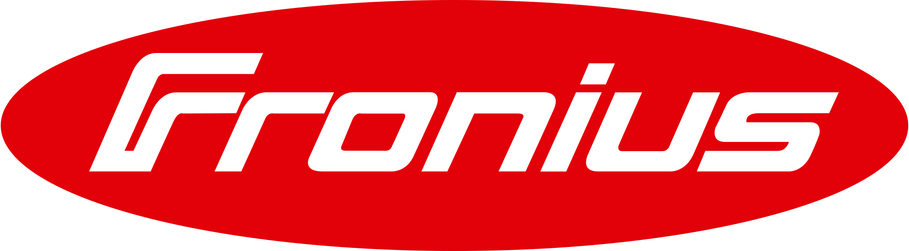        

[[HOME](../README.md)][[#](gallery.md)][[A](gallery-a.md)][[B](gallery-b.md)][[C](gallery-c.md)][[D](gallery-d.md)][[E](gallery-e.md)][[F](gallery-f.md)][[G](gallery-g.md)][[H](gallery-h.md)][[I](gallery-i.md)][[J](gallery-j.md)][[K](gallery-k.md)][[L](gallery-l.md)][[M](gallery-m.md)][[N](gallery-n.md)][[O](gallery-o.md)][[P](gallery-p.md)][[Q](gallery-q.md)][[R](gallery-r.md)][[S](gallery-s.md)][[T](gallery-t.md)][[U](gallery-u.md)][[V](gallery-v.md)][[W](gallery-w.md)][[X](gallery-x.md)][[Y](gallery-y.md)][[Z](gallery-z.md)]

