# Awesome Dashboard Icons

[[HOME](..)][[#](directory.md)][[A](directory-a.md)][[B](directory-b.md)][[C](directory-c.md)][[D](directory-d.md)][[E](directory-e.md)][[F](directory-f.md)][[G](directory-g.md)][[H](directory-h.md)][[I](directory-i.md)][[J](directory-j.md)][[K](directory-k.md)][[L](directory-l.md)][[M](directory-m.md)][[N](directory-n.md)][[O](directory-o.md)][[P](directory-p.md)][[Q](directory-q.md)][[R](directory-r.md)][[S](directory-s.md)][[T](directory-t.md)][[U](directory-u.md)][[V](directory-v.md)][[W](directory-w.md)][[X](directory-x.md)][[Y](directory-y.md)][[Z](directory-z.md)]

# Directory: B

| Icon Name | PNG | SVG |
|-----------|-----|-----|
| b612 |  |  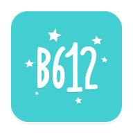 |
| babybuddy |  |   |
| babycenter |  |   |
| backblaze |  |   |
| background-eraser |  |   |
| bacula |  |   |
| badge |  |   |
| badoo |  |   |
| baidu-map |  |   |
| baikal |  |   |
| balance |  |  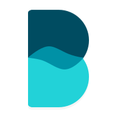 |
| band |  |   |
| bandcamp |  |  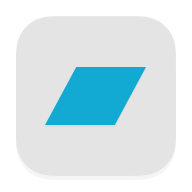 |
| bandlab |  |   |
| banggood |  |   |
| bar-assistant |  |   |
| barcode-scanner |  |  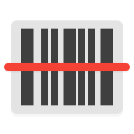 |
| barcodebuddy |  |   |
| barinsta |  |   |
| baserow |  |  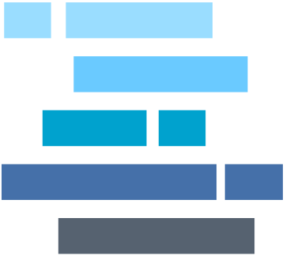 |
| basic-fit |  |  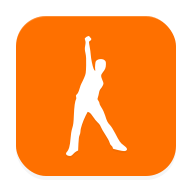 |
| basilisk |  |   |
| bastillion |  |   |
| battery-monitor |  |  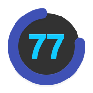 |
| battery-widget-reborn |  |   |
| bazarr | 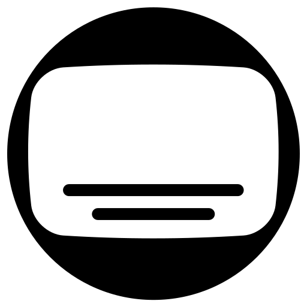 |   |
| bazarr-light |  |   |
| bbc |  |   |
| bbc-player |  |   |
| bbva |  |  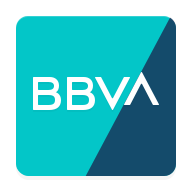 |
| beat-maker-go |  |  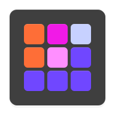 |
| beatfind |  |   |
| beats |  |   |
| beautiful-widgets |  |   |
| beautiful-widgets-pro |  |  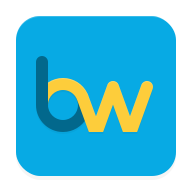 |
| beef |  |   |
| beef-light |  |   |
| beeline |  |   |
| beets | 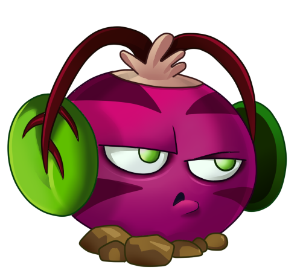 |   |
| befree |  |  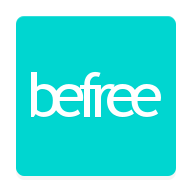 |
| benotes | 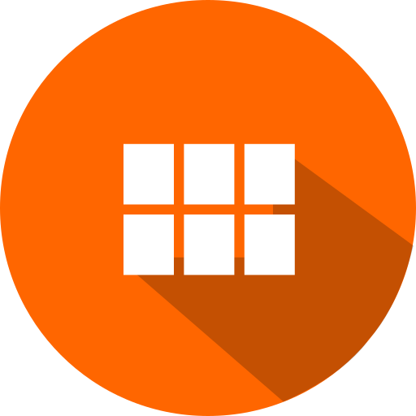 |   |
| betanin |  |   |
| bewegungsmelder |  |  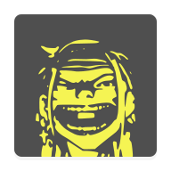 |
| bh-photo |  |   |
| bibi-mob-passageiro |  |   |
| bible |  |   |
| bible-gateway |  |   |
| bible-strongs |  |   |
| bibliogram |  |   |
| biedronka |  |   |
| bigbasket |  |   |
| bima-plus |  |   |
| binary-eye |  |   |
| bing |  |   |
| bipolalarm |  |   |
| birdnet | 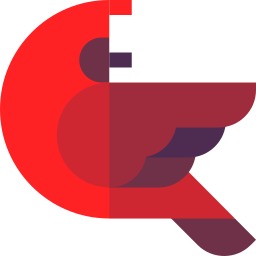 |  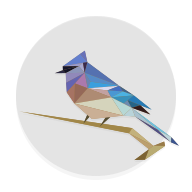 |
| birthdayadapter |  |   |
| birthdaydroid |  |   |
| birthdays |  |   |
| bisq-notifications |  |  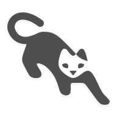 |
| bitcoin |  |   |
| bitdefender |  |   |
| bithumen |  |   |
| bitmask |  |  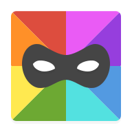 |
| bitshares |  |  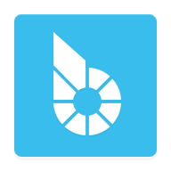 |
| bittorrent |  |   |
| bitwarden |  |   |
| bixby |  |   |
| blablacar |  |  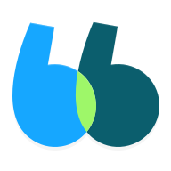 |
| black-player |  |   |
| blackberry-launcher |  |  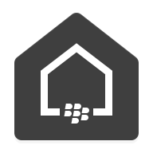 |
| blink |  |   |
| blinkit |  |   |
| blocky | 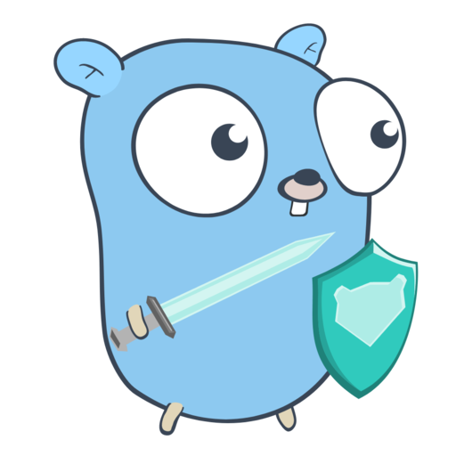 |   |
| blogger |  |   |
| bloom |  |   |
| blue-iris |  |   |
| bluebatt |  |   |
| bluecoins |  |  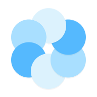 |
| bluejeans |  |   |
| bluemail |  |   |
| bluetooth | 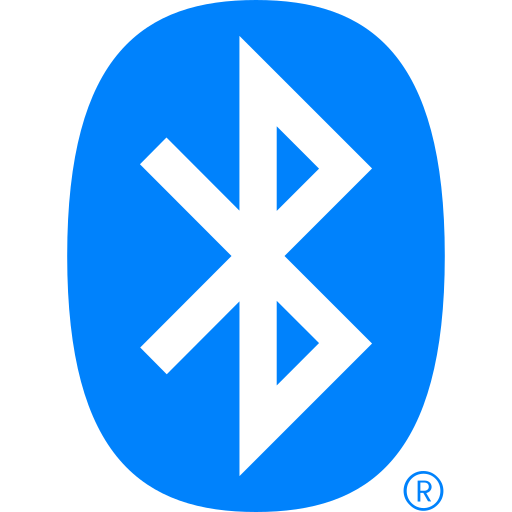 |  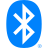 |
| bluewallet |  |   |
| bmz-convert-it |  |   |
| bni-mobile-banking |  |   |
| bnz |  |   |
| boat-browser |  |   |
| boat-browser-mini |  |   |
| bob-world |  |  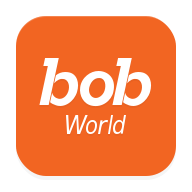 |
| bobcat-miner |  |   |
| bodbot |  |   |
| boinc |  |   |
| booksonic | 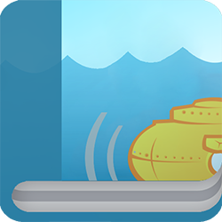 |   |
| bookstack |  |   |
| boom |  |   |
| boomcap |  |   |
| boost |  |   |
| boostnote |  |   |
| bootstrap |  |   |
| borg | 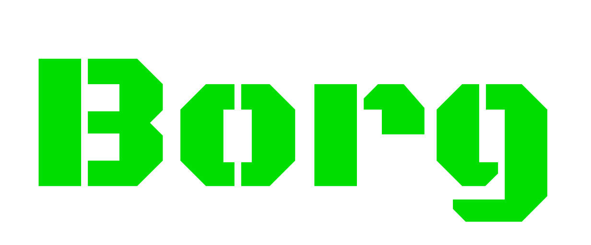 |   |
| boundary | 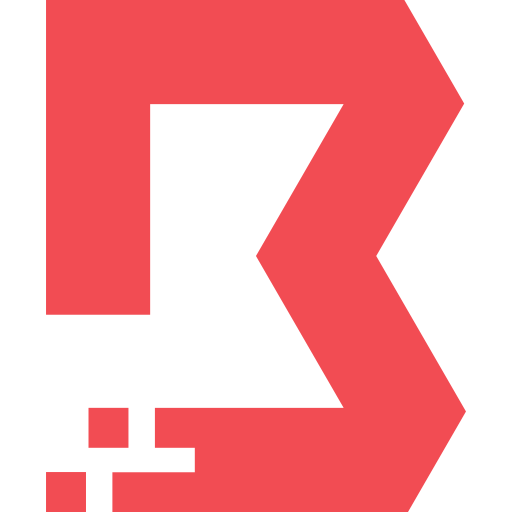 |   |
| box |  |   |
| boxberry |  |   |
| brainly |  |   |
| brave |  |   |
| brave-dev |  |   |
| brewpi | 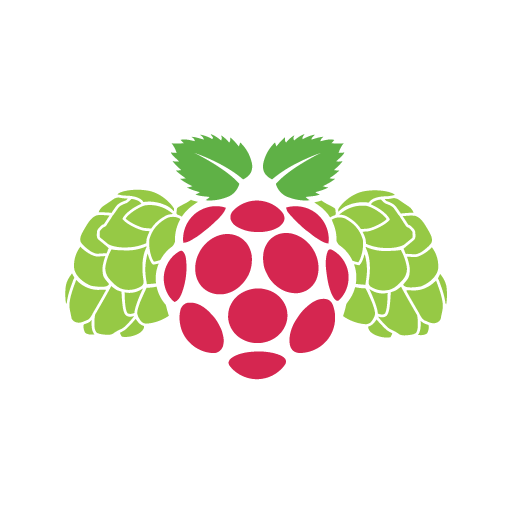 |   |
| briar |  |   |
| brillcam |  |   |
| bring |  |   |
| brocade | 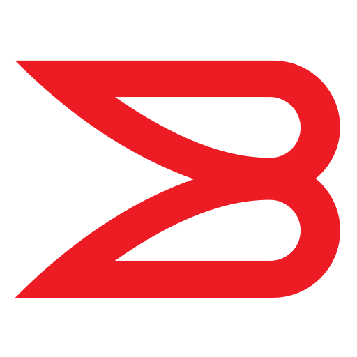 |   |
| bromite |  |   |
| brosix |  |   |
| brother | 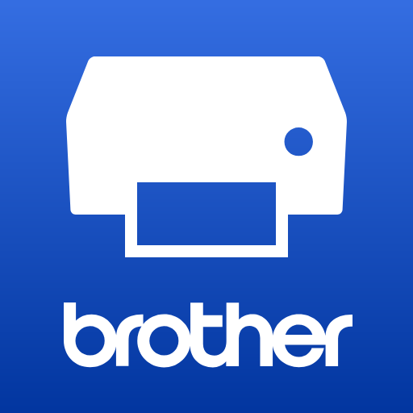 |   |
| browser-apus |  |   |
| browser-brave |  |   |
| browser-du |  |   |
| browser-orbitum |  |  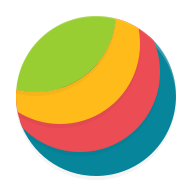 |
| browser-puls |  |   |
| browserless |  |   |
| browserless-light | 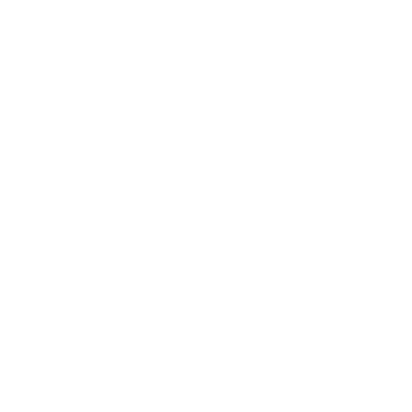 |   |
| browsh | 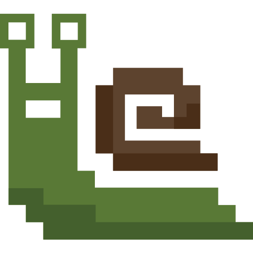 |  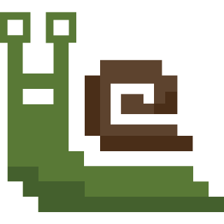 |
| bsnl-selfcare |  |   |
| bsplayer |  |   |
| bsremote |  |   |
| btcpay-server |  |   |
| buddy |  |   |
| budget-zero |  |   |
| budibase |  |   |
| budibase-light |  |   |
| buffalo |  |   |
| bumble |  |   |
| bundled-notes |  |   |
| bunkerweb |  |   |
| bunkerweb-light |  |   |
| busnavi |  |   |
| busuu |  |   |
| buttercup |  |   |
| butterfly-browser |  |   |
| buxfer |  |   |

[[HOME](..)][[#](directory.md)][[A](directory-a.md)][[B](directory-b.md)][[C](directory-c.md)][[D](directory-d.md)][[E](directory-e.md)][[F](directory-f.md)][[G](directory-g.md)][[H](directory-h.md)][[I](directory-i.md)][[J](directory-j.md)][[K](directory-k.md)][[L](directory-l.md)][[M](directory-m.md)][[N](directory-n.md)][[O](directory-o.md)][[P](directory-p.md)][[Q](directory-q.md)][[R](directory-r.md)][[S](directory-s.md)][[T](directory-t.md)][[U](directory-u.md)][[V](directory-v.md)][[W](directory-w.md)][[X](directory-x.md)][[Y](directory-y.md)][[Z](directory-z.md)]

