# Awesome Dashboard Icons

[[HOME](..)][[#](directory.md)][[A](directory-a.md)][[B](directory-b.md)][[C](directory-c.md)][[D](directory-d.md)][[E](directory-e.md)][[F](directory-f.md)][[G](directory-g.md)][[H](directory-h.md)][[I](directory-i.md)][[J](directory-j.md)][[K](directory-k.md)][[L](directory-l.md)][[M](directory-m.md)][[N](directory-n.md)][[O](directory-o.md)][[P](directory-p.md)][[Q](directory-q.md)][[R](directory-r.md)][[S](directory-s.md)][[T](directory-t.md)][[U](directory-u.md)][[V](directory-v.md)][[W](directory-w.md)][[X](directory-x.md)][[Y](directory-y.md)][[Z](directory-z.md)]

# Directory: E

| Icon Name | PNG | SVG |
|-----------|-----|-----|
| e-bilet |  |   |
| e-devlet |  |   |
| e-nabiz |  |   |
| e-num |  |  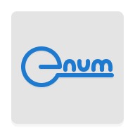 |
| e-titulo |  |   |
| easilydo-mail |  |   |
| easy-cart |  |   |
| easy-fax |  |   |
| easy-gate | 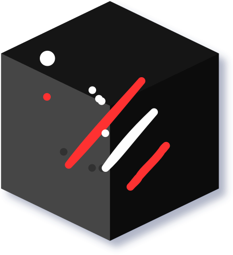 |  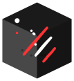 |
| easy-gate-light | 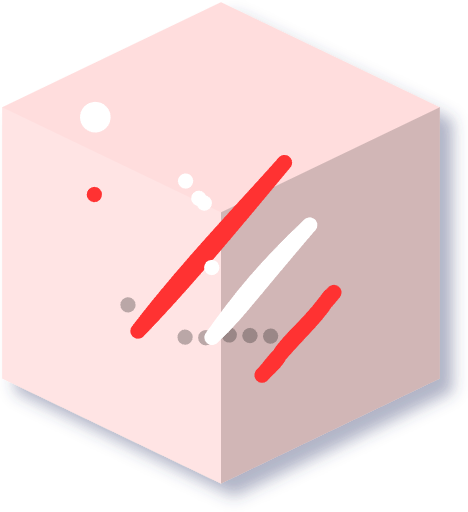 |   |
| easy-photoprint-editor |  |   |
| easy-voice-recorder |  |   |
| ebay |  |   |
| eblocker |  |   |
| eboox |  |   |
| eclipse-mosquitto |  |   |
| ecobee |  |   |
| edge | 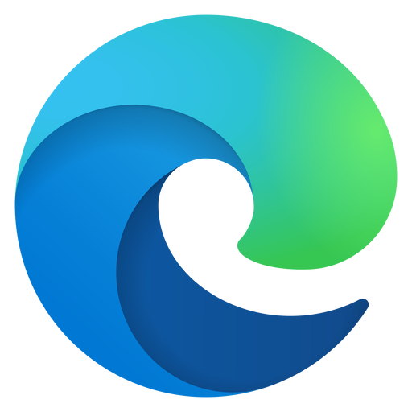 |   |
| edge-dev | 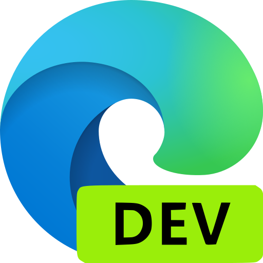 |  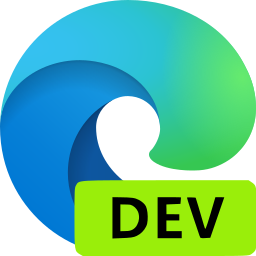 |
| edgeos |  |   |
| edgeos-light |  |   |
| edmodo |  |   |
| edx |  |   |
| ego-cepte |  |  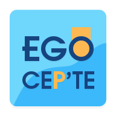 |
| elastic | 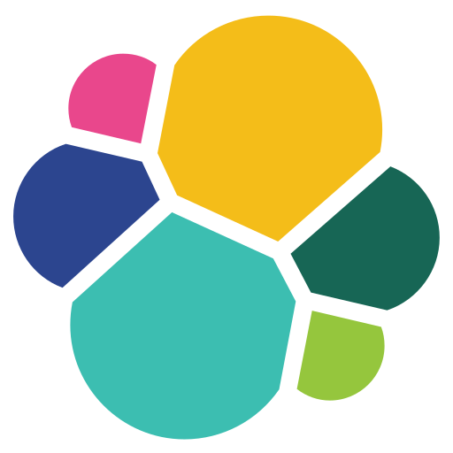 |   |
| elastic-beats |  |  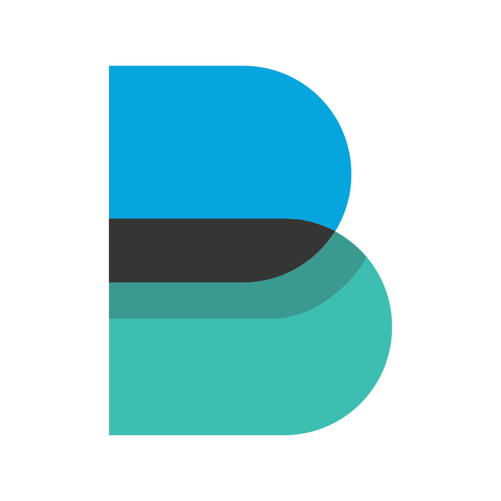 |
| elastic-kibana |  |  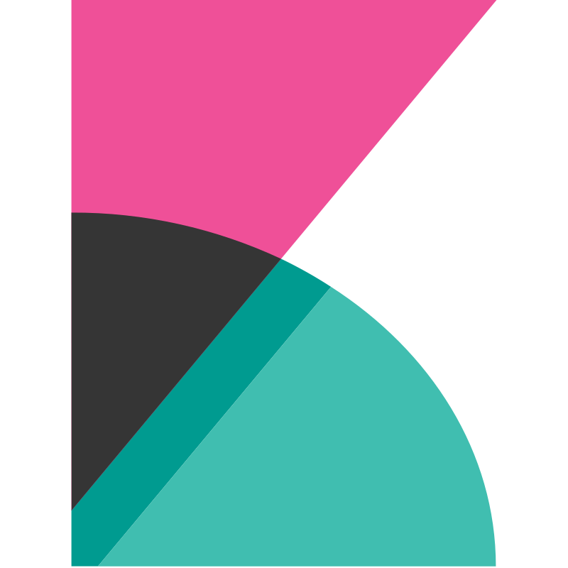 |
| elastic-logstash |  |   |
| elasticsearch |  |   |
| eldorado |  |   |
| electron | 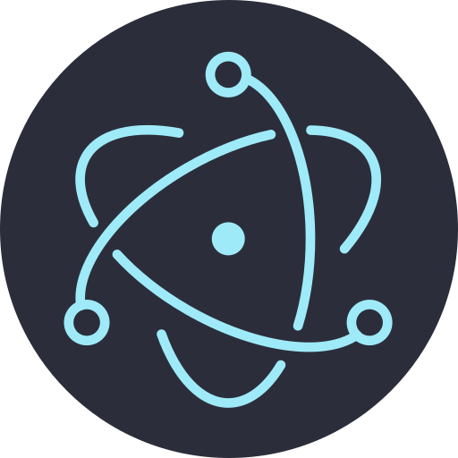 |   |
| electron-cash |  |   |
| electrum |  |   |
| element | 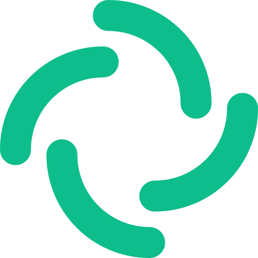 |   |
| elisa |  |   |
| ellen-mp3-player |  |   |
| elta |  |   |
| emacs |  |   |
| emby |  |   |
| embystat |  |   |
| empower |  |   |
| emq |  |   |
| emq-light |  |   |
| emqx |  |  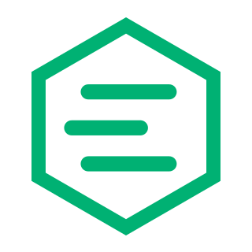 |
| emulatorjs |  |   |
| emule |  |  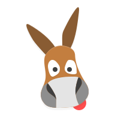 |
| enbizcard | 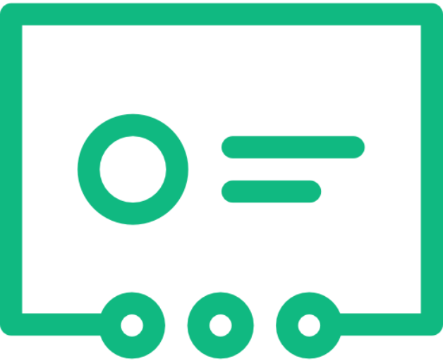 |  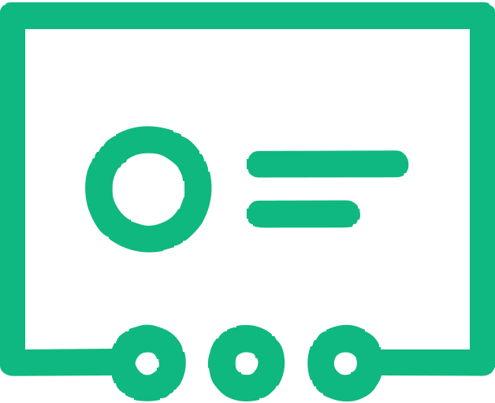 |
| encryptr |  |   |
| energy-iq |  |   |
| enmb |  |  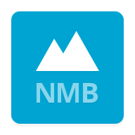 |
| enpass |  |   |
| enshrouded | 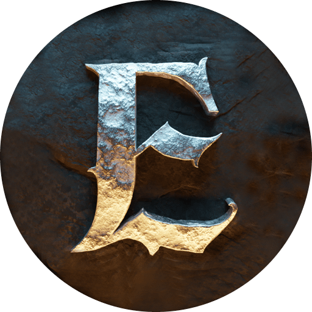 |   |
| eos-remote |  |   |
| epic-games |  |  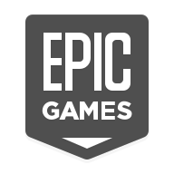 |
| epson-iprint |  |   |
| equalizer-music-player-booster |  |  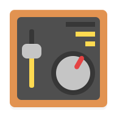 |
| ereader-prestigio |  |   |
| ersatztv |  |   |
| erste |  |   |
| erste-george |  |   |
| es-file-explorer |  |   |
| esewa |  |   |
| esphome | 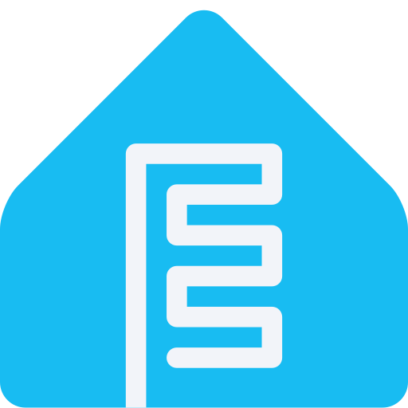 |   |
| esphome-alt | 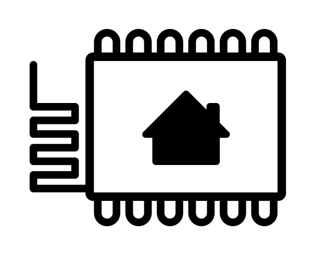 |   |
| espn |  |   |
| espncricinfo |  |   |
| espressif |  |   |
| estmob-sendanywhere |  |   |
| esurance |  |   |
| etcd |  |   |
| etesync |  |   |
| etheremote |  |  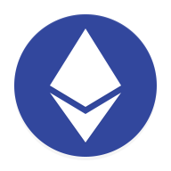 |
| ethereum |  |  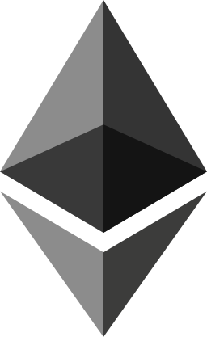 |
| ethereum-wallet |  |  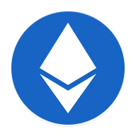 |
| etherpad |  |  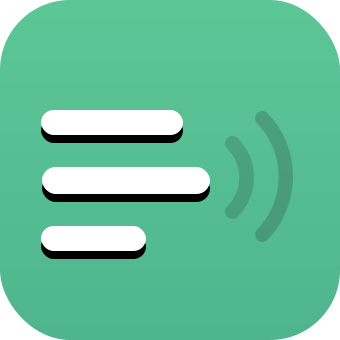 |
| etsy |  |   |
| ettercap |  |   |
| eufy |  |   |
| eve |  |   |
| evebox |  |   |
| eventbrite |  |   |
| everdo |  |   |
| evermatch |  |   |
| evernote |  |   |
| eweka |  |   |
| excalidraw |  |   |
| exodus-wallet |  |  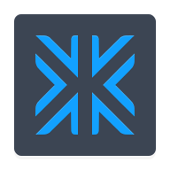 |
| exponential-idle |  |  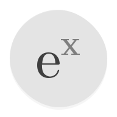 |
| express-vpn |  |   |
| exsoul-web-browser |  |  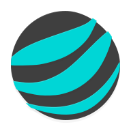 |
| extreme-assistant |  |   |
| ezhld-recipe |  |   |

[[HOME](..)][[#](directory.md)][[A](directory-a.md)][[B](directory-b.md)][[C](directory-c.md)][[D](directory-d.md)][[E](directory-e.md)][[F](directory-f.md)][[G](directory-g.md)][[H](directory-h.md)][[I](directory-i.md)][[J](directory-j.md)][[K](directory-k.md)][[L](directory-l.md)][[M](directory-m.md)][[N](directory-n.md)][[O](directory-o.md)][[P](directory-p.md)][[Q](directory-q.md)][[R](directory-r.md)][[S](directory-s.md)][[T](directory-t.md)][[U](directory-u.md)][[V](directory-v.md)][[W](directory-w.md)][[X](directory-x.md)][[Y](directory-y.md)][[Z](directory-z.md)]

