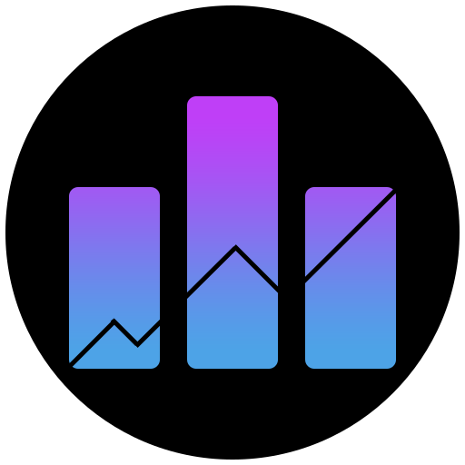
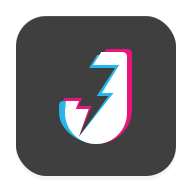

# Awesome Dashboard Icons

[[HOME](..)][[#](directory.md)][[A](directory-a.md)][[B](directory-b.md)][[C](directory-c.md)][[D](directory-d.md)][[E](directory-e.md)][[F](directory-f.md)][[G](directory-g.md)][[H](directory-h.md)][[I](directory-i.md)][[J](directory-j.md)][[K](directory-k.md)][[L](directory-l.md)][[M](directory-m.md)][[N](directory-n.md)][[O](directory-o.md)][[P](directory-p.md)][[Q](directory-q.md)][[R](directory-r.md)][[S](directory-s.md)][[T](directory-t.md)][[U](directory-u.md)][[V](directory-v.md)][[W](directory-w.md)][[X](directory-x.md)][[Y](directory-y.md)][[Z](directory-z.md)]

# Directory: J

| Icon Name | PNG | SVG |
|-----------|-----|-----|
| jabra-sound-plus |  |   |
| jackett |  |   |
| jackett-light |  |   |
| jaeger |  |   |
| jago |  |   |
| jakdojade |  |   |
| jamstack |  |   |
| jango-radio |  |   |
| java |  |   |
| java-editor |  |   |
| javascript |  |   |
| jbak2 |  |   |
| jbl-portable |  |   |
| jdownloader |  |   |
| jeedom |  |   |
| jekyll |  |   |
| jellyfin |  |   |
| jellyfin-vue |  |   |
| jellyseerr |  |   |
| jellystat |  |   |
| jellystat-light |  |   |
| jelu |  |   |
| jenkins |  |   |
| jetaudio |  |   |
| jetbrains-fleet |  |   |
| jetbrains-youtrack |  |   |
| jio |  |   |
| jira |  |   |
| jitsi |  |   |
| jitsi-meet |  |   |
| joal |  |   |
| jobstreet |  |   |
| joom |  |   |
| joomla |  |   |
| joplin |  |   |
| jora-jobs |  |   |
| josh |  |   |
| jotterpad |  |   |
| joylada |  |   |
| jrdcom-file-manager |  |   |
| jrtstudio-music |  |   |
| juicessh |  |   |
| julia |  |   |
| jupyter |  |   |
| just-listenit |  |   |

[[HOME](..)][[#](directory.md)][[A](directory-a.md)][[B](directory-b.md)][[C](directory-c.md)][[D](directory-d.md)][[E](directory-e.md)][[F](directory-f.md)][[G](directory-g.md)][[H](directory-h.md)][[I](directory-i.md)][[J](directory-j.md)][[K](directory-k.md)][[L](directory-l.md)][[M](directory-m.md)][[N](directory-n.md)][[O](directory-o.md)][[P](directory-p.md)][[Q](directory-q.md)][[R](directory-r.md)][[S](directory-s.md)][[T](directory-t.md)][[U](directory-u.md)][[V](directory-v.md)][[W](directory-w.md)][[X](directory-x.md)][[Y](directory-y.md)][[Z](directory-z.md)]

