# Awesome Dashboard Icons

[[HOME](..)][[#](directory.md)][[A](directory-a.md)][[B](directory-b.md)][[C](directory-c.md)][[D](directory-d.md)][[E](directory-e.md)][[F](directory-f.md)][[G](directory-g.md)][[H](directory-h.md)][[I](directory-i.md)][[J](directory-j.md)][[K](directory-k.md)][[L](directory-l.md)][[M](directory-m.md)][[N](directory-n.md)][[O](directory-o.md)][[P](directory-p.md)][[Q](directory-q.md)][[R](directory-r.md)][[S](directory-s.md)][[T](directory-t.md)][[U](directory-u.md)][[V](directory-v.md)][[W](directory-w.md)][[X](directory-x.md)][[Y](directory-y.md)][[Z](directory-z.md)]

# Directory: P

| Icon Name | PNG | SVG |
|-----------|-----|-----|
| p1ib | 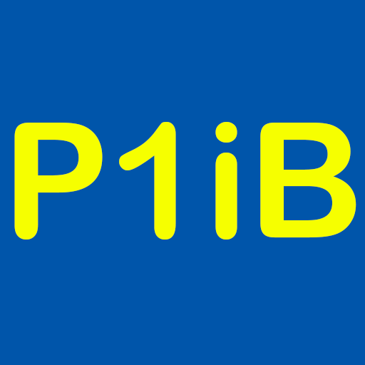 |  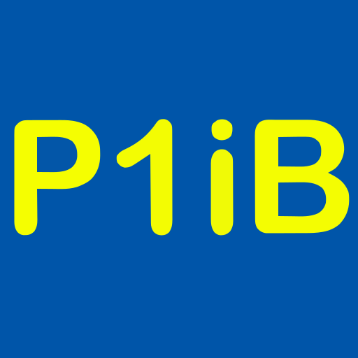 |
| pacer |  |   |
| package-manager |  |  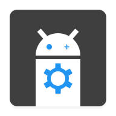 |
| packageradar |  |   |
| pagerduty |  |   |
| pairdrop | 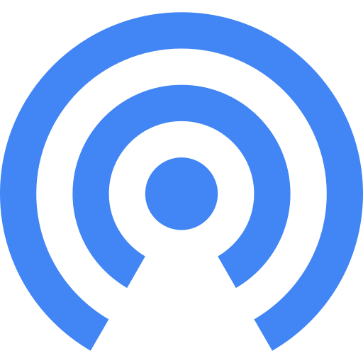 |   |
| palemoon | 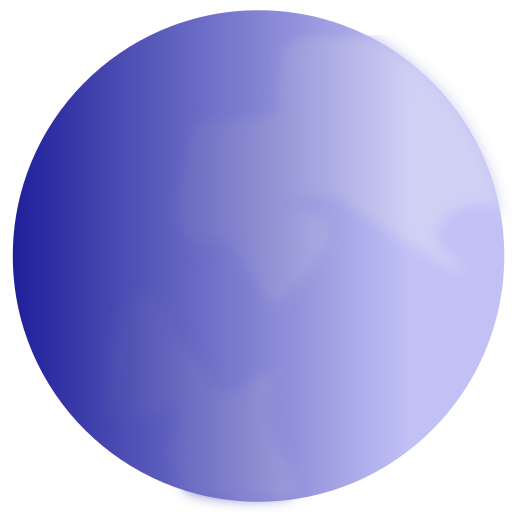 |  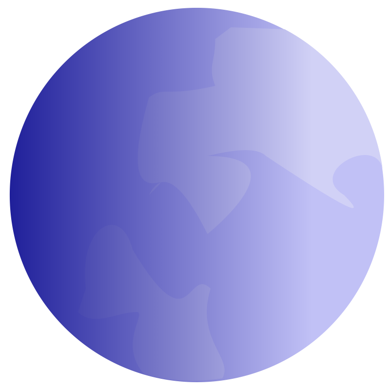 |
| palette |  |   |
| palo-alto |  |   |
| paloaltonetworks |  |   |
| palworld | 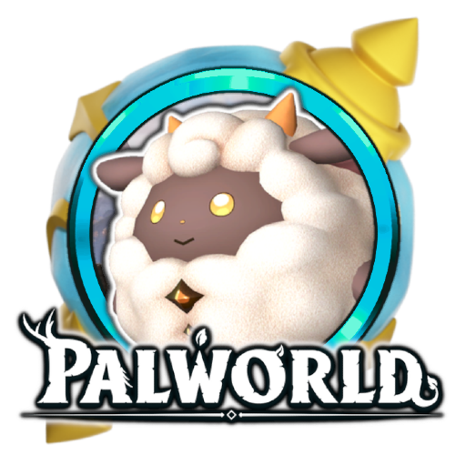 |   |
| pandora |  |  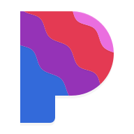 |
| paperdraw |  |  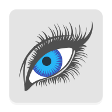 |
| paperless |  |   |
| paperless-ng |  |   |
| paperless-ngx |  |   |
| papermerge |  |   |
| papirus |  |   |
| papirus-adaptive |  |  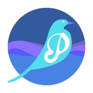 |
| paramount-plus |  |   |
| paramount-plus-alt |  |   |
| paramount-plus-light |  |   |
| parkee |  |   |
| parkimovil |  |   |
| part-db | 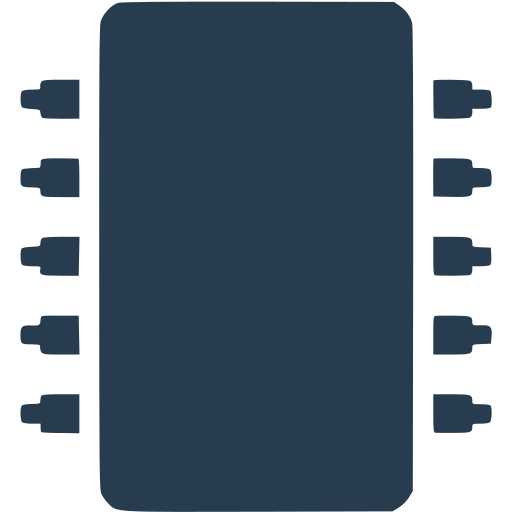 |   |
| part-db-light | 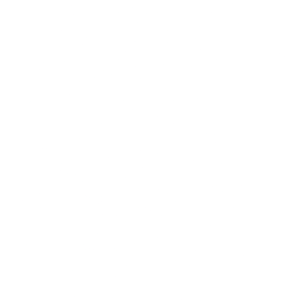 |   |
| partkeepr |  |   |
| passbolt | 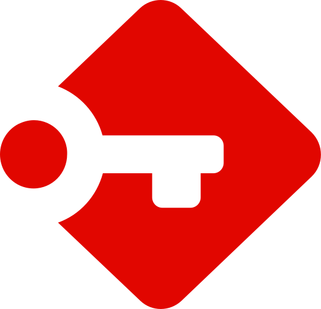 |   |
| passcard |  |  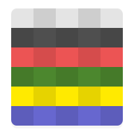 |
| passera |  |   |
| password-store |  |   |
| passwordgenerator |  |   |
| passwordpusher |  |   |
| passwordpusher-light |  |   |
| passwork |  |   |
| pastatool |  |   |
| pastatool-light | 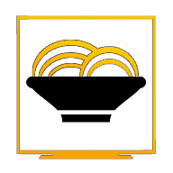 |   |
| pastebin | 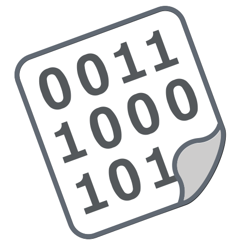 |   |
| pastey |  |   |
| pathao |  |  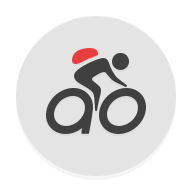 |
| patreon |  |   |
| patreon-white |  |   |
| paypal |  |   |
| pbs-kids-video |  |   |
| pcloud |  |   |
| pdf-converter |  |   |
| pdf-reader-pro |  |   |
| pdf-viewer-plus |  |   |
| pdfstudio |  |   |
| peanut |  |  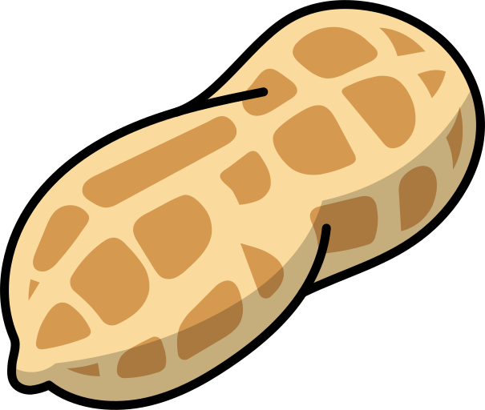 |
| peanut-encryption |  |   |
| pedometer |  |   |
| pedometer-step-counter |  |   |
| pedulilindungi |  |   |
| peertube |  |   |
| pegasus |  |  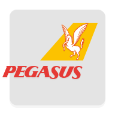 |
| pek |  |   |
| penpot |  |   |
| penpot-light | 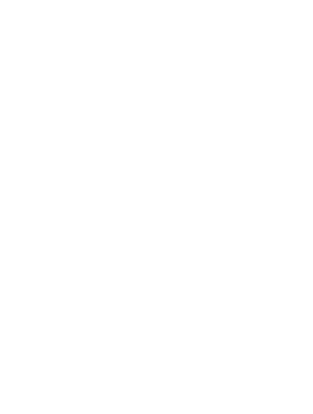 |   |
| penup |  |   |
| perceptron |  |  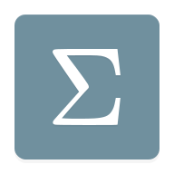 |
| perfect-viewer |  |   |
| period-calendar |  |   |
| perlite | 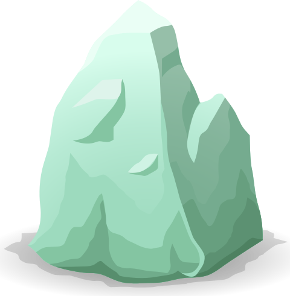 |  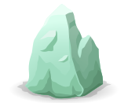 |
| petio | 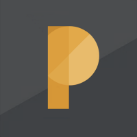 |   |
| pfrf |  |  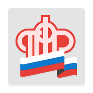 |
| pfsense |  |   |
| pgadmin |  |   |
| pgpauth |  |   |
| pgpclipper |  |   |
| phantombot |  |   |
| phantompeer |  |   |
| phoenix-browser |  |   |
| phone-master |  |   |
| phoneinfoga |  |   |
| phoneinfoga-light |  |   |
| phonemanager |  |  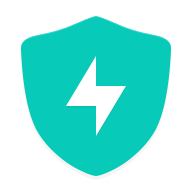 |
| phonepe |  |   |
| phonograph-music-player |  |   |
| phoscon |  |   |
| phoscon-light |  |   |
| photocollage |  |   |
| photodirector |  |  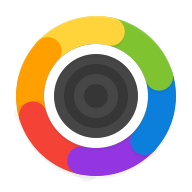 |
| photomath |  |   |
| photonix | 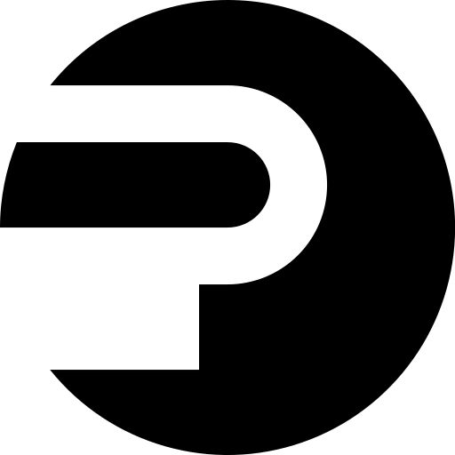 |   |
| photonix-light | 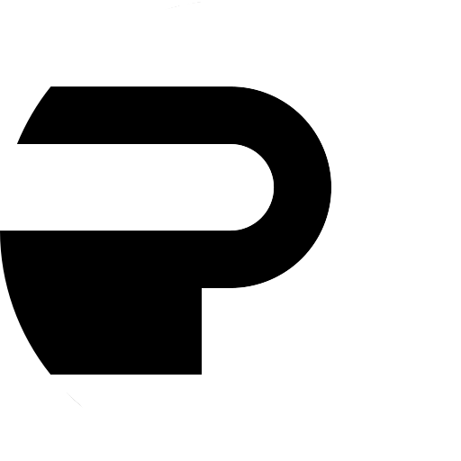 |   |
| photoprism | 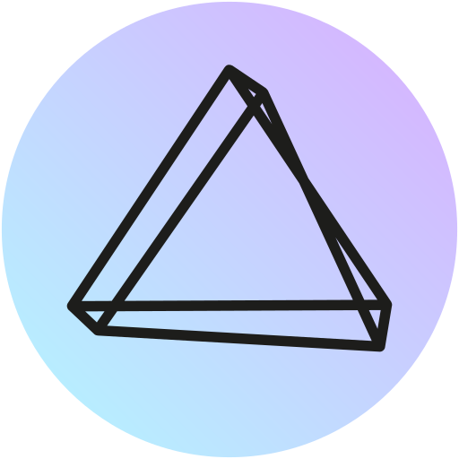 |  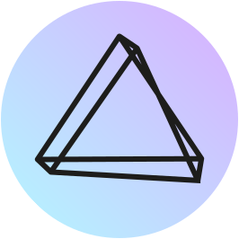 |
| photoroom |  |  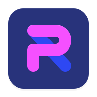 |
| photostructure | 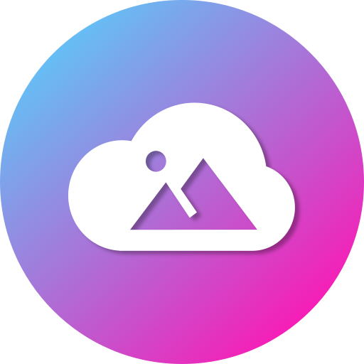 |   |
| photoview | 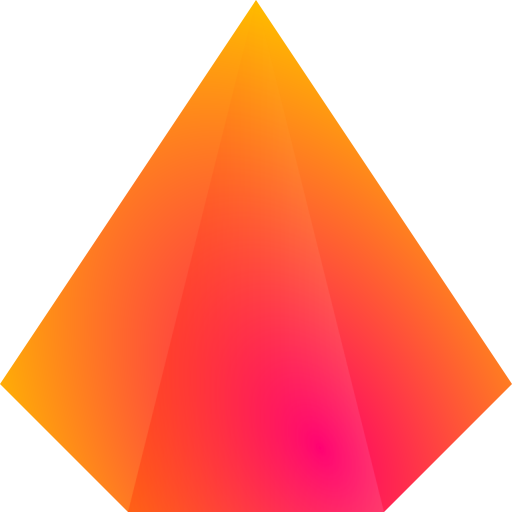 |  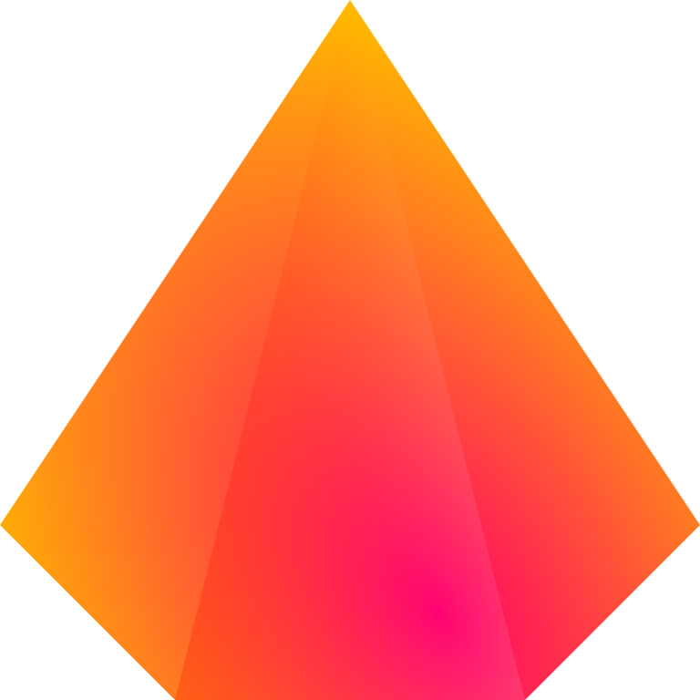 |
| php |  |   |
| phpipam |  |   |
| phpldapadmin |  |   |
| phpmyadmin |  |   |
| pi-alert | 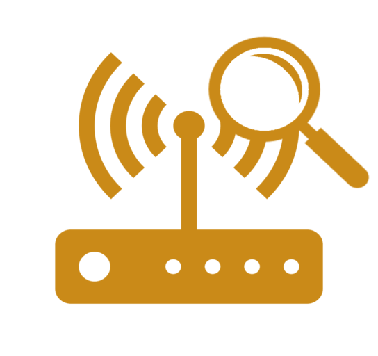 |   |
| pi-hole | 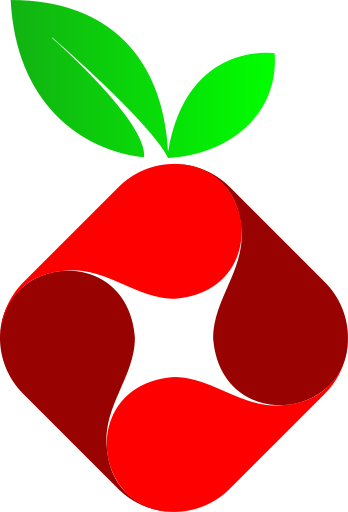 |  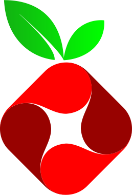 |
| pi-hole-unbound | 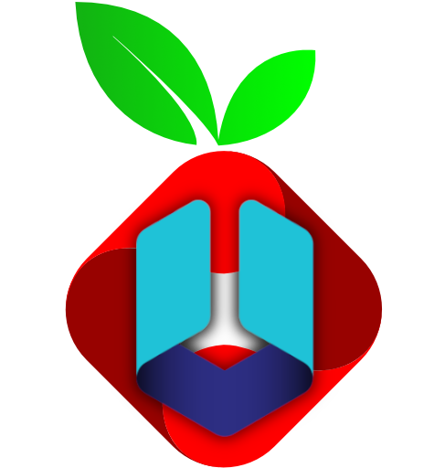 |   |
| pi-musicplayer |  |   |
| pia | 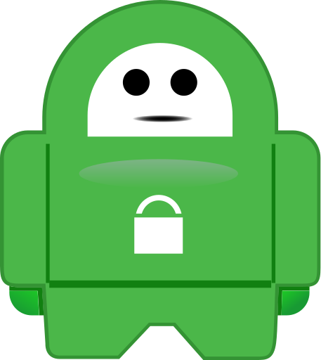 |   |
| pia-manager |  |   |
| piano |  |   |
| piaware |  |   |
| picpay |  |  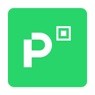 |
| picsart-color |  |   |
| picsart-studio |  |   |
| picsur |  |   |
| picture-mushroom |  |   |
| picturethis |  |  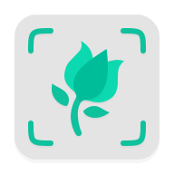 |
| pigallery2 |  |  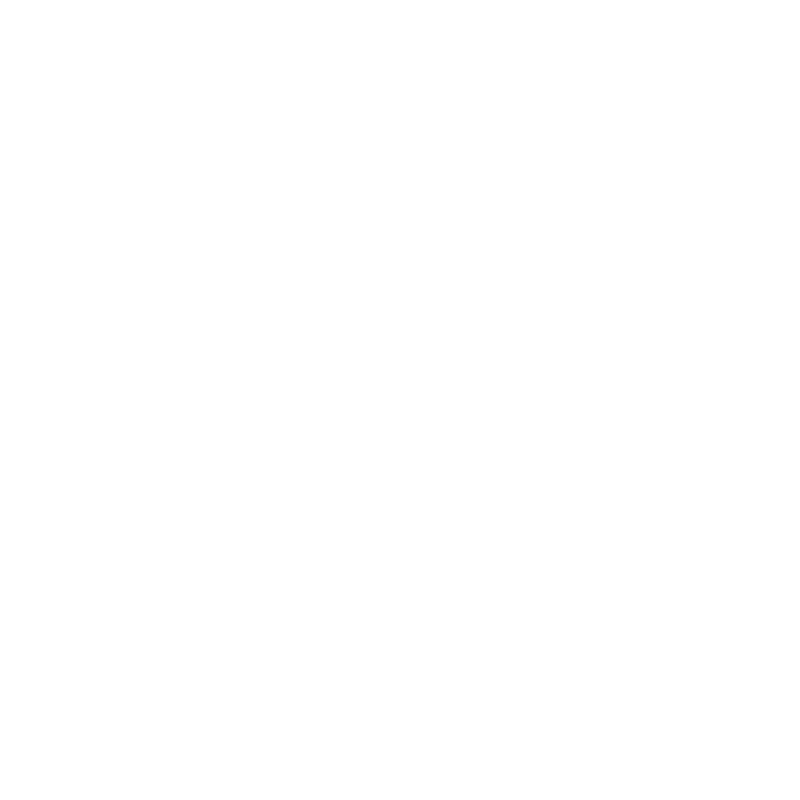 |
| pigallery2-light |  |   |
| pihole | 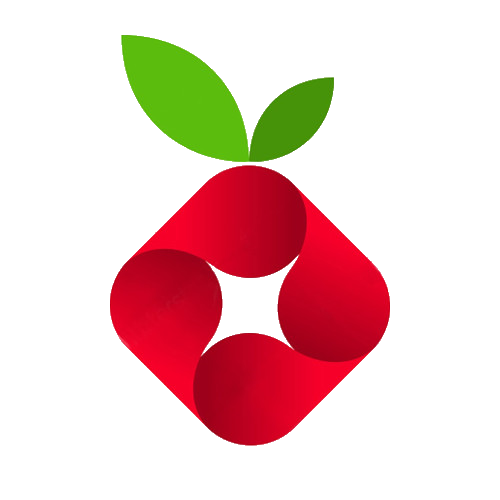 |   |
| pijaret |  |   |
| pikabu |  |  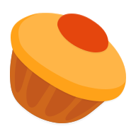 |
| pikvm |  |   |
| pikvm-light | 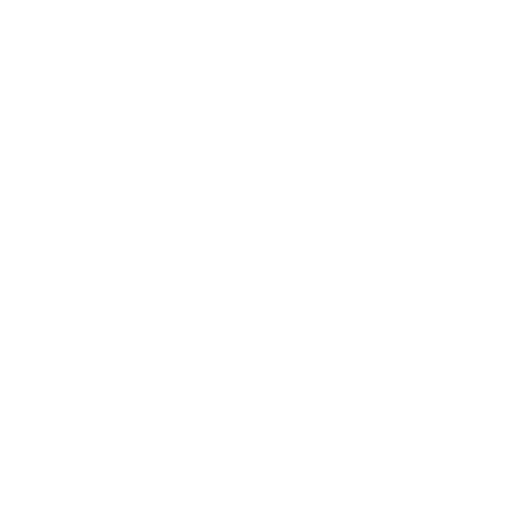 |   |
| pinchflat | 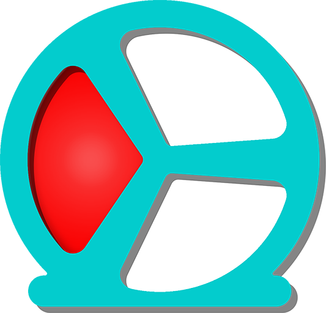 |   |
| pingdom |  |   |
| pingvin |  |   |
| pinmnemonic |  |  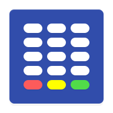 |
| pinry | 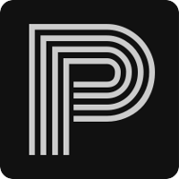 |   |
| pinterest |  |   |
| pinterest-lite |  |   |
| pioneer |  |   |
| pioneer-light |  |   |
| pionex |  |   |
| pirate-proxy |  |   |
| pivpn | 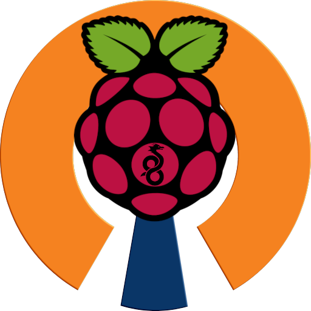 |   |
| piwigo |  |   |
| pixel-icon-pack |  |   |
| pixel-studio |  |   |
| pixelfed |  |   |
| pixelknot |  |   |
| pixellab |  |   |
| pixiv |  |   |
| planka |  |   |
| planner-5d |  |   |
| plant-it |  |   |
| plantix |  |   |
| plantnet |  |   |
| plato |  |   |
| plausible |  |   |
| player-meridian |  |   |
| player-pro-music |  |   |
| playermusic |  |   |
| playerxtreme |  |   |
| playo |  |   |
| pleroma |  |   |
| plesk |  |   |
| plesk-light |  |   |
| plex |  |   |
| plex-alt |  |   |
| plex-alt-light |  |   |
| plex-meta-manager |  |   |
| plex-meta-manager-light |  |   |
| plex-server |  |   |
| plex-vr |  |   |
| plexamp |  |   |
| plexdrive |  |   |
| plexrequests |  |   |
| plexripper |  |   |
| pln-mobile |  |   |
| plume |  |   |
| pocket |  |   |
| pocket-paint |  |   |
| pocketbase |  |   |
| pocketcasts |  |   |
| poco-launcher |  |   |
| podcast-addict |  |   |
| podcast-go |  |   |
| podcast-republic |  |   |
| podgrab |  |   |
| podify |  |   |
| podnapisi |  |   |
| point-blur |  |   |
| pokemon |  |   |
| pokemon-tv |  |   |
| polaris-office |  |   |
| policycontroller |  |   |
| polish |  |   |
| poly |  |   |
| polywork |  |   |
| pomelo-file-explorer |  |   |
| pomodoneapp |  |   |
| popcorn-time |  |   |
| poppin |  |   |
| porkbun |  |   |
| portainer |  |   |
| portainer-alt |  |   |
| portauthority |  |   |
| portknocker |  |   |
| portus |  |   |
| posidon-launcher |  |   |
| post-it |  |   |
| poste |  |   |
| postgres |  |   |
| posylka-net |  |   |
| power-browser |  |   |
| power-media-player |  |   |
| poweramp |  |   |
| poweramp-equalizer |  |   |
| poweraudio-music-player |  |   |
| powerbi |  |   |
| powerdirector |  |   |
| powerdns |  |   |
| powerpanel |  |   |
| powerschool |  |   |
| pratilipi |  |   |
| pregnancy-and-baby-tracker |  |   |
| pregnancy-plus |  |   |
| premium-mobile |  |   |
| prey |  |   |
| prime |  |   |
| prime-video |  |   |
| prime-video-light |  |   |
| print |  |   |
| printer |  |   |
| pritunl |  |   |
| privacy-browser |  |   |
| privacyidea |  |   |
| privat24 |  |   |
| private-internet-access |  |   |
| privatebin |  |   |
| productivity-launcher |  |   |
| progressive |  |   |
| project-zomboid |  |   |
| projectsend |  |   |
| prometheus |  |   |
| prosto-radio |  |   |
| proton-calendar |  |   |
| proton-drive |  |   |
| proton-mail |  |   |
| proton-pass |  |   |
| proton-vpn |  |   |
| protonmail |  |   |
| prowlarr |  |   |
| proxmox |  |   |
| proxmox-light |  |   |
| prtg |  |   |
| prusa-research |  |   |
| prusa-research-light |  |   |
| ps-camera |  |   |
| psitransfer |  |   |
| psono |  |   |
| psx |  |   |
| pterodactyl |  |   |
| pubg |  |   |
| puff |  |   |
| pufferpanel |  |   |
| puffin-web-browser |  |   |
| puffin-web-browser-pro |  |   |
| puffin-web-browser-tv |  |   |
| pulsar |  |   |
| pulse-music |  |   |
| pulse-sms |  |   |
| pulseui |  |   |
| pure-tuber |  |   |
| purelymail |  |   |
| purewriter |  |   |
| pushbullet |  |   |
| pushfish |  |   |
| pushover |  |   |
| putty |  |   |
| pve-helper-scripts |  |   |
| pwndrop |  |   |
| pwndrop-light |  |   |
| pwpush |  |   |
| pwpush-light |  |   |
| pyaterochka |  |   |
| pydio |  |   |
| pyload |  |   |
| pyrope-browser |  |   |
| python |  |   |

[[HOME](..)][[#](directory.md)][[A](directory-a.md)][[B](directory-b.md)][[C](directory-c.md)][[D](directory-d.md)][[E](directory-e.md)][[F](directory-f.md)][[G](directory-g.md)][[H](directory-h.md)][[I](directory-i.md)][[J](directory-j.md)][[K](directory-k.md)][[L](directory-l.md)][[M](directory-m.md)][[N](directory-n.md)][[O](directory-o.md)][[P](directory-p.md)][[Q](directory-q.md)][[R](directory-r.md)][[S](directory-s.md)][[T](directory-t.md)][[U](directory-u.md)][[V](directory-v.md)][[W](directory-w.md)][[X](directory-x.md)][[Y](directory-y.md)][[Z](directory-z.md)]

